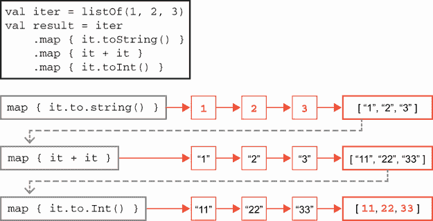
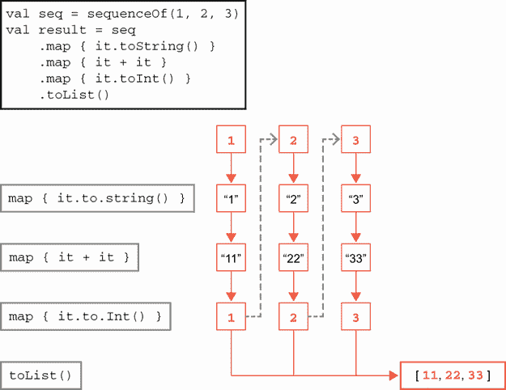
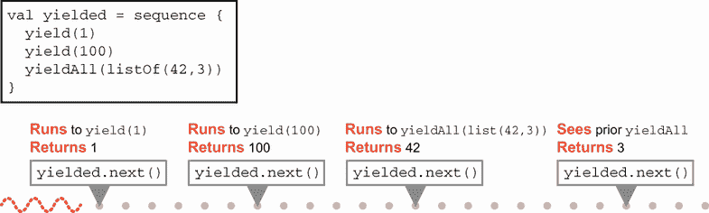

# 15 高级函数式编程

本章涵盖

+   函数式编程概念

+   Java 中函数式编程的局限性

+   Kotlin 高级函数式编程

+   Clojure 高级函数式编程

我们在本书的早期已经遇到了函数式编程概念，但在这章中，我们希望将这些线索汇总并提升到一个新的层次。在业界，关于 *函数式编程* 的讨论很多，但它仍然是一个相当不明确的概念。唯一达成共识的是，在函数式编程（FP）语言中，代码可以表示为第一类数据项，也就是说，应该能够将一个延迟计算的片段表示为一个可以分配给变量的值。

当然，这个定义过于宽泛——在所有实际应用中，过去 30 年中几乎所有的主流语言（除了极少数例外）都符合这个定义。因此，当不同的程序员群体讨论 FP 时，他们谈论的是不同的事情。每个群体对“FP”这个术语下隐含的其他语言属性都有不同的、不言而喻的理解。

换句话说——就像面向对象（OO）一样——对“函数式编程语言”的定义并没有根本上的共识。或者，如果一切都是 FP 语言，那么就没有什么是了。

稳健的开发者最好在一条轴（或者，更好的是，作为一个可能的语言特征的多维空间中的点）上可视化编程语言。语言只是比其他语言更函数式或更少函数式——没有某种绝对尺度来衡量它们。让我们来认识一些超越“代码是数据”这种简单概念的函数式编程语言常见工具箱中的概念。

## 15.1 函数式编程概念简介

在接下来的内容中，我们将经常提到 *函数*，但 neither Java 语言 nor JVM 并没有这样的东西——所有可执行代码都必须以 *方法* 的形式表达，该方法在 *类* 中定义、链接和加载。然而，其他非 JVM 语言对可执行代码有不同的理解，因此当我们在本章中提到函数时，应理解为与 Java 方法大致对应的可执行代码片段。

### 15.1.1 纯函数

一个 *纯函数* 是一个不会改变任何其他实体状态的函数。有时人们说它是 *无副作用的*，这意味着函数的行为像一个数学函数的构想：它接受参数，以任何方式都不影响它们，并返回一个仅依赖于传递的值的输出。

与纯度概念相关的是*引用透明性*的概念。这个名称有些不幸——它与 Java 程序员理解的引用无关。相反，这意味着一个函数调用可以用任何之前对相同函数使用相同参数的调用结果来替换。

显然，所有纯函数都是引用透明的，但也可能存在既不纯又是引用透明的函数。要允许非纯函数以这种方式被考虑，需要基于代码分析的形式证明。纯度关乎代码，但不可变性关乎数据，这是我们接下来要探讨的下一个 FP 概念。

### 15.1.2 不可变性

*不可变性*意味着一旦一个对象被创建，其状态就不能被改变。在 Java 中，对象的默认状态是可变的。Java 中关键字`final`被用于多种方式，但在这里我们关注的是防止在创建后修改字段。其他语言可能更倾向于不可变性，并以各种方式表明这种偏好——例如 Rust，它要求程序员使用`mut`修饰符显式地使变量可变。

不可变性使得代码更容易推理：对象具有简单的状态模型，仅仅因为它们只以它们将永远存在的唯一状态被构建。其他好处包括，这意味着它们可以在线程之间安全地复制和共享。

注意：我们可能会问是否存在任何“几乎不可变”的数据方法，同时仍然保持不可变性的一些（或大多数）吸引人的属性。实际上，我们之前遇到的 Java `CompletableFuture`类就是这样的一个例子。我们将在下一章中对此有更多讨论。

一个后果是，由于不可变对象不能被改变，系统中表达状态变化唯一的方法是从一个不可变值开始，构建一个完全新的、或多或少相同但某些字段已更改的不可变值——可能通过使用*withers*（也称为`with*()`方法）。

例如，`java.time` API 非常广泛地使用了不可变数据，可以通过使用类似这样的 withers 来创建新实例：

```
LocalDate ld = LocalDate.of(1984, Month.APRIL, 13);
LocalDate dec = ld.withMonth(12);
System.out.println(dec);
```

不可变方法有后果——特别是对内存子系统可能产生重大影响，因为旧值的组件必须作为创建修改后值的一部分被复制。这意味着从性能角度来看，就地修改通常要便宜得多。

### 15.1.3 高阶函数

高阶函数实际上是一个非常简单的概念，由以下洞察来描述：如果一个函数可以被表示为一个数据项，那么它应该能够被当作任何其他值来处理。

我们可以将*高阶函数*定义为一种函数值，它执行以下一个或两个操作：

+   将函数值作为参数

+   返回一个函数值

例如，考虑一个静态方法，它接受一个 Java `String`并从中生成一个函数对象，如下所示：

```
    public static Function<String, String> makePrefixer(String prefix) {
        return s -> prefix +": "+ s;
    }
```

这提供了一种直接创建函数对象的方法。现在让我们结合另一个静态方法，如下所示，这次它接受一个函数对象作为输入：

```
    public static String doubleApplier(String input,
                                       Function<String, String> f) {
        return f.apply(f.apply(input));
    }
```

这为我们提供了一个简单的例子：

```
var f = makePrefixer("NaNa");                       ❶
System.out.println(doubleApplier("Batman", f));     ❷
```

❶ 创建一个函数对象

❷ 将函数对象作为参数传递给另一个方法

然而，对于 Java 来说，这并不是全部的故事，我们将在下一节中看到。

### 15.1.4 递归

一个*递归*函数是指在函数的至少一些代码路径上调用自身的函数。这导致了编程中最古老的笑话之一：“为了理解递归，一个人必须首先理解递归。”

然而，为了更加严格地准确，我们可能可以这样写：为了理解递归，一个人必须首先理解

1.  递归，以及

1.  在一个物理可实现系统中，每个递归调用链最终都必须终止并返回一个值。

第二点很重要：编程语言使用调用栈来允许函数调用其他函数，这会占用内存空间。因此，递归的问题在于深度递归调用可能会消耗过多的内存并导致崩溃。

在理论计算机科学中，递归因其许多不同的原因而有趣且重要。其中最重要的原因是递归可以用作探索计算理论和如*图灵完备性*等想法的基础，这大致是指所有非平凡的计算系统都具有相同的理论能力来执行计算。

### 15.1.5 闭包

一个*闭包*通常被定义为“捕获”周围上下文中一些状态的 lambda 表达式。然而，为了使这个定义有意义，我们需要解释捕获概念的含义。

当我们创建一个值并将其分配（或绑定）给一个局部变量时，该变量将存在并且可以在代码的某个后续点被使用。这个后续点可能是声明变量的函数或块的末尾。变量存在并可被使用的代码区域是变量的*作用域*。

当我们创建一个函数值时，函数体内部声明的局部变量在函数值的调用期间仍然在作用域内，这个调用将发生在函数值声明之后。如果在函数值的声明中提到了在函数体作用域之外声明的变量（或其他状态，如字段），那么函数值就说是对状态进行了*封闭*，并且这个函数值被称为闭包。

当闭包稍后调用时，它对捕获的变量有完全的访问权限，即使调用发生在捕获声明的作用域之外。

例如，在 Java 中：

```
    public static Function<Integer, Integer> closure() {
        var atomic = new AtomicInteger(0);
        return i -> atomic.addAndGet(i);
    }
```

这个静态方法是一个高阶函数，它返回一个 Java 闭包，因为它返回了一个引用`atomic`的 lambda 表达式，`atomic`是在方法内部声明的局部变量，即在 lambda 本身声明的范围内。从`closure()`返回的闭包可以被重复调用，并且它会在每次调用中聚合状态。

### 15.1.6 懒惰

我们在第十章中简要提到了*懒惰*的概念。本质上，*惰性评估*允许将表达式的值计算推迟到实际需要时。相比之下，表达式的即时评估被称为*即时评估*（或*严格评估*）。

懒惰的概念很简单：如果你不需要做工作，那就不要做！这听起来很简单，但对你编写程序以及程序的性能有着深远的影响。这个额外复杂性的一个关键部分是，你的程序需要跟踪哪些工作已经完成，哪些还没有完成。

并非每种语言都支持惰性评估，许多程序员可能在这个旅程中只遇到过即时评估——这是完全可以接受的。

例如，Java 在语言级别上没有对懒惰的一般支持，所以很难给出一个清晰的例子。我们得等到我们谈到 Kotlin 时才能具体化。

然而，尽管懒惰对于 Java 程序员来说可能不是一个自然的概念，但在函数式编程（FP）中，懒惰是一个非常有用且强大的技术。事实上，对于某些 FP 语言，如 Haskell，惰性评估是默认的。

### 15.1.7 柯里化和部分应用

柯里化不幸的是，与食物无关。相反，它是一种以 Haskell Curry（他的名字也给了 Haskell 编程语言）命名的编程技术。为了解释它，让我们从一个具体的例子开始。

考虑一个即时评估的纯函数，它接受两个参数。如果我们提供两个参数，我们将得到一个值，函数调用可以在任何地方被结果值替换（这就是引用透明性）。但如果我们只提供两个参数中的一个会发生什么呢？

直观地，我们可以将其视为创建一个新的函数，但这个函数只需要一个参数来计算结果。这个新函数被称为*柯里化函数*（或*部分应用函数*）。Java 没有直接支持柯里化的功能，所以我们再次将具体的例子推迟到本章的后面部分。

从更广泛的角度来看，一些编程语言支持具有多个参数列表的函数概念（或者有语法允许程序员伪造它们）。在这种情况下，我们可以将柯里化视为函数的一种转换。在数学符号中，我们将一个作为 `f(a, b)` 调用的多参数函数转换为可以调用为 `(g(a))(b)` 的形式，其中 `g(a)` 是部分应用函数。

现在应该很明显，我们迄今为止遇到的不同语言对函数式编程的支持程度不同——例如，Clojure 对我们在本节中讨论的许多概念有非常好的支持。另一方面，Java 的情况则完全不同，我们将在下一节中看到。

## 15.2 Java 作为函数式编程语言的局限性

让我们从好消息开始，尽管如此：Java 确实通过`java.util.function`中的类型以及运行时提供的广泛内省支持（如反射和方法句柄）清除了“将代码表示为数据”的相对较低门槛。

注意：使用内部类来模拟函数对象作为技术早于 Java 8，并且存在于像 Google Guava 这样的库中，所以严格来说，Java 将代码表示为数据的能力并不局限于那个版本。

自从第 8 版以来，Java 语言通过引入流以及与之相关的严格受限的延迟操作领域，在最低限度上有所超越。然而，尽管有了流，Java 并不是一个自然的功能环境。这其中的部分原因是平台的历史以及现在已经几十年前的设计决策。

注意：值得记住的是，Java 是一种已经迭代了 25 年的命令式语言，它已经进行了广泛的迭代。其中一些 API 适合函数式编程、不可变数据等，而另一些则不适合。这是在一种已经生存并繁荣的语言中工作的现实，同时仍然保持向后兼容性。

因此，总的来说，Java 可能最好被描述为一种“稍微有点函数式编程语言”。它拥有支持函数式编程所需的基本特性，并通过 Streams API 为开发者提供访问基本模式（如 filter-map-reduce）的途径，但大多数高级函数式特性要么是不完整的，要么完全缺失。让我们详细看看。

### 15.2.1 纯函数

正如我们在第四章中看到的，Java 的字节码执行许多不同类型的事情，包括算术、堆栈操作、流程控制，特别是调用和数据存储和检索。对于已经熟悉 JVM 字节码的扎实开发者来说，这意味着我们可以通过考虑字节码的效果来表达方法的纯度。具体来说，JVM 语言中的纯方法是指以下方法：

+   不修改对象或静态状态（不包含`putfield`或`putstatic`）

+   不依赖于外部可变对象或静态状态

+   不调用任何非纯方法

这是一个相当限制性的条件集，并强调了使用 JVM 作为纯函数式编程基础时的困难。

关于 JDK 中不同接口的语义——即意图——也存在疑问。例如，`Callable`（在`java.util.concurrent`中）和`Supplier`（在`java.util.function`中）基本上做的是同一件事：它们执行一些计算并返回一个值，如下所示：

```
@FunctionalInterface
public interface Callable<V> {
    V call() throws Exception;
}

@FunctionalInterface
public interface Supplier<T> {
    T get();
}
```

它们都是`@FunctionalInterface`，并且通常被用作 lambda 表达式的目标类型。接口的签名是相同的，除了处理异常的方法不同。

然而，它们可以被视为具有不同的角色：`Callable`暗示在调用代码中可能需要进行一些非平凡的工作来创建将要返回的值。另一方面，`Supplier`这个名字似乎暗示工作量较少——可能只是返回一个缓存的值。

### 15.2.2 可变性

Java 是一种可变语言——可变性从其设计之初就内置其中。部分原因是历史的偶然——20 世纪 90 年代末的机器（Java 的起源）在内存方面非常受限（按现代标准）。不可变的数据模型将大大增加内存管理子系统的压力，并导致更频繁的 GC 事件，从而导致更差的吞吐量。

因此，Java 的设计倾向于修改而不是创建修改后的副本。所以原地修改可以看作是 25 年前由于性能权衡而做出的设计选择。

然而，情况甚至比这更糟。Java 通过引用来引用所有复合数据，`final`关键字应用于引用，*而不是*数据。例如，当应用于字段时，字段只能被分配一次。

这意味着即使一个对象的所有字段都是 final 的，组合状态仍然可能是可变的，因为对象可以持有对另一个具有一些非 final 字段的`final`引用。这导致了我们在第五章讨论的浅层不可变性问题。

注意：对于 C++程序员来说：Java 没有`const`的概念，尽管它确实有一个（未使用）关键字。

例如，这里是一个我们在第五章遇到的不可变`Deposit`类的略微增强版本：

```
public final class Deposit implements Comparable<Deposit> {
    private final double amount;
    private final LocalDate date;
    private final Account payee;

    private Deposit(double amount, LocalDate date, Account payee) {
        this.amount = amount;
        this.date = date;
        this.payee = payee;
    }

    @Override
    public int compareTo(Deposit other) {
        return Comparator.nullsFirst(LocalDate::compareTo)
                         .compare(this.date, other.date);
    }

    // methods elided
}
```

这个类的不可变性基于假设`Account`及其所有传递依赖也是不可变的。这意味着有一些限制——从根本上讲，Java 和 JVM 的数据模型并不自然地支持不可变性。

在字节码中，我们可以看到 final 字段作为以下字段元数据出现：

```
$ javap -c -p out/production/resources/ch13/Deposit.class
Compiled from "Deposit.java"
public final class ch13.Deposit
    implements java.lang.Comparable<ch13.Deposit> {

    private final double amount;

    private final java.time.LocalDate date;

    private final ch13.Account payee;

  // ...
  }
```

尝试在 Java 中使用不可变状态的方法就像是在救一个正在漏水的船。必须检查每个引用的可变性，如果遗漏任何一个，那么整个对象图都是可变的。

更糟糕的是，JVM 的反射和其他子系统也提供了绕过不可变性的方法，如下所示：

```
var account = new Account(100);
var deposit = Deposit.of(42.0, LocalDate.now(), account);
try {
    Field f = Deposit.class.getDeclaredField("amount");
    f.setAccessible(true);
    f.setDouble(deposit, 21.0);
    System.out.println("Value: "+ deposit.amount());
} catch (NoSuchFieldException e) {
    e.printStackTrace();
} catch (IllegalAccessException e) {
    e.printStackTrace();
}
```

总的来说，这意味着 Java 和 JVM 都不是提供任何特定支持以使用不可变数据的编程环境。像 Clojure 这样的语言，由于有更严格的要求，最终不得不在其语言特定的运行时中做大量工作。

### 15.2.3 高阶函数

高阶函数的概念对 Java 程序员来说不应该令人惊讶。我们已经看到了一个静态方法`makePrefixer()`的例子，它接受一个前缀字符串并返回一个函数对象。让我们重写代码并将静态工厂改为另一个函数对象，如下所示：

```
Function<String, Function<String, String>> prefixer =
                                           prefix -> s -> prefix +": "+ s;

```

这可能一开始看起来有点难以阅读，所以让我们包括一些实际上不需要的额外语法，以使正在发生的事情更清晰：

```
Function<String, Function<String, String>> prefixer = prefix -> {
    return s -> prefix +": "+ s;
};
```

在这个扩展视图中，我们可以看到`prefix`是函数的参数，返回值是一个 lambda（实际上是一个 Java 闭包），它实现了`Function <String, String>`。

注意函数类型`Function<String, Function<String, String>>`的出现——它有两个类型参数定义了输入和输出类型。第二个（输出）类型参数只是另一个类型——在这种情况下，它是一个函数类型。这是在 Java 中识别高阶函数类型的一种方法：一个`Function`（或其他函数类型），其中`Function`是其类型参数之一。

最后，我们应该指出，语言语法确实很重要——毕竟，函数对象可以作为匿名实现来创建，如下所示：

```
public class PrefixerOld
    implements Function<String, Function<String, String>> {

    @Override
    public Function<String, String> apply(String prefix) {
        return new Function<String, String>() {
            @Override
            public String apply(String s) {
                return prefix +": "+ s;
            }
        };
    }
}
```

如果当时存在`Function`类型（以及如果我们删除注解和泛型，那么至少从 Java 1.1 开始），这段代码甚至会是合法的。但它非常难看。很难看到结构，这也是为什么许多程序员认为函数式编程只有在 Java 8 中才出现。

### 15.2.4 递归

`javac`编译器提供了将 Java 源代码直接转换为字节码的简单翻译。正如我们所见，这适用于递归调用：

```
    public static long simpleFactorial(long n) {
        if (n <= 0) {
            return 1;
        } else {
            return n * simpleFactorial(n - 1);
        }
    }
```

这编译成以下字节码：

```
public static long simpleFactorial(long);
    Code:
       0: lload_0
       1: lconst_0
       2: lcmp
       3: ifgt          8
       6: lconst_1
       7: lreturn
       8: lload_0
       9: lload_0
      10: lconst_1
      11: lsub
      12: invokestatic  #37                 // Method simpleFactorial:(J)J
      15: lmul
      16: lreturn
```

当然，这有一些主要的限制。在这种情况下，调用`simpleFactorial(100000)`将由于字节 12 处的`invokestatic`调用而导致`StackOverflowError`，这将为每个递归调用在栈上放置一个额外的解释器帧。

注意：一个*递归*方法是指调用自身的方法。一个*尾递归*方法是指自我调用是该方法的最后一件事。

让我们尝试找到一种方法来查看是否可以避免递归调用。一种方法是将阶乘代码重写为尾递归形式，在 Java 中，我们可以通过一个私有辅助方法最简单地做到这一点，如下所示：

```
    public static long tailrecFactorial(long n) {
        if (n <= 0) {
            return 1;
        }
        return helpFact(n, 1);
    }

    private static long helpFact(long i, long j) {
        if (i == 0) {
            return j;
        }
        return helpFact(i - 1, i * j);
    }
```

入口方法`tailrecFactorial()`不执行任何递归；它只是设置尾递归调用并隐藏更复杂签名细节。该方法的字节码基本上是微不足道的，但为了完整性，让我们包括它：

```
public static long tailrecFactorial(long);
    Code:
       0: lload_0
       1: lconst_0
       2: lcmp
       3: ifgt          8
       6: lconst_1
       7: lreturn
       8: lload_0
       9: lconst_1
      10: invokestatic  #49                 // Method helpFact:(JJ)J
      13: lreturn
```

如您所见，这里没有循环，只有字节码 3 处的单个分支`if`。真正的动作（以及递归）发生在`helpFact()`中。这仍然由`javac`编译成字节码，其中包含递归调用，如下所示：

```
private static long helpFact(long, long);
    Code:
       0: lload_0
       1: lconst_0
       2: lcmp
       3: ifne          8
       6: lload_2                                        ❶
       7: lreturn                                        ❷
       8: lload_0
       9: lconst_1
      10: lsub
      11: lload_0
      12: lload_2
      13: lmul
      14: invokestatic  #49  // Method helpFact:(JJ)J    ❸
      17: lreturn
```

❶ 长整型是 8 字节，因此每个都需要两个局部变量槽

❷ 从 i == 0 路径返回

❸ 尾递归调用

然而，以这种形式，我们现在可以看到，这个方法中有两条路径。简单的`i == 0`路径从字节码 0 开始，通过 3 号字节码处的`if`条件，并在 7 号字节码处返回`j`。更一般的情况是从 0 到 3，然后从 8 到 14，这会触发一个递归调用。

因此，在只有方法调用的路径上，调用是递归的，并且总是发生在`return`之前最后发生的事情——也就是说，调用处于*尾位置*。然而，它*可以*被编译成以下字节码，从而避免了调用：

```
private static long helpFact(long, long);
    Code:
       0: lload_0
       1: lconst_0
       2: lcmp
       3: ifne          8
       6: lload_2             ❶
       7: lreturn             ❷
       8: lload_0
       9: lconst_1
      10: lsub
      11: lload_0
      12: lload_2
      13: lmul
      14: lstore_2            ❸
      15: lstore_0            ❸
      16: goto          0     ❹
```

❶ 长整型是 8 字节，因此每个都需要两个局部变量槽

❷ 从 i == 0 路径返回

❸ 重置局部变量

❹ 跳转到方法顶部

现在是坏消息的时候了：`javac`不会自动执行这个操作，尽管这是可能的。这又是编译器试图尽可能精确地将 Java 源代码转换为字节码的另一个例子。

注意：在本书附带的资源项目中，有一个如何使用 ASM 库生成实现先前字节码序列的类的示例，因为`javac`不会从递归代码中生成它。

为了完整性，我们应该说，在实践中，实现一个使用递归调用而不是覆盖栈帧来处理长整型的阶乘函数实际上并不会引起问题，因为阶乘增长得如此之快，以至于在达到任何栈大小限制之前，它就会溢出`long`类型可用的空间，如下所示：

```
$ java TailRecFactorial 20
2432902008176640000

$ jshell
jshell> 2432902008176640000L + 0.0
$1 ==> 2.43290200817664E18

jshell> Long.MAX_VALUE + 0.0
$2 ==> 9.223372036854776E18
```

因此，`factorial(21)`已经大于 JVM 可以表示的最大正`long`值。然而，尽管这个特定的简单例子相对安全，但它并没有改变这样一个困难的事实：Java 中所有的递归算法都潜在地容易受到栈溢出的影响。

这个特定的缺陷是 Java 语言的问题——而不是 JVM 的问题。JVM 上的其他语言可以，并且确实以不同的方式处理这个问题，例如，通过使用注解或关键字。当我们讨论本章后面如何使用 Kotlin 和 Clojure 处理递归时，我们将看到这方面的例子。

### 15.2.5 闭包

正如我们之前看到的，闭包本质上是一个捕获了 lambda 表达式声明作用域中一些可见状态的 lambda 表达式，如下所示：

```
int i = 42;
Function<String, String> f = s -> s + i;
// i = 37;
System.out.println(f.apply("Hello "));
```

当它运行时，它会产生预期的结果：`Hello 42`。然而，如果我们取消注释重新分配`i`值的行，那么会发生不同的事情：代码根本无法编译。

为了理解为什么会发生这种情况，让我们看看代码编译成的字节码。正如我们将在第十七章中看到的，Java 中 lambda 表达式的主体被转换为私有静态方法。在这种情况下，lambda 体变成了这样：

```
private static java.lang.String lambda$main$0(int, java.lang.String);
    Code:
       0: aload_1
       1: iload_0
       2: invokedynamic #32,  0 // InvokeDynamic #1:makeConcatWithConstants:
                                // (Ljava/lang/String;I)Ljava/lang/String;
       7: areturn
```

关键在于`lambda$main$0()`的签名。它接受**两个**参数，而不是一个。第一个参数是传递给闭包的`i`的值——在创建闭包时是 42（第二个是当 lambda 执行时 lambda 接受的`String`参数）。Java 闭包包含值的副本，这些值是位模式（无论是原始类型还是对象引用），而不是**变量**。

注意 Java 是严格**按值传递**的语言——在核心语言中没有方法可以**按引用传递**或**按名称传递**。

要看到在闭包体外部作用域内对捕获状态的变化的影响（或在其他作用域中产生影响），捕获状态必须是一个可变对象，如下所示：

```
var i = new AtomicInteger(42);
Function<String, String> f = s -> s + i.get();
i.set(37);                                        ❶
// i = new AtomicInteger(37);                     ❷
System.out.println(f.apply("Hello "));
```

❶ 将值重新分配给可变对象状态是可行的。

❷ 这将无法编译。

事实上，在 Java 的早期版本中，只有显式标记为`final`的变量才能被 Java 闭包捕获其值。然而，从 Java 8 开始，这个限制被改为*实际上是 final*的变量——即使用起来像 final 变量一样使用的变量，即使它们实际上没有在声明中附加关键字。

这实际上是更深层次问题的症状。JVM 有一个共享的堆、方法私有的局部变量和方法私有的评估栈，仅此而已。与其他语言相比，JVM 和 Java 语言都没有“环境”或符号表的概念，也没有传递一个条目引用的能力。

在 JVM 上运行的非 Java 语言必须在其语言运行时中支持这些概念，因为 JVM 不提供对这些概念的任何固有支持。因此，一些编程语言理论家得出结论，Java 提供的不完全是真正的闭包，因为需要额外的间接层。Java 程序员必须修改对象值的内部状态，而不是能够直接更改捕获的变量。

### 15.2.6 懒惰

Java 在核心语言中不提供对普通值的懒惰评估的一级支持。然而，我们可以看到懒惰评估在 Java Streams API 中使用的有趣地方。如果你需要的话，附录 B 有关于流方面的复习内容。

注意：懒惰确实在 JVM 及其编程环境的一些部分中扮演着角色（例如，类加载的一些方面是懒惰的）。

在 Java 集合上调用`stream()`会产生一个`Stream`对象，这实际上是一组元素的懒惰表示。一些流也可以表示为 Java 集合；然而，流更通用，并不是每个流都可以表示为集合。

让我们再次看看典型的 Java `filter()`和`map()`管道：

```
              stream()  filter()  map()     collect()
Collection -> Stream -> Stream -> Stream -> Collection
```

`stream()` 方法返回一个 `Stream` 对象。`map()` 和 `filter()` 方法（以及几乎所有的 `Stream` 操作）都是懒加载的。在管道的另一端，我们有一个 `collect()` 操作，它将剩余的 `Stream` 的内容 *实体化* 回一个 `Collection`。这个 *终端* 方法是急切的，因此整个管道的行为如下：

```
              lazy      lazy      lazy      eager
Collection -> Stream -> Stream -> Stream -> Collection
```

除了将数据实体化回集合之外，该平台完全控制着可以评估多少流数据。这为一系列在纯急切方法中不可用的优化打开了大门。

有时将 Java 流的懒加载、函数式模式想象成科幻电影中的超空间旅行可能会有所帮助。调用 `stream()` 等同于从“正常空间”跳入一个规则不同的超空间领域（函数式和懒加载，而不是面向对象和急切）。

在操作管道的末端，一个终端流操作将我们从懒加载的函数式世界跳回到“正常空间”，要么通过将流重新实体化回一个 `Collection`（例如，通过 `toList()`），要么通过 `reduce()` 或其他操作聚合流。

使用懒加载确实需要程序员更加小心，但这种负担在很大程度上落在库编写者，如 JDK 开发者的身上。然而，Java 开发者应该了解并尊重流的一些懒加载特性的规则。例如，一些 `java.util.function` 接口的实现（例如，`Predicate`、`Function`）不应该改变内部状态或产生副作用。违反这个假设可能会导致开发者编写的实现或 lambda 表达式出现重大问题。

流的另一个重要方面是流对象本身（在流调用管道中被视为中间对象的 `Stream` 实例）是单次使用的。一旦它们被遍历，就应该认为它们是无效的。换句话说，开发者不应该尝试存储或重用流对象，因为这样做几乎肯定会导致错误，并且可能会抛出异常。

注意：将流对象放入临时变量几乎总是代码的坏味道，尽管在开发过程中，当调试与流相关的复杂泛型问题时这样做是可以接受的，前提是在代码完成后移除对流临时变量的使用。

流的另一个懒加载特性是能够模拟比集合更通用的数据。例如，可以通过使用 `Stream.generate()` 结合生成函数来构建一个无限流。让我们看一下：

```
public class DaySupplier implements Supplier<LocalDate> {
    private LocalDate current = LocalDate.now().plusDays(1);

    @Override
    public LocalDate get() {
        var tmp = current;
        current = current.plusDays(1);
        return tmp;
    }
}

final var tomorrow = new DaySupplier();
Stream.generate(() -> tomorrow.get())
      .limit(10)
      .forEach(System.out::println);
```

这会产生一个无限（或者如果你更喜欢，是所需大小）的日数据流。如果没有耗尽空间，这将是无法表示为集合的，从而表明流更加通用。

这个例子还表明，Java 的限制，例如按值传递，在一定程度上限制了设计空间。`LocalDate` 类是不可变的，因此我们需要有一个包含可变字段 `current` 的类，然后在 `get()` 方法中修改 `current` 以提供一个具有状态的、可以生成一系列 `LocalDate` 对象的方法。

在支持按引用传递的语言中，`DaySupplier` 类型是不必要的，因为 `current` 可以是一个与 `tomorrow` 同作用域的局部变量，而 `tomorrow` 可以是一个 lambda 表达式。

### 15.2.7 柯里化和部分应用

我们已经知道 Java 没有任何语言级别的支持用于柯里化，但我们可以快速看一下如何添加它。例如，以下是 `java.util.function` 中 `BiFunction` 接口的声明：

```
@FunctionalInterface
public interface BiFunction<T, U, R> {
    R apply(T t, U u);

    default <V> BiFunction<T, U, V> andThen(
                                  Function<? super R, ? extends V> after) {

        Objects.requireNonNull(after);
        return (T t, U u) -> after.apply(apply(t, u));
    }
}
```

注意接口的默认方法特性是如何用来定义 `andThen()` 的——一个超出标准 `apply()` 方法的额外方法。同样的技术可以用来提供一些对柯里化的支持，例如，通过定义以下两个新的默认方法：

```
default Function<U, R> curryLeft(T t) {
        return u -> this.apply(t, u);
    }

    default Function<T, R> curryRight(U u) {
        return t -> this.apply(t, u);
    }
```

这些定义了两种生成 Java `Function` 对象的方法，即从我们原始的 `BiFunction` 中产生一个只有一个参数的函数。请注意，它们被实现为闭包。我们只是捕获提供的值并存储起来，以便在真正应用函数时使用。然后我们可以像这样使用这些额外的默认方法：

```
BiFunction<Integer, LocalDate, String> bif =
                                       (i, d) -> "Count for "+ d + " = "+ i;

Function<LocalDate, String> withCount = bif.curryLeft(42);
Function<Integer, String> forToday = bif.curryRight(LocalDate.now());
```

然而，语法有些笨拙：它需要两个不同的方法来处理两种可能的柯里化，并且由于类型擦除，它们必须有不同的名称。即使如此，最终的功能可能也只有有限的用途，因此这种方法从未被实现，正如讨论的那样，Java 并不支持开箱即用的柯里化。

### 15.2.8 Java 的类型系统和集合

为了结束我们对 Java 对函数式编程不太友好倾向的不幸故事，让我们谈谈 Java 的类型系统和集合。Java 语言这些部分的以下三个主要问题导致了它们与函数式编程风格的某种不匹配：

+   非单根类型系统

+   `void`

+   Java 集合的设计

首先，Java 有一个非单根类型系统（即没有 `Object` 和 `int` 的公共超类型）。这使得在 Java 中无法编写 `List<int>`，结果导致了自动装箱及其相关问题。

注意许多开发者抱怨在编译过程中泛型类型参数的擦除，但事实上，非单根类型系统才是泛型在集合中真正引起问题的原因。

Java 还有一个问题，与非单根类型系统有关：`void`。这个关键字表示方法不返回值（或者从另一个角度来看，当方法返回时，方法的评估栈为空）。因此，这个关键字携带的语义是，无论方法做什么，它都是纯粹通过副作用来执行的——在某种程度上与“纯”相反。

`void` 的存在意味着 Java 既有语句也有表达式，因此不可能实现设计原则，“一切皆表达式”，这是某些函数式编程传统非常热衷的。

注意：在第十八章中，我们将讨论瓦尔哈拉项目，该项目为 Java 语言设计者提供了一个机会，可能重新审视 Java 类型系统的非单根特性（以及其他目标）。

另一个问题与 Java 集合接口的形状和本质有关。它们是在 Java 1.2 版本（也称为 Java 2）中添加到 Java 语言的，该版本于 1998 年 12 月发布。它们并不是以函数式编程为设计初衷。

在使用 Java 集合进行函数式编程时，一个主要问题是到处都内置了可变性的假设。集合接口很大，并且明确包含来自 `List<E>` 的这些方法：

+   `boolean add(E e)`

+   `E remove(int index)`

这些是修改方法——它们的签名暗示了集合对象本身在原地被修改。

对于不可变列表的相应方法会有这样的签名：`List<E> add(E e)`，它们返回一个新的、修改后的列表副本。`remove()` 的情况很难实现，因为 Java 没有从方法中返回多个值的能力。

注意：真正的问题是 `remove()` 方法在函数式编程（FP）中的实现是错误的，这与我们在第 10.4 节中讨论的 `Iterator` 的情况非常相似。

因此，所有这些都暗示了 *任何* 集合的实现都隐式地期望是可变的。确实存在使用 `UnsupportedOperationException` 的可怕技巧，我们在第 6.5.3 节中讨论过，但这不是一位扎实的 Java 开发者应该使用的东西。

其他非 Java 语言将集合类型的概念与可变性分开，例如，通过将它们表示为不同的接口（或在支持该概念的语言中将它们表示为不同的 *特质*）。这使得实现可以指定它们是否在类型级别上是可变的，通过选择实现或不实现这些单独的接口。

在所有这些背后，Java 的主要优点和最重要的设计原则之一是向后兼容性。这使得改变这些方面以使语言更具函数性变得困难，甚至不可能。例如，在集合的案例中，而不是直接尝试在集合接口上添加额外的函数式方法，我们采取了彻底的突破，引入了`Stream`，作为一种新的容器类型，它不具有集合的隐式语义。

当然，仅仅引入一个新的容器类型和 API 并不能改变数百万行使用集合的现有代码。对于 API 已经以集合类型表达的情况，这也没有丝毫帮助。

注意：这个问题并不仅限于流/集合的划分。例如，Java 反射是在 Java 1.1 中引入的，早于集合的出现。因此，API 的使用非常令人烦恼，因为它依赖于数组作为元素容器。

本节展示了关于 Java 中函数式编程支持状态的几个相当令人沮丧的事实。主要信息是，简单的函数式模式（如 filter-map-reduce）是可用的。这些模式对于各种应用以及很好地推广到并发（甚至分布式）应用都非常有用，但它们几乎就是 Java 能够做到的极限。让我们继续看看我们的非 Java 语言，看看情况是否有所改善。

## 15.3 Kotlin FP

我们已经展示了现代 Java 如何处理函数式编程范式中的某些基本、常见模式。对于倾向于函数式编程的人来说，Kotlin 带来了简洁性和一些额外的想法，这或许并不令人意外。

本节将概述要点，但如果你想要更深入地了解，可以查阅 Marco Vermeulen、Rúnar Bjarnason 和 Paul Chiusano 合著的《Kotlin 函数式编程》（Manning, 2021，[`mng.bz/o2Wr`](http://mng.bz/o2Wr)）。

### 15.3.1 纯函数和高级函数

在 9.2.4 节中，我们介绍了 Kotlin 的函数。在 Kotlin 中，函数是类型系统的一部分，使用如`(Int) -> Int`这样的语法表示，其中括号列表的内容是参数类型，箭头右边是返回类型。

通过使用这种表示法，我们可以轻松地为接受其他函数作为参数或返回函数的函数编写签名——即*高级函数*。Kotlin 自然鼓励使用这样的高级函数。实际上，围绕`map`和`filter`等处理集合的 API 的大部分 API 都是基于这些高级函数构建的，正如我们在提供等效语言特征的 Java（和 Clojure）API 中所看到的那样。

但高阶函数不仅限于集合和流。例如，这里有一个经典的函数式编程函数称为`compose`。`compose`将返回一个函数，该函数将调用传递给它作为参数的每个函数：

```
fun compose(callFirst: (Int) -> Int,
            callSecond: (Int) -> Int): (Int) -> Int {
  return { callSecond(callFirst(it)) }                   ❶
}

val c = compose({ it * 2 }, { it + 10 })                 ❷
c(10)                                                    ❸
```

❶ compose 返回一个函数，所以当此行执行时，callFirst 和 callSecond 不会被调用。

❷ 我们传递两个 lambda，使用第九章中描述的 it 简写来避免显式列出 lambda 的单个参数。

❸ 我们调用并运行由 compose 返回的函数，该函数返回 30。

Kotlin 提供了多种方式来获取函数的引用，具体取决于你的需求。你可以像之前那样声明 lambda 表达式（以及第九章中讨论的许多其他风味和功能）。或者，我们可以通过以下方式通过`::`语法引用命名函数：

```
fun double(x: Int): Int {
  return x * 2
}

val c = compose(::double, { it + 10 })
c(10)                                      ❶
```

❶ 与我们之前的示例结果相同

`::`不仅知道顶级函数。它还可以引用属于特定对象实例的函数，如下所示：

```
data class Multiply(var factor: Int) {
  fun apply(x: Int): Int = x * factor
}

val m = Multiply(2)
val c = compose(m::apply, { it + 10 })    ❶
c(10)
```

❶ 引用 Multiply 类上绑定到特定实例 m 的 apply 方法。

很遗憾，与 Java 类似，Kotlin 没有提供内置的方式来保证给定函数的纯度。虽然定义顶级函数（任何类之外）并使用`val`确保不可变数据可以让你走得很远，但它们并不确保函数的引用透明性。

### 15.3.2 闭包

lambda 表达式的一个可能表面上不明显方面是它们与周围代码的交互。例如，以下代码可以正常工作，即使`local`没有在我们的 lambda 中声明：

```
var local = 0
val lambda = { println(local) }
lambda()                           ❶
```

❶ 打印 0

这被称为*闭包*（即，lambda *捕获*它可以看到的值）。重要的是，与 Java 不同，它不仅仅是 lambda 可以访问的变量的值——在幕后，它实际上保留了变量的引用，如下所示：

```
var local = 0
val lambda = { println(local) }
lambda()                           ❶

local = 10
lambda()                           ❷
```

❶ 打印 0

❷ 打印 10，lambda 被调用时 local 的更新值

即使变量本身在其他情况下已经超出作用域，这种对变量的闭包仍然存在。在这里，我们从函数中返回一个 lambda，保持对通常无法访问的变量的引用：

```
fun makeLambda(): () -> Unit {
  val inFunction = "I'm from makeLambda"    ❶
  return { println(inFunction) }
}

val lambda = makeLambda()
lambda()                                    ❷
```

❶ 因为我们的 lambda 表达式捕获了 inFunction，所以它在这里仍然可用——但仅限于我们的 lambda 内部。

❷ 当 makeLambda 完成后，inFunction 通常会超出作用域。

注意：将引用携带到其典型作用域之外的 lambda 可能是不期望的对象泄漏的来源！

lambda 表达式声明的位置决定了它在其闭包中可以捕获的内容。例如，如果在一个类内部声明，那么 lambda 可以像这样捕获对象中的属性：

```
class ClosedForBusiness {
  private val amount = 100
  val check = { println(amount) }     ❶
}

fun getTheCheck(): () -> Unit {
  val closed = ClosedForBusiness()
  return closed.check                 ❷
}

val check = getTheCheck()
check()                               ❸
```

❶ 将 lambda 保存到 check 中会捕获私有属性 amount。

❷ 此函数返回该 lambda，它保持对 amount 的引用。这使实例在函数完成后通常不会存在时仍然保持活跃。

❸ 当被调用时打印 100。当检查变量退出作用域时，关闭的实例也将最终有资格进行垃圾回收。

高阶函数的闭包为从旧函数构建新函数提供了丰富的基础。

### 15.3.3 Currying 和部分应用

Kotlin 的 currying 故事与 Java 中的非常相似。让我们看看一个例子：

```
fun add(x: Int, y: Int): Int {
  return x + y
}

fun partialAdd(x: Int): (Int) -> Int {
  return { add(x, it) }
}

val addOne = partialAdd(1)
println(addOne(1))
println(addOne(2))

val addTen = partialAdd(10)
println(addTen(1))
println(addTen(2))
```

这实际上只是一个语法技巧，因为它的工作原理是`()`运算符将转换为对`apply()`方法的调用。在字节码级别，这实际上与 Java 示例完全相同。我们可以想象一些辅助语法来自动创建 curries，可能类似于

```
val addOne: (Int) -> Int = add(1, _)
println(addOne(10))
```

然而，核心语言并不直接支持这一点。各种第三方库可以提供类似但稍微冗长的功能，通常通过扩展方法来实现。

### 15.3.4 不可变性

15.1.2 节将不可变性描述为函数式编程成功的关键技术。如果一个纯函数返回的数据对于给定的输入应该是相同的，那么允许对象事后改变就破坏了纯度为我们带来的保证。

Kotlin 帮助我们追求不可变性的一个主要特性是`val`声明。`val`确保属性只能在对象构造期间写入，就像 Java 的`final`一样。事实上，`val`实际上是 Java 的`final var`组合，但也可以应用于属性，并且编写起来不那么笨拙。

第九章涵盖了 Kotlin 支持使用`val`/`var`的许多位置，但要在函数式编程中取得成功，建议拥抱不可变性，并优先使用`val`而不是`var`。Kotlin 对属性的内置支持也消除了 Java 中所需的 getter 样板代码，如下所示：

```
class Point(val x: Int, val y: Int)

val point = Point(10, 20)
println(point.x)
// point.x = 20  // Won't compile because x is immutable!
```

尽管不可变对象有一个主要的问题，那就是当你实际上想要更改某事时的困难。为了保持我们的不可变性，我们必须创建全新的实例，但这可能既繁琐又容易出错。在 Java 中，这通常通过静态工厂方法、构建器对象或 wither 方法来解决，以减少噪音。

Kotlin 的`data class`结构为我们提供了对这些方法的良好替代方案。除了我们在 9.3.1 节中提到的构造函数和相等性操作之外，data 类还获得了一个`copy`方法。将`copy`与 Kotlin 的命名参数配对，你可以生成我们想要的新的实例，只写出你实际想要更改的部分，如下所示：

```
data class Point(val x: Int, val y: Int)

val point = Point(10, 20)
val offsetPoint = point.copy(x = 100)
```

`copy`确实有几个重要的注意事项。首先，它是一个浅拷贝。如果我们的字段之一是一个对象，我们复制的是对该对象的引用，而不是整个对象本身。就像在 Java 中，如果对象链中的任何一个允许修改，那么我们的保证就会被打破。为了实现真正的不可变性，所有涉及的对象都需要配合，但语言不会为你强制执行。

另一个需要注意的问题是，`copy` 仅从类的构造函数生成。如果我们改变规则，在对象的其他地方放置 `var` 字段，`copy` 就不知道这些额外的字段，它们在复制时只会获得默认值，如下所示：

```
data class Point(val x: Int, val y: Int) {
  var shown: Boolean = false
}

val point = Point(10, 20)
point.shown = true

val newPoint = point.copy(x = 100)
println(newPoint.shown)                 ❶
```

❶ 输出为 false，因为非构造函数字段没有被复制操作触及

但我们一开始就绝不允许可变字段悄悄地进入我们美好的不可变对象中，对吧？

控制我们对象的可变性是一个重要的第一步，但大多数非平凡代码将涉及对象集合，而不仅仅是单个实例。在第九章中，我们了解到 Kotlin 构建集合的函数（例如，`listOf`、`mapOf`）返回接口，如 `kotlin.collections.List` 和 `kotlin.collections.Map`，与 `java.util` 中的对应物不同，它们是只读的。遗憾的是，尽管这是一个好的开始，但它并没有提供我们想要的保证。

我们无法信任这些对象的不可变性，因为可变接口扩展了只读特性。任何可以传递 `List` 的地方，你都可以按照以下方式传递 `MutableList`：

```
fun takesList(list: List<String>) {
  println(list.size)
}

val mutable = mutableListOf("Oh", "hi")
takesList(mutable)

mutable.add("there")
takesList(mutable)
```

`takesList` 在两次调用中都接收了相同的对象，但调用结果却不同。我们的功能纯净性被破坏了！

注意：只读辅助工具如 `listOf` 使用底层的 JDK 集合，并返回只读的对象。例如，`listOf` 默认使用数组支持的列表实现，无法添加元素。正是 Kotlin 的可变接口与标准只读接口的混合，破坏了整个局面。

通过 JDK 类实现这些集合也会在接口之间进行类型转换时留下一些锋利的边缘。Kotlin 与 Java 集合的干净交互目标是，`listOf()` 的结果可以转换为 Kotlin 的可变接口和经典的 `java.util.List<T>`，在那里我们可以尝试修改集合！以下代码在编译时没有问题，但在运行时失败：

```
fun takesMutableList(muted: MutableList<Int>) {
  muted.add(4)
}

val list = listOf(1,2,3)
takesMutableList(list as MutableList<Int>)     ❶
```

❶ 此调用将抛出 `java.lang.UnsupportedOperationException`。

这种真正的不可变性缺失在讨论并发时变得尤为成问题。正如我们在第六章中看到的，在多个线程之间使可变集合安全需要相当大的努力。如果我们有一个真正不可变的集合实例，那么它可以自由地在不同的执行线程之间分发，确保每个人都能得到一个相同的世界图景。

虽然 Kotlin 标准库中没有这些，但 `kotlinx.collections.immutable` 库（见 [`mng.bz/nNjg`](http://mng.bz/nNjg)）提供了各种不可变和 *持久* 数据结构。常见的库如 Guava 和 Apache Commons 也提供了许多类似选项。

对于一个集合来说，持久性意味着什么？正如我们多次讨论的那样，不可变性意味着当你需要“更改”一个对象时，你实际上创建了一个新的实例。对于大型集合，这可能会非常低效。持久集合依赖于不可变性来降低修改的成本——它们被构建为安全地共享其内部存储的不可变部分。尽管你仍然创建一个新的对象来实施任何更改，但这些新对象可以比完整复制小得多，如下所示：

```
import kotlinx.collections.immutable.persistentListOf

val pers = persistentListOf(1, 2, 3)
val added = pers.add(4)
println(pers)                          ❶
println(added)                         ❷
```

❶ 打印 [1, 2, 3]

❷ 打印 [1, 2, 3, 4]

图书馆的核心实现了两组接口，分别以 `ImmutableList` 和 `PersistentList` 为代表。对于映射、集合和通用集合也存在匹配对。`ImmutableList` 扩展了 `List`，但与它的基接口不同，它保证任何实例都是不可变的。`ImmutableList` 可以在任何需要传递列表并强制不可变性的地方使用。`PersistentList` 建立在 `ImmutableList` 之上，为我们提供了“修改并返回”的方法。

该库还包括以下熟悉的扩展，用于将其他集合转换为持久版本：

```
val mutable = mutableListOf(1,2,3)
val immutable = mutable.toImmutableList()
val persistent = mutable.toPersistentList()
```

在这一点上，你可能会想知道为什么我们不将每个 `listOf` 改为 `persistentListOf` 以防万一。但它们并不是默认实现的原因。尽管持久数据结构降低了复制的成本，但它们仍然无法触及经典可变数据结构的速度。更少的复制*并不等于没有复制！这要付出多少代价？

如同第七章所希望说服你的那样，唯一的方法是在你自己的用例中进行测量。但如果你需要在多个线程之间对集合进行并发访问，那么比较这些持久结构与更标准的带有同步的复制性能是值得的。现在我们已经有了 Kotlin 的工具包，可以用来使数据不可变，让我们看看它为递归函数世界带来的一个特性。

### 15.3.5 尾递归

在第 15.2.4 节中，我们探讨了 Java 中的递归函数。它们有一个主要的限制，因为每个连续的递归函数调用都会添加一个栈帧，最终耗尽可用空间。从我们将 `simpleFactorial` 函数翻译成 Kotlin（注意 Kotlin `if` 表达式作为返回值的使用）中可以看出，Kotlin 也有同样的限制：

```
fun simpleFactorial(n: Long): Long {
  return if (n <= 0) {
    1
  } else {
    n * simpleFactorial(n - 1)
  }
}
```

这产生了以下字节码，这与 `javac` 为我们的 Java 函数生成的字节码等效：

```
public final long simpleFactorial(long);
    Code:
       0: lload_1
       1: lconst_0
       2: lcmp
       3: ifgt          10
       6: lconst_1
       7: goto          22
      10: lload_1
      11: aload_0
      12: checkcast     #2                  // class Factorial
      15: lload_1
      16: lconst_1
      17: lsub
      18: invokevirtual #19                 // Method simpleFactorial:(J)J
      21: lmul
      22: lreturn
```

除了额外的验证（字节 12）和用 `goto` 代替多个 `lreturn` 指令之外，这基本上是相同的。在字节 18 处的递归调用，我们在 `simpleFactorial` 上调用 `invokevirtual`，最终会崩溃，如下所示：

```
java.lang.StackOverflowError
    at Factorial.simpleFactorial(factorial.kts:32)
    at Factorial.simpleFactorial(factorial.kts:32)
    at Factorial.simpleFactorial(factorial.kts:32)
  ...
```

尽管在一般情况下这个问题是不可避免的，但如果我们的函数是尾递归的，Kotlin 可以帮助我们解决问题。记住，一个尾递归函数是指递归是整个函数中的最后一个操作。之前，我们展示了如何在字节码级别重置状态并`goto`函数的顶部，而不是添加一个栈帧。这把我们的递归调用转换成了一个循环，没有任何栈溢出的风险。Java 没有提供任何方法来做这件事，但 Kotlin 可以。

注意：任何递归函数都可以重写为尾递归。这可能需要额外的参数、变量和技巧来完成转换，但总是可能的。鉴于尾递归函数可以被转换为简单的循环，这表明任何递归函数也可以仅使用循环结构迭代实现。

将我们的阶乘递归调用放到最终位置需要一点调整。就像 Java 一样，我们拆分了函数，以保留对用户友好的单参数形式，并将更复杂的递归函数——现在需要多个参数——放入一个单独的函数中，如下所示：

```
fun tailrecFactorial(n: Long): Long {
  return if (n <= 0) {
    1
  } else {
    helpFact(n, 1)
  }
}

tailrec fun helpFact(i: Long, j: Long): Long {    ❶
  return if (i == 0L) {
    j
  } else {
    helpFact(i - 1, i * j)
  }
}
```

❶ 我们的帮助函数被标记为 `tailrec`，这样 Kotlin 就知道要寻找尾递归。

入口函数 `tailrecFactorial` 在字节码中没有任何惊喜。它执行了我们的起始范围检查，然后按照以下方式将任务转交给我们的尾递归辅助函数：

```
public final long tailrecFactorial(long);
    Code:
       0: lload_1
       1: lconst_0
       2: lcmp
       3: ifgt          10
       6: lconst_1
       7: goto          19
      10: aload_0
      11: checkcast     #2                  // class Factorial
      14: lload_1
      15: lconst_1
      16: invokevirtual #10                 // Method helpFact:(JJ)J
      19: lreturn
```

字节 0–3 检查通过字节 6–7 实现的早期返回。如果我们需要执行递归调用，那么它会在字节 16 加载执行 `invokevirtual` 对 `helpFact` 所需的值。

`tailrec` 关键字引入的重要区别在 `helpFact` 的字节码中体现出来：

```
public final long helpFact(long, long);
    Code:
       0: lload_1
       1: lconst_0
       2: lcmp
       3: ifne          10
       6: lload_3
       7: goto          26
      10: aload_0
      11: checkcast     #2                  // class Factorial
      14: pop
      15: lload_1
      16: lconst_1
      17: lsub
      18: lload_1
      19: lload_3
      20: lmul
      21: lstore_3
      22: lstore_1
      23: goto          0
      26: lreturn
```

这个方法的大部分工作是在进行阶乘的逻辑检查和算术运算，但关键在于字节 23。我们不是通过 `invokevirtual` 对 `helpFact` 进行递归调用，而是简单地 `goto 0` 并重新开始函数。由于没有调用指令，我们没有任何栈溢出的风险，这是一个好消息。谁说 `goto` 总是危险的？

当你的函数可以被重写为适当的形式时，尾递归是一个优雅的解决方案。但如果你要求一个不是尾递归的函数具有尾递归，情况会怎样呢？如下所示：

```
tailrec fun simpleFactorial(n: Long): Long {   ❶
  return if (n <= 0) {
    1
  } else {
    n * simpleFactorial(n - 1)
  }
}
```

❶ 当我们的最终调用不是我们自己时，不恰当地请求 `tailrec`——在这种情况下，最终操作是递归调用结果上的 `*`。

Kotlin 发现了问题，并警告我们它无法将字节码转换为利用尾递归的优势，直接指向我们的错误调用，如下所示：

```
factorial.kts:28:1: warning: a function is marked as tail-recursive
                             but no tail calls are found

tailrec fun simpleFactorial(n: Long): Long {
^
factorial.kts:32:9: warning: recursive call is not a tail call
    n * simpleFactorial(n - 1)
        ^
```

对于编译器来说，发出警告并不是一种特别强烈的行为，因为可能在一个尾递归实现创建之后，它可以被随后微妙地修改为**不是**尾递归。除非构建过程标记了警告，否则这段代码可能会逃逸到生产环境中，并在运行时引发 `StackOverflowError`。可以说，如果像某些其他语言（例如 Scala）那样，将非尾递归函数声明为 `tailrec` 导致编译错误会更好。

### 15.3.6 懒评估

如我们在本章前面提到的，许多函数式语言（如 Haskell）严重依赖于**懒评估**。作为 JVM 上的语言，Kotlin 并没有在其核心执行模型中将懒评估作为中心。但它确实通过 `Lazy<T>` 接口提供了对懒性的第一级支持。这为当你想要延迟——或者可能完全跳过——一些处理时提供了一个标准结构。

通常你不会自己实现 `Lazy<T>`，而是使用 `lazy()` 函数来构建实例。在最简单的形式中，`lazy()` 接受一个 lambda，其返回类型决定了返回接口的类型 `T`。lambda 不会执行，直到显式请求 `value`。我们还可以检查是否已经计算了值，如下所示：

```
val lazing = lazy {
  42
}

println("init? ${lazing.isInitialized()}")    ❶
println("value = ${lazing.value}")            ❷
println("init? ${lazing.isInitialized()}")    ❸
```

❶ 检查我们是否已初始化；将报告为假

❷ 访问值将强制我们的 lambda 执行并保存结果。

❸ 检查我们是否已初始化；将报告为真

我们推迟不必要的计算的需求可能与在多个线程上执行的需求重叠。当这种情况发生时，`lazy()` 接受一个 `LazyThreadSafetyMode` 枚举值来帮助控制这种情况。枚举值包括 `SYNCHRONIZED`（`lazy()` 的默认值）、`PUBLICATION` 和 `NONE`，如下所述：

+   `SYNCHRONIZED` 使用 `Lazy<T>` 实例本身来同步初始化 lambda 的执行。

+   `PUBLICATION` 允许多个初始化 lambda 的并发执行，但只保存第一个看到的值。

+   `NONE` 跳过同步，如果并发访问则行为未定义。

注意，`LazyThreadSafetyMode.NONE` 应该仅在满足以下条件时使用：1) 你已经测量过你的懒实例中的同步确实是一个性能问题，2) 你能以某种方式保证你永远不会从多个线程访问该对象。其他选项 `SYNCHRONIZED` 和 `PUBLICATION` 可以根据你的用例是否对初始化 lambda 并发运行多次敏感来选择。

`Lazy<T>` 接口是为了与另一个高级 Kotlin 特性配合使用，即 *委托属性*。当在类上定义属性时，我们不仅可以提供值或自定义的 getter/setter，还可以提供一个带有 `by` 关键字的对象。该对象必须实现 `getValue()` 和（对于 `var` 属性）`setValue()`。`Lazy<T>` 符合这一规范，如下所示，因此我们可以轻松地将类的属性初始化推迟，而无需重复样板代码或偏离自然的 Kotlin 语法：

```
class Procrastinator {
  val theWork: String by lazy {
    println("Ok, I'm doing it...")   ❶
    "It's done finally"
  }
}

val me = Procrastinator()

println(me.theWork)                  ❷
println(me.theWork)                  ❸
println(me.theWork)                  ❸
```

❶ 诊断信息，以便更容易证明一切正常工作

❷ 第一次调用 theWork 将运行 lambda 并打印工作信息。

❸ 如最后两行所示，后续对 theWork 的调用将只返回相同的、已经计算出的值。

与不可变性一样，惰性非常适合我们自己的对象，但让我们对集合和迭代感到困惑。接下来，我们将看看 Kotlin 如何通过 `Sequence<T>` 接口允许我们更好地控制通过集合流式传输时的执行流程。

### 15.3.7 序列

虽然 Kotlin 的集合函数通常很方便，但它们假设我们会急切地对整个集合应用该函数。在我们的函数链中的每一步都会创建一个中间集合，如下所示——如果我们实际上不需要整个结果，这可能会造成浪费：

```
val iter = listOf(1, 2, 3)
val result = iter
    .map { println("1@ $it"); it.toString() }    ❶
    .map { println("2@ $it"); it + it }          ❷
    .map { println("3@ $it"); it.toInt() }       ❸
```

❶ 生成包含 [“1”，“2”，“3”] 的中间集合

❷ 生成包含 [“11”，“22”，“33”] 的中间集合

❸ 生成我们的最终结果 [11, 22, 33]

如果我们通过图 15.1 跟踪执行过程，我们可以看到我们的 `map` 调用链中的每一步都是在下一个 `map` 运行之前对整个列表进行的。



图 15.1 标准集合迭代

这会导致以下输出：

```
1@ 1
1@ 2
1@ 3
2@ 1
2@ 2
2@ 3
3@ 11
3@ 22
3@ 33
```

除了可能浪费资源的情况外，还有一些用例中我们的输入可能是无限的。如果我们想继续映射尽可能多的数字，直到用户告诉我们停止，我们无法提前创建列表并逐步处理整个内容。

为了处理这个问题，Kotlin 有 *序列*。序列的核心是 `Sequence<T>` 接口，它看起来与 `Iterable<T>` 类似，但在底层提供了全新的功能集。

我们可以使用 `sequenceOf()` 函数创建一个新的序列，然后开始应用我们熟悉的函数。在以下示例中，我们将列表转换为序列，并保留了诊断打印，以便我们可以看到正在发生什么：

```
val seq = sequenceOf(1, 2, 3)
val result = seq
    .map { println("1@ $it"); it.toString() }
    .map { println("2@ $it"); it + it }           ❶
    .map { println("3@ $it"); it.toInt() }
```

❶ 注意，这里的 + 表示字符串连接，而不是数值相加。

当我们运行这个简短的程序时，我们会发现没有任何打印输出。序列的主要特性是它们在评估上是惰性的。这个程序中实际上没有任何内容需要返回我们的 `map` 调用，所以 Kotlin 不会运行它们！不过，如果我们使用以下代码将序列转换为列表，程序将被迫评估一切，我们可以看到序列的控制流是如何运行的：

```
val seq = sequenceOf(1, 2, 3)
val result = seq
    .map { println("1@ $it"); it.toString() }
    .map { println("2@ $it"); it + it }
    .map { println("3@ $it"); it.toInt() }
    .toList()
```

我们可以在图 15.2 中看到序列的每个元素都单独经过 `map` 链，首先是 `1`，然后是 `2`，依此类推，在处理下一个元素之前。



图 15.2 序列执行

这将产生以下输出：

```
1@ 1
2@ 1
3@ 11
1@ 2
2@ 2
3@ 22
1@ 3
2@ 3
3@ 33
```

这很有趣，但在相对较小、静态的列表上，可能并不那么吸引人——适当的测量是应得的，但序列所需的簿记可能会抵消不分配中间集合的收益。序列的力量在创建序列的替代方法中变得更加明显。

我们的第一站是 `asSequence()` 函数。不出所料，这个函数会将可迭代的对象转换为序列。然而，这个函数不仅与你可能期望的列表和集合一起工作，还可以对 *范围* 进行调用。

我们在 9.2.6 节中遇到了 Kotlin 的数字范围，当时它们被用来与 `when` 表达式一起检查包含性。但是范围也可以迭代。我们可以将此与 `asSequence()` 结合起来创建长数字列表，而无需繁琐的输入或过度分配，如下所示：

```
(0..1000000000)          ❶
  .asSequence()
  .map { it * 2 }
```

❶ 范围只跟踪其开始和结束，所以我们不会创建数十亿个元素。

但如果即使是范围的大但仍然有限的本性感觉过于限制性，怎么办呢？标准库中的 `kotlin.sequences` 的 `generateSequence()` 函数可以满足你的需求。这个函数创建了一个新的通用序列对象，并可选地包含一个起始值。每次它需要下一个元素时，它会运行提供的 lambda 表达式，并传入前一个值，如下所示：

```
generateSequence(0) { it + 2 }    ❶
```

❶ 一个无限序列的偶数

一个无限的 `Iterable<T>` 将无法链式调用方法，因为对它的第一次调用永远不会返回。`Sequence<T>` 将只获取它需要的，并将其余的留到以后。这与 `take()` 函数很好地搭配，我们可以请求获取特定数量的元素，作为一个新的、有界的序列，如下所示：

```
generateSequence(0) { it + 2 }
    .take(3)                      ❶
    .forEach { println(it) }      ❷
```

❶ 创建一个包含前三个元素的序列

❷ 通过序列强制评估并打印我们收到的结果

序列上的 `forEach()` 被称为 *终端*，因为它结束了序列的惰性并评估了所有内容。我们已经看到了另一个终端，即 `toList()`，它必然要遍历每个元素来构建一个列表。

如果出于某种原因，仅从序列中的前一个元素工作很困难，Kotlin 提供了另一种创建序列的选项。`sequence()` 与 `yield()` 的组合允许我们构建完全任意的序列，如下所示：

```
val yielded = sequence {
  yield(1)
  yield(100)
  yieldAll(listOf(42, 3))     ❶
}
```

❶ `yieldAll()` 接受一个与我们要 `yield` 的相同类型的可迭代对象，并在请求时依次产生每个元素。

正如我们所期望的，与序列一样，lambda 是惰性执行的，以确定下一个元素。然而，这里独特的是，对于每个对下一个元素的调用，lambda 只会运行到下一个 `yield` 并暂停。随后的对另一个元素的请求将恢复 lambda 在暂停的地方，并再次运行到下一个 `yield`，如图 15.3 所示。



图 15.3 `yield` 执行的时间线视图

`yield` 使用 Kotlin 中的一个称为 *suspend* 函数的特性。正如其名所示，这些函数是 Kotlin 能够识别代码执行中可以暂停和恢复的点。在这种情况下，Kotlin 会看到每次我们 `yield` 一个值时，我们的 `sequence` lambda 的执行应该暂停，直到请求下一个值。尽管我们的代码看起来像是一个简单的 lambda，但实际上 Kotlin 编译器在幕后为我们做了很多额外的工作。

悬挂函数与 Kotlin 的替代并发模型——协程密切相关，我们在第 9.4 节中介绍了协程，将在第十六章中更详细地讨论。然而，值得注意的是，我们经常从并发角度考虑的功能特性，也解锁了独特的函数式编程方式。

## 15.4 Clojure FP

我们在第十章中遇到了 Clojure 函数式编程的基础，例如 `(map)` 形式。我们还对不变性和高阶函数等概念有了早期的介绍，因为这些想法和能力与 Clojure 编程模型的核心非常接近。

因此，在本节中，我们不会介绍 Clojure 对 Java 和 Kotlin 中讨论的功能特性的看法，而是超越这些基础，展示 Clojure 一些更高级的函数式特性是如何工作的，从对列表理解的一个注释开始。

### 15.4.1 理解

函数式编程中的一个重要概念是 *comprehension* 的概念，这里的词意味着集合或其他数据结构的“完整描述”。这个概念源于数学，我们经常看到集合论符号用来描述集合，如下所示：

```
{ x ∈ ℕ : (x / 2) ∈ ℕ }
```

在这个符号中，∈ 表示“是……的成员”，ℕ 是所有 *自然数*（或计数数）的无限集合，这些是我们用来计数对象（如 1、2、3 等等）的数，而 `:` 定义了一个条件或 *限制*。

因此，这种理解描述了一组具有特殊属性的计数数字：集合中的每个数字，当除以二时，都会得到一个也是计数数字的数。当然，我们早已通过另一个名字知道这个集合——它是偶数集合。

关键点在于我们没有通过列出元素来指定偶数的集合（那是不可能的——有无限多个）。相反，我们通过从自然数开始并指定一个附加条件来定义“偶数”，这个条件必须对每个要包含在新集合中的元素成立。

如果这听起来有点像函数技术（如`filter`）的使用，那么它应该是——它们是非常相关的概念。然而，函数语言通常提供推导和`filter-map`，因为每种方法在不同的环境中都更容易使用。

Clojure 使用`(for)`形式来实现*列表推导*，以返回列表（或在某些情况下迭代器）。这就是为什么当我们遇到第十章中的 Clojure 循环时，我们没有介绍`(for)`——它实际上不是一个循环。让我们看看它是如何工作的：

```
user=> (for [x [1 2 3]] (* x x))
(1 4 9)
```

`(for)`形式接受两个参数：一个参数向量和将代表`(for)`将返回的整体列表中要*生成*的值的表达式。

参数向量包含一对（或多个对）元素：一个临时变量，它将在生成的值的定义中使用，以及一个序列来提供输入。我们可以将临时变量视为依次绑定每个值。当然，这可以很容易地写成如下映射：

```
user=> (map #(* % %) [1 2 3])
(1 4 9)
```

那么，我们想在何处使用`(for)`？当我们要构建更复杂结构时，它就派上用场，例如：

```
(for [num [1 2 3]
      ch [:a :b :c]]
  (str num ch))
("1:a" "1:b" "1:c" "2:a" "2:b" "2:c" "3:a" "3:b" "3:c")
```

我们也可以用映射来做这件事，但构造可能会更复杂和繁琐，而使用`(for)`则清晰直接。为了得到过滤的效果，我们还可以在`(for)`上使用一个额外的限定符，它可以作为一个限制，如下所示：

```
user=> (for [x (range 8) :when (even? x)] x)
(0 2 4 6)
```

让我们继续看看 Clojure 是如何实现懒加载的，特别是当应用于序列时。

### 15.4.2 懒序列

在 Clojure 中，懒加载通常在处理序列而不是单个值的懒加载时最常见。对于序列，懒加载意味着我们不必有一个包含序列中所有值的完整列表，而是在需要时（例如，通过调用一个函数按需生成它们）才能获得值。

在 Java 集合中，这样的想法可能需要类似自定义实现`List`的东西，而且没有方便的方法来编写它而不需要大量样板代码。另一方面，使用`ISeq`的实现将允许我们编写如下内容：

```
public class SquareSeq implements ISeq {
    private final int current;

    private SquareSeq(int current) {
        this.current = current;
    }

    public static SquareSeq of(int start) {
        if (start < 0) {
            return new SquareSeq(-start);
        }
        return new SquareSeq(start);
    }

    @Override
    public Object first() {
        return Integer.valueOf(current * current);
    }

    @Override
    public ISeq rest() {
        return new SquareSeq(current + 1);
    }
}
```

没有存储值，相反，序列的每个新元素都是按需生成的。这使我们能够模拟无限序列。或者考虑这个例子：

```
public class IntGeneratorSeq implements ISeq {
  private final int current;
  private final Function<Integer, Integer> generator;

  private IntGeneratorSeq(int seed,
                          Function<Integer, Integer> generator) {
      this.current = seed;
      this.generator = generator;
  }

  public static IntGeneratorSeq of(int seed,
                                   Function<Integer, Integer> generator) {
      return new IntGeneratorSeq(seed, generator);
  }

  @Override
  public Object first() {
      return generator.apply(current);
  }

  @Override
  public ISeq rest() {
      return new IntGeneratorSeq(generator.apply(current), generator);
  }
}
```

这个代码示例使用函数应用的结果来提供下一个序列的种子。这是可以的，前提是生成函数是纯的，但在 Java 中，当然没有任何保证。让我们继续前进，看看一些强大的 Clojure 宏，这些宏旨在帮助您只需付出少量努力就能创建懒序列。

考虑如何表示一个懒的、可能无限的序列。一个明显的选择是使用一个函数来生成序列中的项。该函数应该做两件事：

+   返回序列中的下一个项

+   采取固定、有限数量的参数

数学家会说，这样的函数定义了一个*递归关系*，而这种关系的理论立即表明递归是进行操作的一种适当方式。

想象你有一个机器，其中没有堆栈空间和其他限制，并且假设你可以设置两个执行线程：一个将准备无限序列，另一个将使用它。然后你可以使用递归在生成线程中定义懒序列，如下面的伪代码片段所示：

```
(defn infinite-seq <vec-args>
  (let [new-val (seq-fn <vec-args>)]
    (cons new-val (infinite-seq <new-vec-args>))    ❶
  ))
```

❶ 这实际上不起作用，因为对(infinite-seq)的递归调用会耗尽堆栈。

解决方案是添加一个结构，告诉 Clojure 优化递归并仅在需要时进行操作：`(lazy-seq)`宏。让我们看看下一个列表中的快速示例，它定义了懒序列`k`，`k+1`，`k+2`，...，对于某个数字 k。

列表 15.1 懒序列示例

```
(defn next-big-n [n] (let [new-val (+ 1 n)]
  (lazy-seq                                         ❶
    (cons new-val (next-big-n new-val))             ❷
  )))

(defn natural-k [k]
  (concat [k] (next-big-n k)))                      ❸

1:57 user=> (take 10 (natural-k 3))
(3 4 5 6 7 8 9 10 11 12)
```

❶ 懒序列标记

❷ 无限递归

❸ concat 限制了递归。

关键点是`(lazy-seq)`形式，它标记了一个可能发生无限递归的点，以及`(concat)`形式，它安全地处理它。然后你可以使用`(take)`形式从懒序列中提取所需数量的元素。懒序列是一个非常强大的功能，通过实践，你会发现它们是 Clojure 工具箱中非常有用的工具。

### 15.4.3 Clojure 中的柯里化

与其他语言相比，Clojure 中的柯里化函数具有额外的复杂性。这是由于我们第十章讨论的事实，即许多 Clojure 形式是可变参数的。

可变参数函数是一个复杂因素，因为它们提出了像“用户是否打算柯里化两个参数形式还是评估一个参数形式？”这样的问题——尤其是在 Clojure 使用函数的贪婪求值的情况下。

解决方案是`(partial)`形式，顺便说一下，这是一个真正的 Clojure 函数，而不是宏。让我们看看它在实际中的应用：

```
user=> (filter (partial = :b) [:a :b :c :b :d])
(:b :b)
```

函数`=`接受 1 个或多个参数，因此`(= :b)`会贪婪地求值到`true`，但`(partial)`的使用将其转换为柯里化函数。它在`(filter)`调用中的使用使其被识别为一个单参数函数（实际上，是单参数重载），然后它被用来测试以下向量中的每个元素。

注意 `(partial)` 本身只会对形式的前一个参数进行柯里化。如果我们想对其他参数进行柯里化，我们需要将 `(partial)` 与另一个形式结合——这个形式在函数应用之前会重新排列参数列表。

在我们探讨的三种语言中，Clojure 的函数式特性最为突出。如果这里的介绍已经激起了你的兴趣，你还有更多可以探索的内容。我们到目前为止所涵盖的只是冰山一角，但它确实有助于证明 JVM 本身可以是一个良好的函数式编程家园——更多的是 Java 语言阻碍了以函数式风格进行编程。

在本章中，我们深入探讨了函数式编程，远不止 Java Streams 的传统 filter-map-reduce 范式。我们主要通过跳出 Java，转向其他 JVM 语言来实现这一点。

当然，可以更进一步。存在两个主要的函数式编程学派：动态类型学派，以 Clojure（以及 JVM 之外的 Erlang 等语言）为代表，以及静态类型学派，包括 Kotlin，但可能更由 Scala（以及非 JVM 语言的 Haskell）代表。

然而，Java 的一项主要设计优点——向后兼容性——也可以被视为一种潜在的弱点。为 1.0 版本（超过 25 年前）编译的 Java 代码仍然可以在现代 JVM 上运行而无需修改。然而，这一显著的成就并非没有代价。Java 的 API 以及字节码和 JVM 的设计不得不忍受现在难以或无法更改的设计决策，而这些决策并不特别有利于函数式编程。这是开发者想要频繁使用函数式风格时，常常发现自己转向非 Java JVM 语言的一个主要原因。

## 摘要

+   Filter-map-reduce 是函数式编程的起点，而非终点。

+   Java 并非特别适合函数式风格的编程语言，因为它缺少像惰性求值、柯里化和尾递归优化这样的内置特性。

+   JVM 上的其他语言可以更好地支持函数式编程，例如 Kotlin 的 `Lazy<T>` 和 Clojure 的惰性序列。

+   JVM 层面仍然存在一些问题，例如数据的默认可变性，改变编程语言的选择并不能从根本上解决这个问题。
