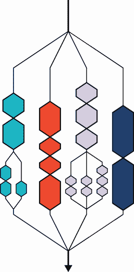
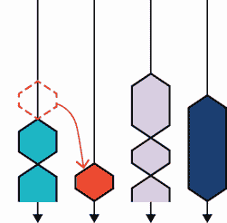
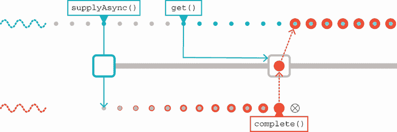
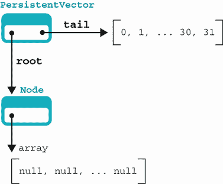
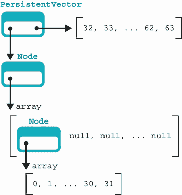
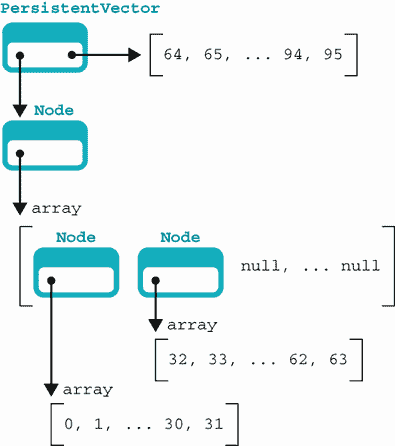
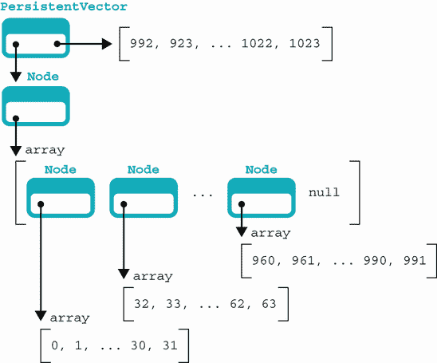
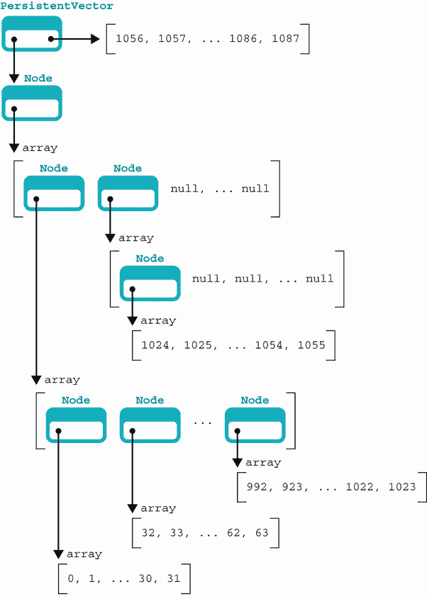
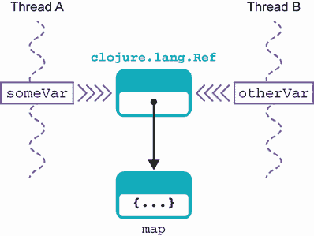

# 16 高级并发编程

本章涵盖

+   Fork/Join API

+   工作窃取算法

+   并发与函数式编程

+   Kotlin 协程背后的原理

+   Clojure 并发

+   软件事务内存

+   代理

在本章中，我们将结合前面章节中的几个主题。特别是，我们将把前面章节中的函数式编程概念与第六章中的 Java 并发库编织在一起。我们的非 Java 语言也包括在内，Kotlin 和 Clojure 的一些新颖并发特性将在本章后面出现。

注意：本章中的概念，如协程和代理（又称演员），也越来越多地成为 Java 并发领域的一部分。

我们将从一个小小的异常开始：Java Fork/Join API。这个框架允许一类并发问题比我们在第六章中看到的 executors 更有效地处理。

## 16.1 Fork/Join 框架

正如我们在第七章中讨论的那样，处理器速度（或者更确切地说，CPU 上的晶体管数量）在近年来大幅提高。I/O 性能并没有相同的显著改进，因此最终结果是等待 I/O 现在成为一种常见情况。这表明我们可以更好地利用我们计算机内部的处理器能力。Fork/Join（F/J）框架正是为了实现这一点而进行的尝试。

F/J 主要关于在用户不可见的线程池上自动调度任务。为此，任务必须能够以用户指定的方式进行拆分。在许多应用中，F/J 有一个关于“小任务”和“大任务”的概念，这对于框架来说是非常自然的。

让我们快速看一下与 F/J 相关的某些主要事实和基本概念：

+   框架引入了一种新的执行器服务类型，称为`ForkJoinPool`。

+   `ForkJoinPool`处理一个比`Thread`“更小”的并发单元（`ForkJoinTask`）。

+   `ForkJoinPool`可以通过更轻量级的方式对`ForkJoinTask`进行调度。

+   F/J 使用以下两种类型的任务（都表示为`ForkJoinTask`的实例）：

    +   “小任务”是指那些可以立即执行而不会消耗太多处理器时间的任务。

    +   “大任务”是指在直接执行之前需要拆分（可能需要多次拆分）的任务。

+   框架提供了基本方法来支持大任务的拆分。

+   框架具有自动调度和重新调度功能。

框架的一个关键特性是，预期这些轻量级任务可能会产生其他`ForkJoinTask`实例，这些实例将在执行其父任务的同一个线程池上进行调度。这种模式有时被称为*分而治之*。

我们将从使用 F/J 框架的简单示例开始，然后简要介绍适合这种并行处理方法的问题特征。然后我们将讨论 F/J 中使用的“工作窃取”功能及其在更广泛环境中的相关性。开始使用 F/J 的最佳方式是举一个例子。

### 16.1.1 一个简单的 F/J 示例

作为 F/J 框架能做什么的一个简单例子，考虑以下情况：我们在不同时间创建了一系列事务对象。我们将使用`Transaction`类来表示它们，如下所示，这是从第五章和第六章中遇到的`TransferTask`类演变而来的：

```
public class Transaction implements Comparable<Transaction> {
    private final Account sender;
    private final Account receiver;
    private final int amount;
    private final long id;
    private final LocalDateTime time;

    private static final AtomicLong counter = new AtomicLong(1);

    Transaction(Account sender, Account receiver,
                int amount, LocalDateTime time) {
        this.sender = sender;
        this.receiver = receiver;
        this.amount = amount;
        this.id = counter.getAndIncrement();
        this.time = time;
    }

    public static Transaction of(Account sender, Account receiver,
                                 int amount) {
        return new Transaction(sender, receiver,
                               amount, LocalDateTime.now());
    }

    @Override
    public int compareTo(Transaction other) {
        return Comparator.nullsFirst(LocalDateTime::compareTo)
                         .compare(this.time, other.time);
    }

    // Getter and other methods (equals, hashcode, etc) elided
}
```

我们希望获得一个按时间排序的事务列表。为了实现这一点，我们将使用 F/J 作为多线程排序——实际上是一种*归并排序*算法的变体。

我们的例子使用了`RecursiveAction`，它是`ForkJoinTask`的一个特殊子类。它比一般的`ForkJoinTask`简单，因为它明确表示没有整体结果（事务将在原地重新排序），并且强调任务的递归性质。

`TransactionSorter`类提供了一种使用`Transaction`对象的`compareTo()`方法对一系列更新进行排序的方法。`compute()`方法（你必须实现，因为它在`RecursiveAction`超类中是抽象的）基本上是按照创建时间对事务数组进行排序，如下一个列表所示。

列表 16.1 使用`RecursiveAction`进行排序

```
public class TransactionSorter extends RecursiveAction {
    private static final int SMALL_ENOUGH = 32;                            ❶
    private final Transaction[] transactions;
    private final int start, end;
    private final Transaction[] result;

    public TransactionSorter(List<Transaction> transactions) {
        this(transactions.toArray(new Transaction[0]),
             0, transactions.size());
    }

    public TransactionSorter(Transaction[] transactions) {
        this(transactions, 0, transactions.length);
    }

    public TransactionSorter(Transaction[] txns, int start, int end) {
        this.start = start;
        this.end = end;
        this.transactions = txns;
        this.result = new Transaction[this.transactions.length];
    }

    /**
     * This method implements a simple Mergesort. Please consult a suitable
     * textbook if you are interested in the implementation details.
     *
     * @param left
     * @param right
     */
    private void merge(TransactionSorter left, TransactionSorter right) {
        int i = 0;
        int lCount = 0;
        int rCount = 0;

        while (lCount < left.size() && rCount < right.size()) {
            int comp = left.result[lCount].compareTo(right.result[rCount]);
            result[i++] = (comp < 0)
                    ? left.result[lCount++]
                    : right.result[rCount++];
        }

        while (lCount < left.size()) {
            result[i++] = left.result[lCount++];
        }

        while (rCount < right.size()) {
            result[i++] = right.result[rCount++];
        }
    }

    public int size() {
        return end - start;
    }

    public Transaction[] getResult() {
        return result;
    }

    @Override
    protected void compute() {                                             ❷
        if (size() < SMALL_ENOUGH) {
            System.arraycopy(transactions, start, result, 0, size());
            Arrays.sort(result, 0, size());
        } else {
            int mid = size() / 2;
            TransactionSorter left =
                new TransactionSorter(transactions, start, start + mid);
            TransactionSorter right =
                new TransactionSorter(transactions, start + mid, end);
            invokeAll(left, right);

            merge(left, right);
        }
    }
}
```

❶ 32 个或更少的排序序列

❷ 在 RecursiveAction 中定义的方法

要使用排序器，你可以用一些像下面这样的代码来驱动它，这将生成一些事务并将它们打乱，然后再将它们传递给排序器。输出是重新排序的更新：

```
var transactions = new ArrayList<Transaction>();
var accs = new Account[] {
              new Account(1000),
              new Account(1000)};

for (var i = 0; i < 256; i = i + 1) {
  transactions.add(Transaction.of(accs[i % 2], accs[(i + 1) % 2], 1));
  Thread.sleep(1);
}
Collections.shuffle(transactions);

var sorter = new TransactionSorter(transactions);
var pool = new ForkJoinPool(4);

pool.invoke(sorter);

for (var txn : sorter.getResult()) {
  System.out.println(txn);
}
```

F/J 的承诺似乎很有吸引力，但在实践中，并不是每个问题都能像我们刚才讨论的多线程`MergeSort`那样简单地简化。

这是一个反模式“简单情况很简单”的例子，其中开发者可能会被一种看似简单的技术所吸引，这种技术允许通过非常少的努力完成简单的任务，但掩盖了技术无法扩展或很好地推广到不那么简单的情况的事实。我们应该谈谈那些可能通过使用 F/J 方法容易解决的问题，以及那些可能更适合其他方法的问题。

### 16.1.2 并行化适合 F/J 的问题

这里有一些适合 F/J 方法的典型问题示例：

+   模拟大量简单物体的运动（例如，粒子效果）

+   日志文件分析

+   数据操作，其中从一个聚合输入中计算出一个数量（例如，map-reduce 操作）

另一种看待这个问题的方式是说，一个好的 F/J 问题是可以分解的，如图 16.1 所示。



图 16.1 分支和合并

确定一个问题是否可能得到良好解决的一个实用方法是将以下清单应用于该问题和其子任务：

+   问题子任务能否在没有子任务之间显式合作或同步的情况下工作？

+   子任务是否从其数据中计算一些值而不改变它（即，它们是否是纯函数）？

+   对于子任务来说，分而治之是否是自然的？

如果对前面问题的答案是“是！”或“大多数情况下是，但有边缘情况”，那么你的问题可能非常适合 F/J 方法。另一方面，如果那些问题的答案是“可能”或“不是真的”，你可能会发现 F/J 的性能不佳，而另一种方法可能更有效。

设计良好的多线程算法很困难，F/J 并不适用于所有情况。它在自己的适用范围内非常有用，但最终，你必须决定你的问题是否适合该框架。如果不适合，你必须准备好开发自己的解决方案，这可能意味着在 `java.util.concurrent` 的出色工具箱之上构建。

### 16.1.3 工作窃取算法

`ForkJoinTask` 是 `RecursiveAction` 的超类。它是一个动作返回类型中的泛型类（因此 `RecursiveAction` 扩展 `ForkJoinTask<Void>`）。这使得 `ForkJoinTask` 非常适合将数据集归结为一种方法，并返回一个结果或通过副作用执行（正如 `RecursiveAction` 的情况）。

`ForkJoinTask` 类型的对象在 `ForkJoinPool` 上进行调度，这是一种专为这些轻量级任务设计的新的执行服务类型。服务为每个线程维护一个任务列表，如果一个任务完成，服务可以从满载的线程重新分配任务给空闲的线程。我们可以在图 16.2 中看到这种情况。



图 16.2 工作窃取：当第二个线程完成其任务时，服务将任务从仍然忙碌的第一个线程重新分配给第二个线程。

没有这个 *工作窃取算法*，可能会出现与两种任务大小相关的调度问题。一般来说，两种大小的任务可能需要非常不同的运行时间。

例如，一个线程可能只有一个由小任务组成的工作队列，而另一个线程可能只有大任务。如果小任务运行速度比大任务快五倍，那么只有小任务的线程很可能在大型任务线程完成之前就空闲了。

警告：工作窃取依赖于任务之间相互独立的假设。如果这个假设不成立，计算结果可能会在不同的运行中有所不同。

工作窃取（Work-stealing）被精确实现以解决此问题，并允许在整个 F/J 作业的生命周期中使用所有池线程。这是完全自动的，你不需要做任何具体的事情来获得工作窃取的好处。这是运行时环境为了帮助开发者管理并发而做更多工作的另一个例子。文档也明确指出：`ForkJoinPool` 也适用于与事件式任务一起使用，这些任务永远不会合并。

注意 `ForkJoinPool` 也用于流行的 Java/JVM 库中，例如 Scala 和 Java 中的基于演员的并发 Akka 系统。

要与 `ForkJoinPool` 交互，该类公开以下主要方法：

+   `execute()`—启动异步执行

+   `invoke()`—启动执行并等待结果

+   `submit()`—启动执行并返回结果的 future

自 Java 8 以来，运行时已包含一个公共池，通过 `ForkJoinPool.commonPool()` 访问。这主要提供其工作窃取功能——并不期望许多程序会将其用于递归分解。

公共池具有许多可配置的属性，可以设置以控制诸如并行级别（即使用多少线程）和用于为公共池创建新线程的线程工厂类等事项。

## 16.2 并发与函数式编程

在第五章中，我们遇到了不可变对象的概念，并展示了它们对于并发编程非常有用，因为它们避开了 *共享可变状态* 的问题，这是许多并发问题的核心。因此，我们可能会猜测，利用不可变性的函数技术对于构建并发应用程序是一个重要的工具。这是真的，但不可变性的一个小扩展也与并发编程相关。

### 16.2.1 重新审视 CompletableFuture

在第六章中，我们遇到了 `CompletableFuture` 类。这种类型不是不可变的，但它有一个非常简单的状态模型，下面将进行描述：

+   它从未完成状态开始。

+   任何尝试从其中获取 `get()` 值的尝试都将阻塞。

+   在某个稍后的时间，发生发布事件。

+   这将设置值并将其传递给任何阻塞在 `get()` 上的线程。

+   已发布的价值现在不可更改。

图 16.3 展示了未来和发布事件。



图 16.3 事件发布设置值并将其传递给任何阻塞在 `get()` 上的线程。

`CompletableFuture` 的一个重大优势是，可以组合带有结果的功能，并且结果将被延迟评估，也就是说，函数将在值到达之前不会执行。

这种函数组合可以同步或异步发生。这也许通过运行几个示例最容易看出。让我们重用第六章中提到的 `NumberService` 的想法，并使用一个模拟实现，例如：

```
public class NumberService {
    public static long findPrime(int n) {
        try {
            Thread.sleep(5_000);
        } catch (InterruptedException e) {
            throw new CancellationException("interrupted");
        }
        return 42L;
    }
}
```

这显然实际上并没有计算素数，但它足以演示线程行为，这是我们想要的目标。我们需要一些代码来驱动它，如下所示：

```
var n = 1000;
var future =
  CompletableFuture.supplyAsync(() -> {                                    ❶
  System.out.println("Starting on: "+ Thread.currentThread().getName());
  return NumberService.findPrime(n);
});
var f2 = future.thenApply(l -> {                                           ❷
  System.out.println("Applying on: "+ Thread.currentThread().getName());
  return l * 2;
});
var f3 = future.thenApplyAsync(l -> {                                      ❸
  System.out.println("Async on: "+ Thread.currentThread().getName());
  return l * 3;
});

try {
  System.out.println("F2: "+ f2.get());
  System.out.println("F3: "+ f3.get());
} catch (InterruptedException | ExecutionException e) {
  e.printStackTrace();
}
```

❶ 提供要异步运行的计算

❷ 为异步计算的结果提供要应用的功能

❸ 为结果提供另一个异步应用的功能

当我们运行这段代码时，我们会得到一些类似这样的输出：

```
Starting up on thread: ForkJoinPool.commonPool-worker-19
Applying on thread: ForkJoinPool.commonPool-worker-19
Applying async on thread: ForkJoinPool.commonPool-worker-5
F2: 84
F3: 126
```

使用`thenApply()`的`f2`未来将在与`future`相同的线程上执行，而`f3`（使用`thenApplyAsync()`）将在池中的不同线程上执行。

你可能会注意到，默认情况下，`CompletableFuture`代码的执行都使用公共池。这个池以`ForkJoinPool.commonPool`的名称出现，如前一个输出所示。

在某些情况下，开发者可能想要使用一个替代的线程池。例如，常见的线程池在可配置的最大线程数方面是不可配置的，这可能不适合某些工作负载。幸运的是，`CompletableFuture`的工厂方法，如`supplyAsync()`，提供了带有显式`Executor`参数的重载。这允许未来在特定的线程池上运行。

除了`thenApply()`方法外，`CompletableFuture`还提供了`thenCompose()`。一些开发者发现这两个方法之间的区别令人困惑，所以让我们花点时间来解释一下。

回想一下，`thenApply()`接受一个`Function`作为参数，该函数将`T`映射到`U`。这个函数在原始未来完成后的同步方式应用于`CompletableFuture`运行的任何线程上。

另一方面，`thenCompose()`接受一个将`T`映射到`CompletableFuture<U>`（实际的返回类型是`CompletionStage<U>`而不是`CompletableFuture<U>`，但现在我们先忽略这个细节）的`Function`。这实际上是一个异步函数（它可以在不同的线程上运行）。让我们看一个具体的例子：

```
Function<Long, CompletableFuture<Long>> f = l ->
  CompletableFuture.supplyAsync(() -> {
      System.out.println("Applying on thread: " +
                          Thread.currentThread().getName());
      return l * 2;
  });
```

我们*可以*将这个函数传递给`thenApply()`，但结果将会是一个`CompletableFuture<CompletableFuture<Long>>`。相反，`thenCompose()`会将结果扁平化回一个`CompletableFuture<Long>`。这类似于 Java Streams API 中的`flatMap()`方法——它将返回`Stream<T>`的函数应用到流对象上，但与返回`Stream<Stream<T>>`不同，它将独立的流扁平化并合并成一个单一的流。

`CompletableFuture`还支持`join()`，它本质上就像一个线程 join，但返回一个值。也可以通过让代码在任意（或两个）未来完成之后运行来“连接”未来。例如：

```
var n = 1000;
var future = CompletableFuture.supplyAsync(() -> {
    System.out.println("Starting up: "+ Thread.currentThread().getName());
    return NumberService.findPrime(n);
});

var future2 = CompletableFuture.supplyAsync(() -> {
    System.out.println("Starting up: "+ Thread.currentThread().getName());
    return NumberService.findPrime(n);
});

Runnable dontKnow = () -> System.out.println("One of the futures finished");
future.runAfterEither(future2, dontKnow);
```

现在，我们希望将上一章中关于函数式编程的讨论与这里的思想结合起来。

如果我们想要应用于 `CompletableFuture` 结果的函数是纯函数且不依赖于任何东西，只依赖于输入值，那么将函数应用于未来的操作与将函数应用于结果的操作相同。换句话说：如果将未来视为一个容器类型，它包含一个值，那么容器对于应用于该值的函数来说是“透明的”，一旦值到达，容器就不再存在。

特别是，引用透明度（例如，使用纯函数）的两个主要好处如下：

+   缓存。

+   可移植性。

第一个意思是任何纯函数调用都可以替换为已计算出的值——我们不需要用相同的参数重新运行函数调用，因为我们已经知道答案了。其次，当然，如果我们正在计算一个纯函数，那么它发生在哪个线程上并不重要，所以无论我们是否提供了同步或异步应用函数，都不会影响结果。

注意，如前所述，Java 是一种相当不纯的语言，因此许多这些好处只有在程序员小心地使用纯函数和不可变数据时才会适用。

当我们在讨论并发函数式编程时，似乎有必要谈谈 *并行流*，这是许多开发者误解的 Streams API 的一个领域。

### 16.2.2 并行流

在第五章中，我们遇到了阿姆达尔定律，这是关于数据并行性的基本结果之一。这是我们处理大量非常相似且必须以更多或更少相同方式处理的大批量数据时经常想要使用的并发方法。一般来说，如果以下所有条件都成立，数据并行方法是有用的：

+   你需要处理大量以相同（或非常相似）方式处理的数据。

+   排序不重要。

+   项之间相互独立。

+   你可以显示特定的处理步骤是瓶颈。

并行流是一种数据并行类型，许多 Java 开发者在 Java 8 中将其包含进来时非常兴奋。然而，正如我们将看到的，现实与最初的希望大相径庭。这里显示的 API 看起来足够简单：

```
// Just replace stream() with parallelStream()
List<String> origins = musicians
      .parallelStream()
      .filter(artist -> artist.getName().startsWith("The"))
      .map(artist -> artist.getNationality())
      .collect(toList());
```

在底层，工作是通过 F/J 框架进行分布式处理的，并使用工作窃取算法将计算分散到多个核心上。以下内容看起来好得令人难以置信：

+   工作由框架管理。

+   API 旨在明确但又不显眼。

+   按数据分布。

+   `parallelStream()` 允许程序员在顺序和并行之间切换。

+   “免费加速”。

事实上，这确实好得令人难以置信。第一个且最明显的问题是阿姆达尔定律。要将顺序任务分割成可以并行执行的一组块，需要做工作——即计算时间。准备和通信开销越大，多处理器提供的益处就越少——这就是阿姆达尔定律的本质。

没有一种简单可靠的方法可以轻松地估计拆分与线性操作成本之间的相对成本。框架将决定是否值得并行化的认知成本转回给开发者。这听起来就像“自动并行化”并不是曾经承诺的极乐境界。相反，最终用户必须对许多理想的抽象化细节有敏锐的认识。

仅举一个例子：拆分和重新组合的工作必须在 JVM 内部的线程池中完成。JVM 创建的线程越多，它们对 CPU 时间的竞争就越激烈。Streams API 并非事先就知道当前进程中存在多少个并行流的实例。这导致了以下两种同样令人不快的策略：

+   为并行流的每次调用创建一个新的、专用的线程池。

+   创建一个线程池的单个实例（私有于 JVM），并使所有并行流的调用都使用它。

第一种选择可能导致线程的无界创建，最终会饿死或崩溃 JVM。因此，在 Java 8 中，并行流下面有一个单一的共享线程池：`ForkJoinPool.commonPool()`。这个选择可能导致对共享资源的潜在竞争（正如我们在第七章中看到的，这是许多性能问题的真正根源）。

有一个解决方案：如果你将并行流作为一个任务在 `ForkJoinPool` 上执行，它将在这里执行，而不是使用公共池，如下所示：

```
// Use a custom pool
var forkJoinPool = new ForkJoinPool(4);
List<String> origins2 = forkJoinPool.submit(() -> musicians
    .parallelStream()
    .filter(artist -> artist.getName().startsWith("The"))
    .map(artist -> artist.getNationality())
    .collect(toList())).get();
forkJoinPool.shutdown();
```

注意，`forkJoinPool` 必须显式关闭，否则它将保留在内存中等待新任务，从而泄漏内存和线程。

通常，关于并行流的最佳建议是不要盲目地应用并行化。相反，实际上展示你有使用它的用例。像往常一样，这是通过测量并展示流操作确实是瓶颈，然后再尝试看并行流是否有所帮助来完成的。

不幸的是，没有一类问题可以预期并行流可能有所帮助。每个案例都必须从基本原则出发进行检验和测试。只有在这种情况下，你才能尝试将并行性应用于流，并通过数据证明可以取得有价值的改进。

## 16.3 Kotlin 协程的内部机制

正如我们在第九章中介绍的，Kotlin 为并发提供了一个对 `Thread` 模型的替代方案，即 *协程*。协程可以被视为“轻量级线程”，它们没有完整操作系统线程的资源惩罚。这与 Java 的 Fork/Join 有一些相似之处。Kotlin 是如何提供这种替代执行方式的？对表面之下发生的事情有更深入的了解是必要的。

### 16.3.1 协程的工作原理

让我们从第九章中看到的修改后的例子开始：

```
package com.wgjd

import kotlinx.coroutines.GlobalScope
import kotlinx.coroutines.delay
import kotlinx.coroutines.launch

fun main() {
  GlobalScope.launch {
    delay(1000)
    sus()
  }

  Thread.sleep(2000)
}

suspend fun sus() {
  println("Totally sus...")
}
```

这里我们使用`GlobalScope.launch`来启动一个新的协程。*作用域*用于表达协程应该如何运行，我们将在下一节更仔细地研究它们。

我们在这里创建的协程将使用`delay`函数等待一秒，然后调用我们的函数`sus`。最后，我们使用`Thread.sleep`等待 2 秒，以确保在程序完全退出之前协程有足够的时间完成。

协程与线程的不同之处在于，它们的执行可能在特定的点暂停。Kotlin 是如何知道它可以暂停的地方呢？这来自于我们放在`sus`函数上的`suspend`关键字（以及库提供的`delay`函数）。`suspend`函数标记了 Kotlin 将其视为执行单元的代码块。

在我们的协程中，`suspend`函数标记了代码块，在这些代码块之间我们可以暂停，Kotlin 可以创建一个*状态机*来管理协程的执行。通过我们生成的代码跟踪状态机的进度，我们的`suspend`定义的块提供了到达该机器的步骤。

让我们将我们的协程转换成这样的状态机：

```
  GlobalScope.launch {
    delay(1000)
    sus()
  }
```

我们协程的步骤如下，并在图 16.4 中展示：

+   通过调用`launch`创建我们的新协程实例。

+   通过`delay`执行。

+   控制权返回到 Kotlin，它将等待请求的 1 秒。

+   在`delay`之后恢复，并通过`sus`执行。

+   将控制权交还给 Kotlin，这次不需要暂停。

+   在`sus`之后恢复，并完成协程。


图 16.4 协程状态机

这种步骤分解清楚地说明了为什么协程有时被描述为“协作式多任务处理”。在调用`suspend`函数之间的代码是同步执行的，`suspend`点提供了唯一的暂停和执行其他协程步骤的机会。想象一下，在`delay`和`sus`之间我们进入了一个无限循环。这个循环将永远阻塞它正在执行的任何线程。

这个状态机不仅仅是一个想法——Kotlin 直接生成执行此操作的代码，我们可以检查它。让我们看看我们之前函数的输出，看看它是如何被转换的。（注意，为了长度和清晰度，省略了一些细节。）

我们基本应用程序的编译结果比我们预期的有更多的类文件。例如，以下是 Gradle 构建目录下的结果输出：

```
build
└── classes
     └── kotlin
          └── main
               └── com
                    └── wgjd
                         ├── MainKt$main$1.class
                         └── MainKt.class
```

我们在第九章遇到了`MainKt.class`。Kotlin 透明地创建了一个用于顶层函数的持有类，因为 JVM 原生不支持自由浮动的函数，必须将所有方法代码放在某个类中。

同时，我们还有一个新的类：`MainKt$main$1.class`。反汇编这个类文件揭示 Kotlin 为我们的协程创建了类似的“秘密”类，就像它为我们顶级函数所做的那样。这个生成的类代表我们协程的单次执行。正如我们接下来可以看到的，这个生成的类是我们代码和将我们编写的作为协程运行的管道的混合体：

```
final class com.wgjd.MainKt$main$1
    extends kotlin.coroutines.jvm.internal.SuspendLambda    ❶
    implements kotlin.jvm.functions.Function2<              ❷
        kotlinx.coroutines.CoroutineScope,
        kotlin.coroutines.Continuation<? super kotlin.Unit>,
        java.lang.Object> {
```

❶ 我们生成的类从 Kotlin 的 SuspendLambda 获取功能。

❷ 我们生成的类实现了调用代码将用来调用我们的协程的特定接口。

如果我们检查 `MainKt.class` 中从我们的 `main` 函数生成的代码，我们看到 Kotlin 创建了一个我们的协程实例然后调用了它：

```
Compiled from "Main.kt"
public final class com.wgjd.MainKt {

  public static final void main();
    Code:
       0: getstatic     #41  // Field                                      ❶
                             // kotlinx/coroutines/GlobalScope.INSTANCE:
                             // Lkotlinx/coroutines/GlobalScope;
       3: checkcast     #43  // class kotlinx/coroutines/CoroutineScope
       6: aconst_null
       7: aconst_null
       8: new           #45  // class com/wgjd/
                             // MainKt$main$1                              ❷
      11: dup
      12: aconst_null
      13: invokespecial #49  // Method com/wgjd/MainKt$main$1."<init>":
                             // (Lkotlin/coroutines/Continuation;)V
      16: checkcast     #51  // class kotlin/jvm/functions/Function2
      19: iconst_3
      20: aconst_null
      21: invokestatic  #57  // Method kotlinx/coroutines/
                             // BuildersKt.launch$                         ❸
                             // default:(Lkotlinx/coroutines/CoroutineScope;
                             // Lkotlin/coroutines/CoroutineContext;
                             // Lkotlinx/coroutines/CoroutineStart;
                             // Lkotlin/jvm/functions/Function2;
                             // ILjava/lang/Object;)Lkotlinx/coroutines/Job;
      24: pop
      25: ldc2_w        #58  // long 2000l
      28: invokestatic  #65  // Method java/lang/Thread.sleep:(J)V
      31: return
```

❶ 获取全局作用域实例以启动我们的协程

❷ 创建并初始化我们生成的协程类的新实例

❸ 调用 `launch` 方法，向其提供作用域和我们的协程实例。特别是，我们的协程实例作为 Function2 参数传递。

在 `launch` 方法中的代码将开始调用我们生成的协程实例上的方法，运行我们的状态机。让我们看看实现该状态机的字节码。首先，协程实例有两个单独的字段。这些跟踪协程作用域和我们在状态机中的当前位置：

```
final class com.wgjd.MainKt$main$1
    extends kotlin.coroutines.jvm.internal.SuspendLambda
    implements kotlin.jvm.functions.Function2<
        kotlinx.coroutines.CoroutineScope,
        kotlin.coroutines.Continuation<? super kotlin.Unit>,
        java.lang.Object> {

  java.lang.Object L$0;    ❶

  int label;               ❷
```

❶ 当前执行的协程作用域

❷ 表示我们状态机当前步骤的整数值

当我们的状态机运行时，其核心是一个基于这些字段决定我们下一步的方法。Kotlin 为此目的生成一个名为 `invokeSuspend` 的方法。`invokeSuspend` 最终成为我们代码和跟踪我们进度的状态机的混合体。在我们的协程生命周期内，每当协程准备好执行下一个步骤时，Kotlin 都会重复调用 `invokeSuspend`。

下一个代码片段展示了 `invokeSuspend` 的开始，以及从状态机中的第一个步骤（从协程的启动到我们调用 `delay`）：

```
public final java.lang.Object invokeSuspend(java.lang.Object);
    Code:
       0: invokestatic  #36  // Method kotlin/coroutines/intrinsics/
                             // IntrinsicsKt.getCOROUTINE_SUSPENDED:
                             // ()Ljava/lang/Object;
       3: astore_3
       4: aload_0
       5: getfield      #40  // Field label:I                              ❶
       8: tableswitch   {    // 0 to 2
                     0: 36
                     1: 69
                     2: 104
               default: 122
          }
      36: aload_1                                                          ❷
      37: invokestatic  #46  // Method kotlin/ResultKt.throwOnFailure:
                             // (Ljava/lang/Object;)V
      40: aload_0
      41: getfield      #48  // Field p$:Lkotlinx/coroutines/CoroutineScope;
      44: astore_2
      45: ldc2_w        #49  // long 1000l
      48: aload_0
      49: aload_0
      50: aload_2
      51: putfield      #52  // Field L$0:Ljava/lang/Object;
      54: aload_0
      55: iconst_1
      56: putfield      #40  // Field label:I
      59: invokestatic  #58  // Method kotlinx/coroutines/DelayKt.delay:
                             // (JLkotlin/coroutines/Continuation;)
                             // Ljava/lang/Object;
      62: dup
      63: aload_3
      64: if_acmpne     82
      67: aload_3
      68: areturn
      69: aload_0                                                          ❸
      70: getfield      #52  // Field L$0:Ljava/lang/Object;
      73: checkcast     #60  // class kotlinx/coroutines/CoroutineScope

      // Further steps excluded for length.
      // See resources for full listing
```

❶ 确定状态机中的下一步

❷ 首个步骤的开始（直到调用延迟）

❸ 第二个步骤的开始（直到调用 `suspend`），这将在再次调用 `invokeSuspend` 时发生

在收集当前协程的信息后，字节 5 从 `label` 字段加载我们即将执行的步骤。然后在字节 8，它使用我们之前未见过的操作码 `tableswitch`。这个操作码查看栈上的值并根据定义的值跳转。因为这是我们第一次通过 `invokeSuspend`，我们的 `label` 的值为 0，然后我们继续到字节 36。从这里开始线性执行。在字节 55 和 56，我们更新我们的状态 `label` 为 1 并前进到下一步。我们在字节 59 调用 `delay`，然后在字节 68 从 `invokeSuspend` 返回。

在这个点上，Kotlin 的代码获得了控制权，并决定何时运行协程的下一步。当它确定时机合适时，它将在相同的协程实例上调用 `invokeSuspend`。我们的状态 `label` 将被设置为 1，然后我们跳到执行第二个步骤的代码，在 `delay` 之后但在我们的 `sus` 调用之前。

虽然在日常使用协程时真正深入到底层字节码级别并非必要，但理解其机制是有价值的。对于那些基础扎实的开发者来说，当某个特性看起来过于神奇时，也不应该感到满足。毕竟，所有这些都是一次执行一条指令的代码，而我们拥有理解它的工具。

这次检查也可能回答第 15.3.7 节中的一些问题，在那里我们看到了在定义 Kotlin 序列时使用 `yield` 函数。在那个点上，我们稍微挥了挥手，关于我们的 lambda 定义序列的函数如何“暂停”其执行。实际上，这是使用基于 `suspend` 函数生成的状态机机制。每次对 `invokeSuspend` 的连续调用都会获取序列中的下一个项目。

### 16.3.2 协程作用域和调度

尽管协程为标准操作系统线程模型提供了不同的抽象，但在表面之下，我们的代码仍然在某个线程中执行。Kotlin 协程如何管理和协调这项工作由协程作用域和 *调度器* 管理。

让我们修改我们的示例，看看协程的每个步骤实际上在哪里执行：

```
package com.wgjd

import kotlinx.coroutines.GlobalScope
import kotlinx.coroutines.delay
import kotlinx.coroutines.launch

fun main() {
  GlobalScope.launch {
    println("On thread ${Thread.currentThread().name}")
    delay(500)

    println("On thread ${Thread.currentThread().name}")
    delay(500)

    println("On thread ${Thread.currentThread().name}")
  }

  Thread.sleep(2000)
}
```

结果并不是确定性的，但看起来可能像这样：

```
On thread DefaultDispatcher-worker-1
On thread DefaultDispatcher-worker-2
On thread DefaultDispatcher-worker-1
```

我们线程的名称提供了两个有趣的信息：一个调度器（`DefaultDispatcher`）的名称和一个数字，表示我们正在使用可用池中的哪个线程。当我们请求特定的作用域时——在我们的例子中，是整个应用程序生命周期的 `GlobalScope`——我们选择的部分包括调度器，它决定了我们的工作是如何实际调度的。

假设我们想要对工作调度有更大的控制权。我们不是使用 `GlobalScope`，而是可以创建自己的、独立的 `CoroutineScope` 实例，如下所示。通常，一个作用域与我们的系统中不同的对象相关联，具有其特定的生命周期。我们的自定义作用域在构造时需要一个上下文，标准函数工厂方法主要根据它们如何配置调度来识别：

```
  val context: CoroutineContext = newFixedThreadPoolContext(3, "New-Pool")

  CoroutineScope(context).launch {
    println("On thread ${Thread.currentThread().name}")
    delay(500)

    println("On thread ${Thread.currentThread().name}")
    delay(500)

    println("On thread ${Thread.currentThread().name}")
  }
```

并非特别令人惊讶的输出显示我们正在执行与之前完全不同的线程集：

```
On thread New-Pool-1
On thread New-Pool-2
On thread New-Pool-1
```

注意：值得注意，因为 `newFixedThreadPoolContext` 和其他相关函数已被标记为过时，但截至本文撰写时，它们的替代品尚不可用。请查看 Kotlin 协程文档 [`kotlin.github.io/kotlinx.coroutines`](https://kotlin.github.io/kotlinx.coroutines) 以获取最新的实践方法。

上下文类不仅封装了协程的调度器，还可以提供额外的信息。我们可以提供的信息示例包括为我们的协程命名（这改善了 IDE 中的调试体验，尤其是在许多协程共享调度器时）和通用错误处理器。元素可以通过`plus`函数添加到现有的上下文对象中，如下所示：

```
  val context: CoroutineContext = newFixedThreadPoolContext(3, "New-Pool")
    .plus(CoroutineExceptionHandler { _, thrown ->
        println(thrown.message + "!!!!") })
    .plus(CoroutineName("Our Coroutine"))

  CoroutineScope(context).launch {
    throw RuntimeException("Failed")
  }
```

除了在异常抛出时自动取消协程之外，我们的`CoroutineExceptionHandler`将被执行并打印“Failed!!!!”。您可能希望考虑为您的生产应用程序制定更彻底的错误处理策略，但协程提供了必要的钩子。

想要并行执行各种步骤，然后再继续之前需要那些阶段的结果，这种情况并不少见。在协程中，这可以通过`async`函数来实现，如下所示，它返回一个`Deferred<T>`——实际上是一个允许等待和检索值的协程`Job`：

```
GlobalScope.launch {
    val result: Deferred<Int> = async {
      10;
    }

    println("Got ${result.await()}")    ❶
  }
```

❶ 毫不意外，打印出“Got 10”

在 9.5 节中，我们看到了默认情况下，协程会在错误发生时取消整个协程层次结构，如下所示：

```
  val failed = GlobalScope.launch {
    launch { throw RuntimeException("Failing...") }
  }

  Thread.sleep(2000)                               ❶

  println("Cancelled ${failed.isCancelled}")       ❷
```

❶ 给予时间完成执行

❷ 打印取消为 true

当你需要它时，这种行为非常强大。然而，这并不总是可取的。如果某些子协程可以安全失败，我们可以用`supervisorScope`将它们包装起来，如下所示。这就像一个典型的协程包装器，但不会向上传递取消操作：

```
  val supervised = GlobalScope.launch {
    supervisorScope {
      launch { throw RuntimeException("Failing...") }
    }
  }

  Thread.sleep(2000)                               ❶

  println("Cancelled ${supervised.isCancelled}")   ❷
```

❶ 再次，需要时间来完成

❷ 打印取消为 false，表示我们的主管允许子协程失败而不取消父协程

协程为我们提供了许多处理并发执行的方式。尽管它们不是思考世界的唯一替代方式，但它们提供了很多选项。让我们看看 Clojure 能带来什么。

## 16.4 并发 Clojure

Java 的状态模型从根本上基于可变对象的概念。正如我们在第五章中看到的，这直接导致并发代码中的安全问题。我们需要引入相当复杂的锁定策略来防止其他线程在给定线程正在修改对象状态时看到中间状态（即*不一致*的对象状态）。这些策略很难想出来，很难调试，更难测试。

Clojure 有不同的看法，其并发抽象在某些方面并不像 Java 那样低级。例如，使用由 Clojure 运行时（开发者几乎无法控制）管理的线程池可能看起来很奇怪。但获得的力量来自于允许平台（在这种情况下，是 Clojure 运行时）为你做账本记录，让你有更多精力去处理更重要的任务，比如整体设计。

总体而言，Clojure 的哲学是默认将线程彼此隔离，这有助于使语言默认情况下并发类型安全。通过假设基线为“不需要共享任何东西”并使用不可变值，Clojure 避免了许多 Java 的问题，并且可以专注于安全共享状态以进行并发编程的方法。

注意：为了促进安全性，Clojure 的运行时提供了线程间协调的机制，强烈建议您使用这些机制，而不是尝试使用 Java 习惯用法或创建自己的并发结构。

让我们看看这些构建块中的第一个：持久化数据结构。

### 16.4.1 持久化数据结构

一种 *持久化数据结构* 是在修改时保留先前版本的。因此，它们是线程安全的，因为对它们的操作不会改变现有读者所看到的结构，而是始终产生一个新的更新对象。

所有 Clojure 集合都是持久的，并允许通过使用 *结构共享* 高效地创建修改后的副本。集合本质上是线程安全的，并且设计得非常高效。

需要注意的是，Clojure 的持久化集合不允许原地修改或删除元素。如果您的程序调用 Java 集合接口（如 `List` 或 `Map`）的这些方法，它们将抛出 `UnsupportedOperationException`。相反，预期持久化集合将通过 `(cons)` 和 `(conj)` 等操作构建，遵循 Lisp 传统。

所有集合都支持以下基本方法：

+   `count` 获取集合的大小。

+   `cons` 和 `conj` 向集合中添加元素。

+   `seq` 获取一个可以遍历集合的序列。

因此，所有序列函数都可以通过 `seq` 的支持与任何集合一起使用。让我们看一个例子——Clojure 的 `PersistentVector`——从一些 Java 代码开始，展示如何通过重复使用 `(cons)` 添加新元素来构建向量：

```
var aList = new ArrayList<PersistentVector>();
var vector = PersistentVector.EMPTY;
for (int i=0; i < 32; i = i + 1) {
    vector = vector.cons(i);
    aList.add(vector);
}
System.out.println(aList);
```

这将输出类似以下内容

```
[[0], [0 1], [0 1 2], [0 1 2 3],

...

[0 1 2 3 4 5 6 7 8 9 10 11 12 13 14 15 16 17 18 19 20 21 22 23 24 25 26 27
 28 29 30 31]]
```

这表明，如果您需要，可以保留持久向量的每个早期版本。这也意味着可以在线程之间传递向量，并且每个线程都可以修改它，而不会影响其他线程。

让我们快速看一下这种数据结构的实现方式。回想一下，其他语言中基于数组的结构（如向量）通常是通过一个单一的连续内存块实现的。这种实现使得索引操作，如查找，非常快，但对于像创建向量的修改副本（同时保留原始副本）这样的操作，我们必须复制整个支持数组。

Clojure 的`PersistentVector`非常不同。相反，Clojure 将向量的元素存储在 32 个元素的块中。一般思路是，如果添加了一个元素，只需要复制当前的 32 个元素的*尾部*。如果一个向量添加了超过 32 个元素，就会创建一个称为*节点*的结构，它包含一个 32 个元素的数组，这些元素本身是包含完整 32 个元素数组的节点的引用。

注意`PersistentVector`是 Clojure 的核心抽象之一，它被广泛使用，实际上是在 Java（而不是 Clojure）中实现的，因为它需要启动 Clojure 语言运行时。

类定义看起来像这样（为了清晰起见略有简化）：

```
public class PersistentVector extends APersistentVector
                              implements IObj, ... {

    // ...

    public final PersistentVector.Node root;
    public final Object[] tail;
    private final int cnt;

    // ...

    public static final PersistentVector EMPTY;
    public static final PersistentVector.Node EMPTY_NODE;

   // ...
}
```

内部类`PersistentVector.Node`定义如下：

```
public static class Node implements Serializable {
        public final transient AtomicReference<Thread> edit;
        public final Object[] array;

        public Node(AtomicReference<Thread> edit, Object[] array) {
            this.edit = edit;
            this.array = array;
        }

        Node(AtomicReference<Thread> edit) {
            this.edit = edit;
            this.array = new Object[32];
        }
    }
```

注意，`array`字段只是一个`Object[]`。这是 Clojure 动态类型特性的一部分——这里没有泛型。

此外，Clojure 在其核心中频繁使用公共最终字段，并不总是定义访问器方法。因此，我们可以查看数据结构内部，看看节点是如何工作的。例如：

```
var vector = PersistentVector.EMPTY;
for (int i = 0; i < 32; i = i + 1) {
    vector = vector.cons(i);
}
System.out.println(Arrays.toString(vector.tail));
System.out.println(Arrays.toString(vector.root.array));
System.out.println("----------------");
for (int i=32; i < 64; i = i + 1) {
    vector = vector.cons(i);
}
System.out.println(Arrays.toString(vector.tail));
System.out.println(Arrays.toString(vector.root.array));
var earlier = (PersistentVector.Node)(vector.root.array[0]);
System.out.println("Earlier: "+ Arrays.toString(earlier.array));
```

产生如下输出：

```
[0, 1, 2, 3, ... 31]
[null, null, null, null, ... null]
----------------
[32, 33, 34, 35,  ...  63]
[clojure.lang.PersistentVector$Node@783e6358, null, null, null, ... null]
Full Tail: [0, 1, 2, 3, ... 31]
```

添加了 64 个元素之后，`tail`将是`[32, ... 63]`，而`root.array`包含一个单一的`PersistentVector.Node`，其数组字段包含元素`[0, ... 31]`。因此，在图示形式上，对于 0 到 32 个元素，向量看起来像图 16.5。



图 16.5 一个包含 32 个元素的持久向量

对于超过 32 个元素但少于 64 个元素的数目，结构将类似于图 16.6。



图 16.6 一个包含 64 个元素的持久向量

对于 64 到 96 个元素，其结构将类似于图 16.7，依此类推。



图 16.7 一个包含 96 个元素的持久向量

你可能会合情合理地问，当所有节点的数组槽位都满了会发生什么。这发生在向量包含 32 + (32 * 32)——或 1,056——个元素时。读者可能期望这个数字是 1,024，但我们还有*尾部*，它包含 32 个元素——实际上是一个“偏移一个”的效果。一个包含一个`Node`层级的完整`PersistentVector`可以在图 16.8 中看到。



图 16.8 一个包含 1,056 个元素的持久向量

如果我们继续添加元素，树结构将再增加一个层级，如图 16.9 所示。



图 16.9 一个包含许多元素的持久向量

要在代码中看到这一点，我们可以运行一些这样的代码：

```
var vector = PersistentVector.EMPTY;
for (int i = 0; i < 1088; i = i + 1) {
    vector = vector.cons(i);
}
System.out.println(Arrays.toString(vector.tail));
System.out.println(Arrays.toString(vector.root.array));
System.out.println();

var v0 = (PersistentVector.Node) (vector.root.array[0]);
var v1 = (PersistentVector.Node) (vector.root.array[1]);
System.out.println("r.a[0] : " + Arrays.toString(v0.array));
System.out.println("r.a[1] : " + Arrays.toString(v1.array));
System.out.println();

var v0A0 = (PersistentVector.Node)(((PersistentVector.Node)v0).array[0]);
var v0A31 = (PersistentVector.Node)(((PersistentVector.Node)v0).array[31]);
var v1A0 = (PersistentVector.Node)(((PersistentVector.Node)v1).array[0]);
System.out.println("r.a[0].a[0] : " + Arrays.toString(v0A0.array));
System.out.println("r.a[0].a[31] : " + Arrays.toString(v0A31.array));
System.out.println("r.a[1].array[0] : " + Arrays.toString(v1A0.array));

```

这会产生如下输出：

```
[1056, 1057, 1058, 1059, ... 1087]
[clojure.lang.PersistentVector$Node@2344fc66,
clojure.lang.PersistentVector$Node@458ad742, null, null, ... null]

r.a[0] : [clojure.lang.PersistentVector$Node@735f7ae5,
          clojure.lang.PersistentVector$Node@180bc464, ... ,
          clojure.lang.PersistentVector$Node@617c74e5]
r.a[1] : [clojure.lang.PersistentVector$Node@6ea12c19, null, ... , null]

r.a[0].a[0] : [0, 1, ... , 31]
r.a[0].a[31] : [992, 993, ... , 1023]
r.a[1].a[0] : [1024, 1025, ... , 1055]
```

注意在这个例子中，`v0`和`v1`的数组字段不再包含`Integer`元素，而是现在包含`Node`对象。这就是为什么`array`字段被类型化为`Object[]`，以允许这种动态类型。

注意：如果我们继续添加元素，我们将构建一个多层结构，这允许 `PersistentVector` 处理任何大小的向量（尽管对于更大的向量，间接成本会不断增加）。

然而，数据结构并不是 Clojure 需要成为成功并发语言所需要的一切。例如，并发模型和执行的概念绝对至关重要。幸运的是，Clojure 已经为您提供了这些！

实际上，Clojure 使用多种方法来提供不同类型的并发模型：futures 和 pcalls、refs 和 agents。让我们逐一查看，从最简单的一个开始。

### 16.4.2 Futures 和 pcalls

我们首先应该明确，您可以通过利用 Clojure 对 Java 的紧密绑定来启动新线程。您在 Java 中能做的事情，在 Clojure 中也能做，并且您可以在 Clojure 中非常容易地编写并发 Java 代码。

然而，Java 的一些抽象在 Clojure 中有一种清理后的形式。例如，Clojure 提供了一个非常干净的方法来处理我们在第六章中在 Java 中遇到的 `Future` 概念。下面的列表显示了一个简单的示例。

列表 16.2 Clojure 中的 Future

```
user=> (def simple-future
  (future (do
        (println "Line 0")
        (Thread/sleep 10000)
        (println "Line 1")
        (Thread/sleep 10000)
        (println "Line 2"))))

#'user/simple-future
Line 0                                ❶
user=> (future-done? simple-future)
user=> false
Line 1
user=> @simple-future                 ❷
Line 2
nil
user=>
```

❶ 立即开始执行

❷ 解引用时的阻塞

在这个列表中，您使用 `(future)` 设置一个 Future。一旦创建，它就会在后台线程上开始运行，这就是为什么您在 Clojure REPL 上看到第 0 行（以及后来的第 1 行）的打印输出——代码已经开始在另一个线程上运行。

您可以使用 `(future-done?)` 来测试代码是否已完成，这是一个非阻塞调用（类似于 Java 中的 `isDone()`）。然而，尝试解引用 future 会导致调用线程阻塞，直到函数完成。

这实际上是一个简单的 Clojure 包装器，覆盖了 Java Future，并有一些稍微干净的语法。Clojure 还提供了对并发程序员非常有用的辅助形式。一个简单的函数是 `(pcalls)`，它接受一个零参数函数的变量数量，并并行执行它们。

注意 `(pcalls)` 与 Java 的 `ExecutorService.invokeAll()` 辅助方法有些类似。

调用在运行时管理的线程池上执行，并将返回一个惰性序列的结果。尝试访问尚未完成的序列中的任何元素将导致访问线程阻塞。

列表 16.3 设置一个名为 `(wait-with-for)` 的一参数函数。这使用一个类似于第 10.2.5 节中引入的循环形式。从这个循环中，您创建了一系列零参数函数——`(wait-1)`、`(wait-2)` 等等，您可以将它们馈送到 `(pcalls)`。

列表 16.3 Clojure 中的并行调用

```
user=> (defn wait-with-for [limit]
  (let [counter 1]
    (loop [ctr counter]
      (Thread/sleep 500)
      (println (str "Ctr=" ctr))
    (if (< ctr limit)
      (recur (inc ctr))
    ctr))))
#'user/wait-with-for

user=> (defn wait-1 [] (wait-with-for 1))
#'user/wait-1

user=> (defn wait-2 [] (wait-with-for 2))
#'user/wait-2

user=> (defn wait-3 [] (wait-with-for 3))
#'user/wait-3

user=> (def wait-seq (pcalls wait-1 wait-2 wait-3))
#'user/wait-seq
Ctr=1
Ctr=1
Ctr=1
Ctr=2
Ctr=2
Ctr=3

user=> (first wait-seq)
1

user=> (first (next wait-seq))
2
```

使用仅 500 毫秒的线程睡眠值，等待函数会非常快地完成。通过调整超时（例如，将其扩展到 10 秒），很容易验证由 `(pcalls)` 返回的名为 `wait-seq` 的惰性序列具有描述的阻塞行为。

这种对简单多线程结构的访问对于不需要共享状态的情况是好的，但在许多应用中，不同的处理线程需要在飞行中通信。Clojure 有几个处理这种情况的模型，所以让我们看看下一个：由`(ref)`形式启用的共享状态，该状态在事务中处理。

### 16.4.3 软件事务内存

第一种，也是最明显的方法是不共享状态。事实上，我们到目前为止一直在使用的 Clojure 构造，即`var`，实际上并不能被共享。如果两个不同的线程继承了同一个`var`的名称并在线程内重新绑定它，那么这些重新绑定只对那些个别线程可见，并且永远不会被其他线程共享。

这是由设计决定的，Clojure 提供了一个在线程之间共享状态的替代方法：*ref*。这个概念依赖于运行时提供的模型，该模型用于需要被多个线程看到的状态更改。该模型有效地在符号和值之间引入了一个额外的间接层——也就是说，一个符号绑定到一个值的引用，而不是直接绑定到值。

系统本质上具有事务性，对底层值的更改由 Clojure 运行时进行协调。这如图 16.10 所示。



图 16.10 软件事务内存

这种间接性意味着在 ref 可以被更改或更新之前，它必须被放置在一个事务中。当事务完成时，所有的更新要么全部生效，要么全部不生效，这显然与数据库中的事务有明显的类比。

这可能看起来有点抽象，所以让我们回到一个更早的例子，我们在第五章和第六章讨论过的`Account`类。回想一下，为了避免像丢失更新这样的并发问题，在 Java 中，你必须使用锁来保护每一点敏感数据，如下所示：

```
    // ...

    private final Lock lock = new ReentrantLock();
    private int balance;

    public boolean withdraw(final int amount) {
        // Elided code - check to see amount > 0, throw if not

        lock.lock();
        try {
            if (balance >= amount) {
                balance = balance - amount;
                return true;
            }
        } finally {
            lock.unlock();
        }
        return false;
    }

    // ...
```

让我们看看你如何在 Clojure 中尝试编写类似的东西。然而，正是在这里，我们遇到了一个概念上的问题。

在 Java 中，默认使用可变状态，这在之前的代码中就是这种情况。`withdraw()`方法接受一个参数，`amount`，以下三种情况中的一种会发生：

+   `amount` *小于或等于零* —会抛出一个`IllegalArgumentException`异常，因为这不是一个有效的提款操作。

+   *提款成功*—余额已更新，并返回`true`。

+   *提款失败（可用余额不足）*—余额*未*更新，并返回`false`。

不考虑无效的情况，这里有两个独立的过程正在发生：更新可变状态和通过返回码信号操作是否成功。

在函数式编程中，我们通常会返回一个包含更新状态的新值，而不是更新可变状态。然而，如果提款失败，代码的使用者将如何知道余额是否已更新？我们可以想象将返回代码更改为一对返回代码和可能的一个更新值，但这有些笨拙。

相反，让我们从一个稍微不同的单线程版本开始，这个版本将在下一列表中展示。这里的语义是，`(debit)`形式在映射（表示账户）上操作，如果提款成功则返回一个新的映射，如果失败则抛出异常。

列表 16.4 Clojure 中的简单账户模型

```
(defn make-new-acc [account-name opening-balance]
  {:name account-name :bal opening-balance})

(defn debit [account amount]
  (let [balance (:bal account) my-name (:name account)]
    (if (<= amount 0)
      (throw (AssertionError. "Withdrawal amount cannot be < 0")))
    (if (> balance amount)
      (make-new-acc my-name (- balance amount))
      (throw (AssertionError. "Withdrawal amount cannot exceed balance"))
    )))

(debit (make-new-acc "Ben" 5000) 1000)
```

注意与 Java 版本相比，这段代码是多么紧凑。诚然，这仍然是单线程的，但与 Java 所需的代码相比要少得多。运行代码将给出预期的结果：你最终会得到一个余额为 4000 的映射。

尽管相对简单，但这并不完全令人满意——我们实际上是用不同的语义解决了一个不同的问题。让我们看看是否可以通过推广到并发版本来解决一些问题。

要使这段代码并发，我们需要引入 Clojure 的 refs。这些是通过`(ref)`形式创建的，是类型为`clojure.lang.Ref`的 JVM 对象。通常它们与 Clojure 映射一起设置，以保存状态。

我们还需要`(dosync)`形式，它设置了一个事务。在这个事务中，我们还将使用`(alter)`形式，它可以用来修改 refs 的内容。让我们看看如何使用 refs 来实现对账户构造的多线程方法，如下所示。

列表 16.5 多线程账户处理

```
user=> (defn safe-debit [ref-account amount]
  (dosync
    (alter ref-account debit amount)
    ref-account))
#'user/safe-debit

user=> (def my-acc (make-new-acc "Ben" 5000))
#'user/my-acc

user=> (def r-my-acc (ref my-acc))
#'user/r-my-acc

user=> (safe-debit r-my-acc 1000)
#object[clojure.lang.Ref 0x6b1e7ad3 {:status :ready,
                                     :val {:name "Ben", :bal 4000}}]
```

如前所述，`(alter)`形式通过应用一个带有参数的函数来作用于一个 ref。所作用的价值是在事务期间对该线程可见的局部值。这被称为*事务中的值*。返回的值是在 alter 函数返回后 refs 的新值。这个值在退出由`(dosync)`定义的事务块之前对更改线程不可见。

其他交易可能同时进行。如果这样，Clojure STM 系统将跟踪这些交易，并且只有在它与自开始以来已提交的其他交易一致的情况下，才会允许事务提交。如果它不一致，它将被回滚，并且可能需要使用更新后的世界视图重新尝试。

如果事务执行任何产生副作用（如日志文件或其他输出）的操作，这种重试行为可能会导致问题。你需要尽可能使事务部分简单且在函数式编程意义上纯净（意味着无副作用）。

对于某些多线程方法，这种乐观的事务行为可能看起来是一种相当重量级的做法。一些并发应用程序只需要偶尔以相当不对称的方式在线程之间进行通信。幸运的是，Clojure 提供了另一种并发机制，它更加简单直接，这是我们下一节的主题。

### 16.4.4 代理

代理是 Clojure 的另一个并发原语。与使用共享状态不同，Clojure 代理是一个异步、面向消息的执行对象。它们与其他语言中的 *actor* 概念（如 Scala 和 Erlang）类似。

代理是一个可以接收来自另一个线程（或同一个线程）发送给它的消息（以函数的形式）的执行上下文。新的代理通过 `(agent)` 函数声明，可以使用 `(send)` 向它们发送消息。

“它们必须通过载体传递，”她心想；“给自己的脚送礼物看起来多么有趣！而且指示看起来多么奇怪！”

——刘易斯·卡罗尔

代理本身不是线程，而是比线程“更小”的可执行对象。它们被安排在由 Clojure 运行时管理的线程池中（线程池通常不能直接由程序员访问）。

注意：与 Java 线程池中的任务对象不同，Clojure 代理可能是长期存在的，因为任务对象通常具有有限的生命周期。

运行时还确保从外部看到的代理的值是隔离和原子的。这意味着用户代码将只看到代理在其之前或之后的状态。

注意：我们将在第十八章中遇到另一个小于线程的可执行对象示例。

下面的列表展示了代理的一个简单示例，类似于我们用来讨论未来的示例。

列表 16.6 Clojure 中的代理

```
user=> (defn wait-and-log [coll str-to-add]
  (do (Thread/sleep 10000)
    (let [my-coll (conj coll str-to-add)]
      (Thread/sleep 10000)
      (conj my-coll str-to-add))))
#'user/wait-and-log

user=> (def str-coll (agent []))
#'user/str-coll

user=> (send str-coll wait-and-log "foo")
#object[clojure.lang.Agent 0x38499e48 {:status :ready, :val []}]

user=> @str-coll
[]

// Wait to allow message to be handled

user=> @str-coll
["foo" "foo"]
```

`(send)` 调用会将 `(wait-and-log)` 调用分发给代理，通过使用 REPL 来取消引用它，你可以看到，正如承诺的那样，你永远看不到代理的中间状态——只有最终状态出现（其中 `"foo"` 字符串被添加了两次）。

在代理方法中，我们向一个在 Clojure 管理的线程池中的线程上安排的代理发送消息，当两个线程已经共享地址空间时，这似乎有些奇怪。但你在并发中已经多次遇到的一个主题是，如果它能够使使用更简单、更清晰，那么额外的抽象可能是一件好事。

在 Clojure 将许多线程和并发控制方面的低级方面委托给运行时的情况下，这种协同效应在 Clojure 中表现得尤为明显。这使程序员能够专注于良好的多线程设计和更高级别的关注点。这与 Java 的垃圾收集设施允许你从内存管理的细节中解脱出来的方式类似。

## 摘要

+   每种语言都以自己的方式扩展了执行的核心概念。

+   Java 通过 Fork/Join 库引入了可分解的任务和工作窃取；Kotlin 使用高级编译器技巧来生成协程版本；而 Clojure 通过代理概念构建了一种形式的 actor 模型。

+   在我们的三种语言中，对状态的处理不同，这是并发编程的关键

+   在 Java 中，可变性是默认的，通过`CompletableFuture`等一些增强功能。

+   Kotlin 更加重视不可变性，但仍然从根本上借鉴了共享、可变状态的世界观。

+   Clojure 通过软件事务内存中心化不可变性，但代价是编程模型不太熟悉，与 Java 集合的集成也不太紧密。
