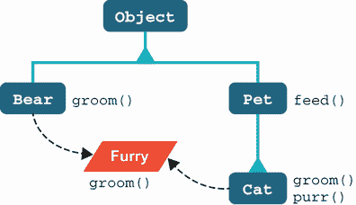
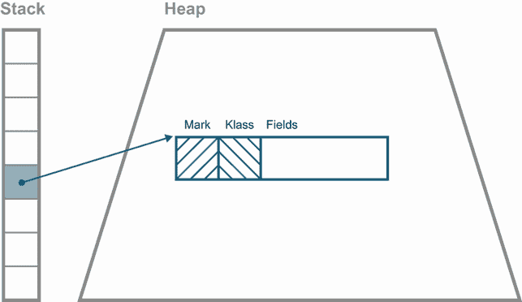
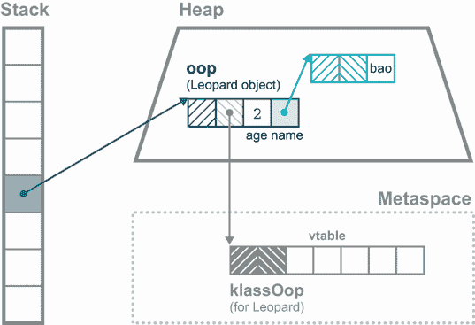
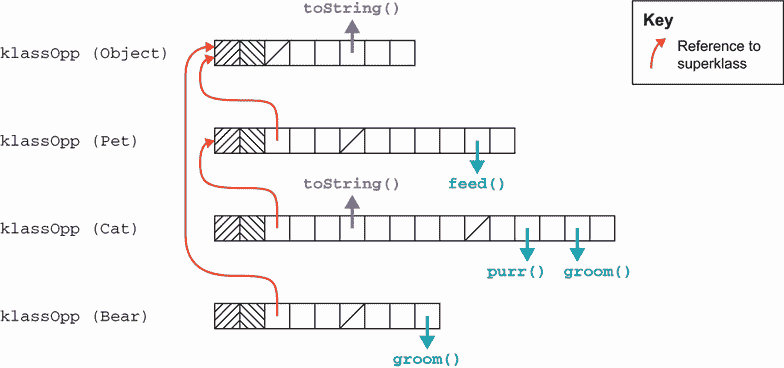
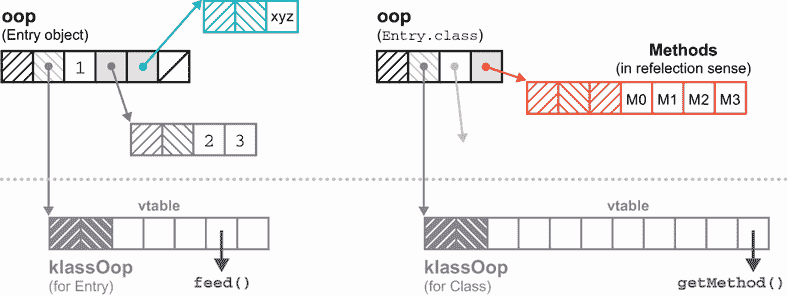
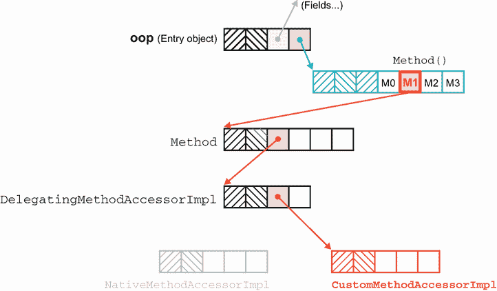

# 17 现代内部结构

本章涵盖

+   介绍 JVM 内部结构

+   反射内部结构

+   方法处理

+   Invokedynamic

+   近期内部更改

+   不安全

Java 的虚拟机（JVM）是一个极其复杂的运行环境，几十年来一直优先考虑稳定性和生产级工程。因此，许多 Java 开发者从未需要深入了解内部结构，因为这通常并不必要。

另一方面，本章是为好奇的人准备的——那些想要了解更多、想要揭开面纱看看 JVM 实现细节的人。让我们从方法调用开始。

## 17.1 介绍 JVM 内部结构：方法调用

为了开始，让我们看看由`Pet`、`Cat`和`Bear`类以及`Furry`接口定义的一个简单示例。这可以在图 17.1 中看到。



图 17.1 简单继承层次结构

我们还可以假设存在其他`Pet`的子类（例如`Dog`和`Fish`），这些子类在图中没有显示，以保持清晰。我们将使用这个例子来详细解释不同的调用操作码是如何工作的，从`invokevirtual`开始。

### 17.1.1 调用虚拟方法

最常见的方法调用类型是通过使用`invokevirtual`字节码在特定类（或其子类）的对象上调用实例方法。这被称为*分派*（即调用）*虚拟方法*（或简称虚拟分派），这意味着要调用的确切方法是在运行时而不是编译时通过查看运行时的实际对象类型来确定的。当 JVM 执行这段代码时：

```
Pet p = getPet();
p.feed();
```

实际调用`feed()`的实现是在方法需要执行时确定的。

实现可能因`p`持有`Cat`或`Dog`（或假设超类不是抽象的`Pet`）而不同。还有可能`getPet()`在程序执行的不同时间返回`Pet`的不同子类型对象。这并不重要——每次方法需要执行时都会查找要调用的实现。尽管这是一段有点像墙的文字，但这正是自从你第一次学习这门语言以来 Java 方法一直以来的工作方式。

在内部，为了使这成为可能，JVM 存储了一个表（每个类一个），该表包含对应类型的方法定义，称为*vtable*（这是 C++程序员所说的虚函数表）。这个表存储在 JVM 内部的一个特殊内存区域，称为*元空间*，其中包含 VM 需要的元数据。

注意：在 Java 7 及之前版本中，此元数据位于 Java 堆的一个区域，称为*permgen*。

要了解 vtable 的使用方法，我们需要简要地看一下类的 JVM 元数据。在 Java 中，所有对象都生活在 Java 堆中，并且仅通过引用来处理。HotSpot 使用通用术语 *oop*（“普通对象指针”）来指代堆中存在的各种内部数据结构。

每个 Java 对象都必须有一个 *对象头*，它包含以下两种类型的元数据：

+   特定于类实例的元数据（“标记词”）

+   由类的所有实例共享的元数据（“klass 词”）

为了节省空间，每个类的元数据只存储一个副本，并且属于该类的每个对象都有一个指向它的指针——klass 词。在图 17.2 中，我们可以看到一个表示，它是一个存储在局部变量中的 Java 引用，指向堆中 Java 对象头的开始。



图 17.2 Java 对象头和布局

*klass* 是 JVM 在运行时对 Java 类的内部表示，存储在元空间中。它包含 JVM 在运行时与该类交互所需的所有信息（例如，方法定义和字段布局）。

从 klass 中的一些信息可以通过对应于类型的 `Class<?>` 对象提供给 Java 程序员，但 klass 和 `Class` 是两个不同的概念。特别是，klass 包含一些故意不使普通应用程序代码能够访问的信息。

注意：选择拼写“klass”是相当故意的，因为它在书面文档中将内部数据结构与其他使用“class”一词的情况区分开来，但在英语口语中却不是这样。您也可能看到使用“clazz”或“clz”的单词——这些通常命名一个包含 `Class` 对象的 Java 变量。

我们现在可以用 JVM 的内部结构来解释虚拟分派（由 `invokevirtual` 字节码实现），特别是 klass 和它的 vtable。当 JVM 遇到要执行的 `invokevirtual` 指令时，它会从当前方法的评估堆栈中弹出接收对象和任何方法参数。

注意：接收对象是实例方法被调用的对象。

JVM 对象头布局从标记词开始，紧接着是 klass 词。因此，为了定位要执行的方法，JVM 会跟随指针进入元空间，在那里它咨询 klass 的 vtable，以确定需要执行的确切代码。这个过程可以在图 17.3 中看到。



图 17.3 定位方法实现

如果 klass 没有对该方法的定义，JVM 会跟随一个指针到对应直接超类的 klass，并再次尝试。这个过程是 JVM 中方法重写的基础。

为了使其高效，vtable 以特定的方式布局。每个 klass 都布局其 vtable，使得首先出现的方法是父类型定义的方法。这些方法按照父类型使用的确切顺序布局。对于这个类型来说是新的、且不是由父类型声明的方法，放在 vtable 的末尾。

当子类重写一个方法时，它将在 vtable 中的位置与被重写实现的偏移量相同。这使得查找重写方法变得完全简单，因为它们在 vtable 中的偏移量将与它们的父类相同。在图 17.4 中，我们可以看到我们示例中一些类的 vtable 布局。



图 17.4 Vtable 结构

因此，如果我们调用`Cat::feed`，JVM 将不会在`Cat`类中找到重写，而会跟随超类指针到`Pet`的 klass。这确实有一个`feed()`的实现，所以这将是被调用的代码。

注意：这种 vtable 结构——以及重写的有效实现——之所以工作得很好，是因为 Java 只实现了类的单继承。任何类型（除了没有超类的`Object`）只有一个直接超类。

### 17.1.2 调用接口方法

在`invokeinterface`的情况下，情况要复杂一些。例如，请注意，`groom()`方法不一定在每个`Furry`实现的 vtable 中出现在相同的位置。`Cat::groom`和`Bear::groom`的不同偏移量是由它们不同的类继承层次结构造成的。结果是，当在编译时只知道接口类型的对象上调用方法时，需要额外的查找。

注意：尽管查找接口调用会做稍微多一点的工作，但你不应试图通过避免接口来微优化。记住，JVM 有一个即时编译器，它将基本上消除这两种情况之间的性能差异。

让我们看看一个例子。考虑以下代码片段：

```
Cat tom = new Cat();
Bear pooh = new Bear();
Furry f;

tom.groom();
pooh.groom();
f = tom;
f.groom();
f = pooh;
f.groom();
```

这产生了以下字节码：

```
0: new           #2                  // class ch15/Cat
       3: dup
       4: invokespecial #3                  // Method ch15/Cat."<init>":()V
       7: astore_1
       8: new           #4                  // class ch15/Bear
      11: dup
      12: invokespecial #5                  // Method ch15/Bear."<init>":()V
      15: astore_2
      16: aload_1
      17: invokevirtual #6                  // Method ch15/Cat.groom:()V
      20: aload_2
      21: invokevirtual #7                  // Method ch15/Bear.groom:()V
      24: aload_1
      25: astore_3
      26: aload_3
      27: invokeinterface #8,  1            // InterfaceMethod
                                            // ch15/Furry.groom:()V
      32: aload_2
      33: astore_3
      34: aload_3
      35: invokeinterface #8,  1            // InterfaceMethod
                                            // ch15/Furry.groom:()V
```

在 27 和 35 处的两个调用在 Java 代码中看起来相同，但实际上会调用不同的方法，因为`f`的运行时内容不同。27 处的调用实际上会调用`Cat::groom`，而 35 处的调用会调用`Bear::groom`。

### 17.1.3 调用“特殊”方法

在了解了`invokevirtual`和`invokeinterface`的背景之后，`invokespecial`的行为现在就容易理解了。如果一个方法是通过`invokespecial`调用的，它不会经历虚拟查找。相反，JVM 将只在请求的方法的确切 vtable 位置进行查找。

`invokespecial`用于两种情况：调用超类方法和调用构造函数体（在字节码中转换为名为`<init>`的方法）。在这两种情况下，虚拟查找和重写的可能性都被明确排除。

我们应该提到两个进一步的边缘情况，它们可能看起来暗示了使用`invokespecial`（也称为*精确分发*）。第一个是私有方法——它们不能被重写，当类被编译时，要调用的确切方法已知，所以它们可能应该通过`invokespecial`来调用。然而，这种情况比它看起来更复杂。让我们通过一个例子来演示：

```
public class ExamplePrivate {

  public void entry() {
    callThePrivate();
  }

  private void callThePrivate() {
    System.out.println("Private method");
  }
}
```

让我们先使用 Java 8 来编译这个例子。使用`javap`反编译它给出以下结果：

```
$ javap -c ch15/ExamplePrivate.class
Compiled from "ExamplePrivate.java"
public class ch15.ExamplePrivate {
  public ch15.ExamplePrivate();
    Code:
       0: aload_0
       1: invokespecial #1   // Method java/lang/Object."<init>":()V
       4: return

  public void entry();
    Code:
       0: aload_0
       1: invokespecial #2   // Method callThePrivate:()V
       4: return
}
```

注意，`javap`是在没有`-p`开关的情况下被调用的，所以私有方法的反编译没有出现。到目前为止，一切顺利——私有方法确实是通过`invokespecial`调用的。然而，如果我们用 Java 11 重新编译并仔细观察，我们会看到不同的结果，如下所示：

```
$ javap -c ch15/ExamplePrivate.class
Compiled from "ExamplePrivate.java"
public class ch15.ExamplePrivate {
  public ch15.ExamplePrivate();
    Code:
       0: aload_0
       1: invokespecial #1 // Method java/lang/Object."<init>":()V
       4: return

  public void entry();
    Code:
       0: aload_0
       1: invokevirtual #2 // Method callThePrivate:()V    ❶
       4: return
}
```

❶ 这现在是`invokevirtual`。

正如我们所见，在现代 Java 中，对私有方法的调用处理方式不同，我们将在第 17.5.3 节中解释，当我们遇到嵌套成员时。

### 17.1.4 最终方法

另一个特殊情况是`final`方法的使用。乍一看，调用`final`方法似乎也会被转换为`invokespecial`指令——毕竟，它们不能被重写，要调用的实现是在编译时已知的。然而，Java 语言规范对此有一些说法：

将声明为`final`的方法更改为不再声明为`final`不会破坏与现有二进制的兼容性。

假设一个类的代码调用了另一个类中的`final`方法，该方法已被编译成`invokespecial`。然后，如果包含`final`方法的类被修改为使方法不再为`final`（并重新编译），则可以在子类中重写它。

现在假设将子类的实例传递到第一个类中的调用方法。将执行`invokespecial`，现在将调用错误的方法实现。这是违反 Java 面向对象规则的（严格来说，它违反了 Liskov 替换原则）。因此，对`final`方法的调用必须编译成`invokevirtual`指令。

注意：在实践中，HotSpot 包含优化，可以非常高效地检测和执行`final`方法的情况。

我们通过虚拟方法调用的视角介绍了 HotSpot 内部机制的基础。在这个阶段，重新阅读第七章的 JIT 编译部分可能很有趣——特别是关于单态分发和内联的部分。现在你已经看到了它们实现的一些细节，你可能能够对这些技术有更深入的理解。

## 17.2 反射内部机制

我们在第四章中遇到了反射，作为在运行时动态处理对象和调用方法的一种方式。现在我们知道了 vtable，我们可以更深入地了解 JVM 是如何实现反射的。

回想一下，我们可以从一个类对象中获取一个`java.lang.reflect.Method`对象，然后调用它，如下所示（省略了异常处理）：

```
Class<?> clazz = // ... some class
Method m = clazz.getMethod("toString");
Object ret = m.invoke(this);
System.out.println(ret);
```

但这个`Method`对象代表什么？它实际上是“在运行时动态调用特定方法的能力。”调用的动态性质意味着在编译代码中，我们只看到`Method`上的`invokevirtual`调用，如下所示：

```
0: ldc           #7   // ... some class
 2: astore_1
 3: aload_1
 4: ldc           #24  // String toString
 6: iconst_0                                                       ❶
 7: anewarray     #26  // class java/lang/Class                    ❶
10: invokevirtual #28  // Method java/lang/                        ❶
                       // Class.getMethod:                         ❶
                       // (Ljava/lang/String;[Ljava/lang/Class;)
                       // Ljava/lang/reflect/Method;
13: astore_2
14: aload_2
15: aload_0
16: iconst_0                                                       ❷
17: anewarray     #2   // class java/lang/Object                   ❷
20: invokevirtual #32  // Method java/lang/reflect/                ❷
                       // Method.invoke:                           ❷
                       // (Ljava/lang/Object;[Ljava/lang/Object;)
                       // Ljava/lang/Object;
23: astore_3
```

❶ 调用 getMethod()是可变参数的，并传递一个大小为 0 的 Class 对象数组。

❷ 调用 invoke()传递一个大小为 0 的 Object 对象数组（参数）。

注意：没有字节码通过方法描述符（例如`java/lang/Object.toString:()Ljava/lang/String;`）引用`toString()`，而是直接作为字符串`toString`。

现在，让我们回顾一下，类对象（例如，`String.class`）只是普通的 Java 对象——它们具有普通 Java 对象的属性，并由 oops 表示。类对象为类上的每个方法包含一个`Method`对象，而这些方法对象再次只是普通的 Java 对象。

注意：`Method`对象是在类加载后延迟创建的。有时你可以在 IDE 的代码调试器中看到这种效果的痕迹。

那么 JVM 实际上是如何实现反射的呢？让我们看看`Method`类的部分源代码，并看看它的字段：

```
    private Class<?>            clazz;                           ❶
    private int                 slot;                            ❷
    // This is guaranteed to be interned by the VM in the 1.4
    // reflection implementation
    private String              name;
    private Class<?>            returnType;
    private Class<?>[]          parameterTypes;
    private Class<?>[]          exceptionTypes;
    private int                 modifiers;
    // Generics and annotations support
    private transient String    signature;
    // generic info repository; lazily initialized
    private transient MethodRepository genericInfo;
    private byte[]              annotations;
    private byte[]              parameterAnnotations;
    private byte[]              annotationDefault;
    private volatile MethodAccessor methodAccessor;              ❸
```

❶ 该方法所属的类

❷ 该方法在 vtable 中的偏移量

❸ 执行调用的代理

我们已经知道，在 Java 中，调用实例方法涉及到在 vtable 中查找它。所以，从概念上讲，我们想要利用 vtable 和由`Class`对象持有的`Method`对象数组之间的双重性。我们可以在图 17.5 中看到这种双重性，其中`Method`对象数组通过`Entry.class`帮助，与`Entry`的 klassOop 上的 vtable 是双重关系。



图 17.5 反射内部结构

让我们看看`Method`是如何利用这种双重性来实现反射的。关键在于`MethodAccessor`对象。

注意：以下部分代码进行了简化，并基于 Java 的早期版本，以帮助理解机制。Java 11 及以后的当前发行版生产代码更为复杂。

`Method`上的`invoke()`方法看起来有点像这样：

```
public Object invoke(Object obj, Object... args)
    throws IllegalAccessException, IllegalArgumentException,
           InvocationTargetException {

  if (!override) {                                                  ❶
    if (!Reflection.quickCheckMemberAccess(clazz, modifiers)) {
      Class<?> caller = Reflection.getCallerClass();
      checkAccess(caller, clazz, obj, modifiers);
    }
  }
  MethodAccessor ma = methodAccessor;                               ❷
  if (ma == null) {
    ma = acquireMethodAccessor();
  }
  return ma.invoke(obj, args);                                      ❸
}
```

❶ 执行安全访问检查（如果未设置 setAccessible()）

❷ 访问者的 volatile 读取

❸ 方法访问者代理

在第一次反射调用此方法时，`acquireMethodAccessor()`创建了一个`DelegatingMethodAccessorImpl`实例，该实例持有一个指向`NativeMethodAccessorImpl`的引用。这些类是在`sun.reflect`中定义的，它们都实现了`MethodAccessor`。请注意，它们不是`java.base`模块的 API 的一部分，不能直接调用。

下面是完整的`DelegatingMethodAccessorImpl`：

```
class DelegatingMethodAccessorImpl extends MethodAccessorImpl {
  private MethodAccessorImpl delegate;

  DelegatingMethodAccessorImpl(MethodAccessorImpl delegate) {
    setDelegate(delegate);
  }

  public Object invoke(Object obj, Object[] args)
        throws IllegalArgumentException, InvocationTargetException {
    return delegate.invoke(obj, args);
  }

  void setDelegate(MethodAccessorImpl delegate) {
    this.delegate = delegate;
  }
}
```

下面是`NativeMethodAccessorImpl`：

```
class NativeMethodAccessorImpl extends MethodAccessorImpl {
  private Method method;
  private DelegatingMethodAccessorImpl parent;
  private int numInvocations;

  // ...

  public Object invoke(Object obj, Object[] args)
          throws IllegalArgumentException, InvocationTargetException {

    if (++numInvocations >
          ReflectionFactory.inflationThreshold()) {       ❶
      MethodAccessorImpl acc = (MethodAccessorImpl)
          new MethodAccessorGenerator()
            .generateMethod(method.getDeclaringClass(),
                            method.getName(),
                            method.getParameterTypes(),
                            method.getReturnType(),
                            method.getExceptionTypes(),
                            method.getModifiers());       ❷
        parent.setDelegate(acc);                          ❸
    }

    return invoke0(method, obj, args);                    ❹
  }

  private static native Object invoke0(Method m, Object obj, Object[] args);

  // ...
}
```

❶ 在达到调用阈值后进入

❷ 使用`MethodAccessorGenerator`创建一个实现反射调用的自定义类

❸ 将当前对象作为代理替换为新自定义类的实例

❹ 如果尚未达到阈值，则继续进行本地调用

这种技术——使用可以与新动态生成的字节码访问器修补的委托访问器——可以在图 17.6 中看到。请注意，自定义访问器类是`MethodAccessorImpl`的子类，以便成功进行类型转换。



图 17.6 实现反射

关于性能的一个词：这个机制涉及权衡两种不同的可能来源的缓慢。一方面，本地访问器使用本地调用，这比 Java 方法调用慢，并且不能被 JIT 编译。另一方面，在`MethodAccessorGenerator`中动态生成字节码可能很慢，这可能是一个我们想要避免的坏交易，对于仅通过反射调用一次的方法。这种技巧，即延迟加载访问器对象然后动态修补调用点，我们将在本章后面以不同的形式再次遇到。

另一个值得注意的事实是，反射也破坏了内联和 JVM 可以很好地优化的标准方法调度类型。修补后的`Delegating-MethodAccessorImpl`方法的调用点被称为*megamorphic*（方法有许多可能的实现），因为每个`Method`实例都有一个不同的、动态生成的访问器对象。这意味着 JVM 的一些主要优化机制对于反射调用可能不会很好地工作。

因此，使用委托和修补本地访问器是一种折衷方案，旨在在可接受的性能和 JIT 的一些好处之间取得平衡。这种折衷方案，以及我们在第四章中讨论的反射的其他问题，导致了对动态调用和轻量级方法对象问题更好方法的探索。在下一节中，我们将介绍该研究的第一项成果：*方法句柄* API。

## 17.3 方法句柄

方法句柄 API 是在 Java 7 版本中添加到 Java 中的。这个 API 的核心是`java.lang.invoke`包，特别是`MethodHandle`类。这种类型的实例代表调用方法的能力，并且可以直接执行，类似于`java.lang.reflect.Method`对象。

该 API 是作为将`invokedynamic`（我们在第 17.4 节中讨论）引入 JVM 的项目的一部分产生的。但方法句柄对象在框架和常规用户代码中的应用远远超出了`invokedynamic`用例。

我们将首先介绍方法句柄的基本技术；然后，我们将查看一个扩展示例，将其与一些替代方案进行比较，并总结差异。

### 17.3.1 方法句柄

什么是`MethodHandle`？官方答案是它是对可以直接执行的方法的带类型的引用。另一种说法是，`MethodHandle`是一个表示能够安全调用方法的对象。

注意：`MethodHandle`在很多方面与`java.lang.reflect`中的`Method`对象相似，但 API 通常更好，更简洁，并且纠正了几个重大的设计缺陷。

使用方法句柄有两个方面：获取它们和使用它们。第二个方面，使用它们，非常简单。让我们看看调用方法句柄的一个非常简单的例子。现在，我们假设我们有一些静态辅助方法`getTwoArgMH()`，它返回一个接收者对象`obj`和一个调用参数`arg0`的方法句柄，并返回`String`。

之后，我们将解释如何获取与该签名匹配的方法句柄，但现在我们只是假设我们有一个辅助方法会为我们创建方法句柄。以下用法应该会让你想起反射调用：

```
MethodHandle mh = getTwoArgMH();                  ❶

try {
  String result = mh.invokeExact(obj, arg0);      ❷
} catch (Throwable e) {
  e.printStackTrace();
}
```

❶ 从辅助方法获取方法句柄

❷ 执行调用，传递接收者和一个参数

这看起来像是对方法的反射调用，就像我们在第 4.5.1 节中看到的那样——我们使用`MethodHandle`上的`invokeExact()`而不是`Method`上的`invoke()`，但除此之外，它应该看起来非常相似。然而，这只有在我们实际上首先有一个方法句柄对象的情况下才可能——那么，我们如何得到一个呢？

要获取一个方法句柄，我们需要通过一个*查找上下文*来查找它。获取上下文的通常方法是通过调用静态辅助方法`MethodHandles.lookup()`。这将返回一个基于当前执行方法的查找上下文。从查找中，我们可以通过调用`find*()`方法之一（如`findVirtual()`或`findConstructor()`）来获取方法句柄。

查找上下文对象可以提供对任何从创建查找的执行上下文中可见的方法的方法句柄。然而，除了方法查找上下文之外，我们还需要考虑如何表示我们想要句柄的方法的签名。

回想一下第六章中的`Callable`接口。它表示要执行的一段代码，与方法句柄类似。然而，`Callable`的一个问题是它只能模拟不带参数的方法。

如果我们要模拟所有类型的方法，我们就必须创建其他接口，类型参数的数量逐渐增加。我们最终会得到一组像这样的接口：

```
Function0<R>
Function1<R, P>
Function2<R, P1, P2>
Function3<R, P1, P2, P3>
...
```

这将非常快地导致接口的大量激增。这种方法被一些非 Java 语言（例如 Scala）采用，但 Java 中没有。

考虑 Clojure 是如何做的也很具有洞察力。`IFn`接口有`invoke`方法，代表所有不同类型的函数（包括用于接受超过 20 个参数的函数的可变参数形式）。我们在第十章遇到了`IFn`的简化版本。

然而，Clojure 是动态类型的，所以所有的`invoke`方法都接受每个参数的`Object`，并且也返回`Object`——这消除了处理泛型时的所有复杂性。Clojure 形式也可以非常自然地以可变的形式编写——如果形式以错误的 arity 调用，Clojure 将抛出运行时异常。Java 不使用这两种方法中的任何一种。

相反，Java 的方法处理实现了一种可以模拟任何方法签名的方案，无需生成大量的小类。这是通过新的`MethodType`类来实现的。

### 17.3.2 MethodType

`MethodType`是一个不可变对象，表示方法的类型签名。每个方法处理程序都有一个包含返回类型和参数类型的`MethodType`实例。但它不包含方法名称或接收器类型——实例方法被调用的类型。

获取新的`MethodType`实例的一个简单方法是在`MethodType`类中使用工厂方法。以下是一些示例：

```
var mtToString = MethodType.methodType(String.class);
var mtSetter = MethodType.methodType(void.class, Object.class);
var mtStringComparator = MethodType.methodType(int.class,
                                                String.class, String.class);
```

这些是表示`toString()`、一个 setter 方法（对于类型`Object`的成员）和由`Comparator<String>`定义的`compareTo()`方法的`MethodType`实例。通用实例遵循相同的模式，首先传递返回类型，然后是参数类型（所有作为`Class`对象），如下所示：

```
MethodType.methodType(RetType.class, Arg0Type.class, Arg1Type.class, ...);
```

正如你所见，不同的方法签名现在可以表示为正常的实例对象，无需为每个签名定义新的类型。这也提供了一种简单的方法来确保尽可能多的类型安全。如果你想了解一个候选方法处理是否可以用一组特定的参数调用，你可以检查属于该处理程序的`MethodType`。

注意：传递单个`MethodType`对象比反射强制你使用的繁琐的`Class[]`要方便得多。

现在你已经看到了`MethodType`对象如何解决接口膨胀问题，让我们看看我们如何创建指向我们类型中方法的`method handle`。

### 17.3.3 查找方法处理程序

让我们看看如何获取指向当前类`toString()`方法的`method handle`。注意，我们希望`mtToString`与`toString()`的签名完全匹配——它有一个返回类型为`String`，没有参数。相应的`MethodType`实例应该是`MethodType.methodType(String.class)`，如下所示：

```
public MethodHandle getToStringMH() {
  MethodHandle mh;
  var mt = MethodType.methodType(String.class);
  var lk = MethodHandles.lookup();                                  ❶

  try {
    mh = lk.findVirtual(getClass(), "toString", mt);                ❷
  } catch (NoSuchMethodException | IllegalAccessException mhx) {
    throw (AssertionError)new AssertionError().initCause(mhx);
  }

  return mh;
}
```

❶ 获取查找上下文

❷ 从上下文中查找处理程序

要从查找对象中获取方法处理程序，你需要提供包含你想要的方法的类，方法名称，以及表示适当签名的`MethodType`。方法类型对于处理重载方法是必要的。

使用查找上下文在当前类上查找方法是非常常见的，但实际上，你可以使用上下文来获取属于 *任何* 类型的方法句柄，包括 JDK 类型。当然，如果你从不同包或模块中的类获取句柄，查找上下文只能看到你有权访问的方法（例如，导出包中公共类的公共方法）。这是方法句柄 API 的重要方面：方法句柄的访问控制是在找到方法时检查的，而不是在执行句柄时检查。

一旦获得方法句柄，就可以安全地调用它，因为没有进一步的访问控制检查。方法句柄可以在允许访问的上下文中创建，然后传递到不允许访问的另一个上下文中，它仍然会执行。这与反射的一个重要区别。

注意：调用方法句柄的访问控制无法绕过，与反射调用不同。没有与第四章中遇到的反射 `setAccessible()` 漏洞等效的方法。

现在我们已经拥有了方法句柄，自然的事情就是用它来执行。API 提供了两种主要方式来完成这个任务：`invokeExact()` 和 `invoke()` 方法。

`invokeExact()` 方法要求参数类型与底层方法期望的参数类型完全匹配。`invoke()` 方法执行一些转换，试图在类型不完全匹配的情况下（例如，装箱或拆箱，如所需）使类型匹配。

在介绍之后，我们将继续展示一个更长的示例，说明如何使用方法句柄来替换其他技术，例如反射和用于代理功能的小型内联类。

### 17.3.4 反射 vs. 代理 vs. 方法句柄

如果你花过时间处理包含大量反射的代码库，你很可能非常熟悉反射代码带来的痛苦。在本小节中，我们想向你展示如何使用方法句柄来替换大量的反射样板代码，使你的编码生活变得更加轻松。

为了展示方法句柄与其他技术的区别，我们提供了三种从类外部访问私有 `callThePrivate()` 方法的途径。有两种标准技术：反射和用作代理的内联类。我们可以将这些技术与基于 `MethodHandle` 的现代方法进行比较。三种替代方案的示例将在下一列表中展示。

列表 17.1 提供三种访问方式

```
public class ExamplePrivate {
    // Some state ...

    public void entry() {
        callThePrivate();
    }

    private void callThePrivate() {                                      ❶
        System.out.println("Private method");
    }

    public Method makeReflective() {
        Method meth = null;

        try {
            Class<?>[] argTypes = new Class[] { Void.class };
            meth = ExamplePrivate.class
                       .getDeclaredMethod("callThePrivate", argTypes);
            meth.setAccessible(true);
        } catch (IllegalArgumentException |
                    NoSuchMethodException |
                    SecurityException e) {
            throw (AssertionError)new AssertionError().initCause(e);
        }

        return meth;
    }

    public static class Proxy {
        private Proxy() {}

        public static void invoke(ExamplePrivate priv) {
            priv.callThePrivate();
        }
    }

    public MethodHandle makeMh() {
        MethodHandle mh;
        var desc = MethodType.methodType(void.class);                    ❷

        try {
            mh = MethodHandles.lookup()
                     .findVirtual(ExamplePrivate.class,
                         "callThePrivate", desc);                        ❸
        } catch (NoSuchMethodException | IllegalAccessException e) {
            throw (AssertionError)new AssertionError().initCause(e);
        }

        return mh;
    }

}
```

❶ 我们想要提供访问权限的私有方法

❷ 方法类型创建——我们可以使用确切类型，而不是需要在这里装箱。

❸ 方法句柄查找

示例类提供了三种不同的能力，可以访问私有的 `callThePrivate()` 方法。在实际应用中，通常只会提供其中一种能力——我们只展示所有三种能力来讨论它们之间的区别。在实际应用中，作为 API 的用户，你通常不需要关心使用哪种方法。

在表 17.1 中，你可以看到反射的主要优势是熟悉性。对于简单用例，代理可能更容易理解，但我们相信方法句柄代表了两者的最佳结合。我们强烈建议在所有新应用程序中使用它们。

表 17.1 比较 Java 的间接方法访问技术

| 功能 | 反射 | 内部类/lambda | 方法句柄 |
| --- | --- | --- | --- |
| 访问控制 | 必须使用 `setAccessible()`。可能被活动的安全管理器禁止。 | 内部类可以访问受限制的方法。 | 允许从当前上下文访问所有方法。与安全管理器无关。 |
| 类型纪律 | 无。不匹配时会产生丑陋的异常。 | 静态。可能过于严格。可能需要大量的元空间来存储所有代理。 | 运行时类型安全。几乎不消耗（如果有的话）元空间。 |
| 性能 | 与其他替代方案相比较慢。 | 与任何其他方法调用一样快。 | 力求与其他方法调用一样快。 |

方法句柄提供的一个额外功能是能够从静态上下文中确定当前类。如果你曾经编写过类似这样的日志代码（例如，对于 log4j）：

```
Logger lgr = LoggerFactory.getLogger(MyClass.class);
```

然后你知道这段代码是脆弱的。如果将其重构为移动到父类或子类，显式的类名会导致问题。然而，使用方法句柄，你可以这样写：

```
Logger lgr = LoggerFactory.getLogger(MethodHandles.lookup().lookupClass());
```

在此代码中，`lookupClass()` 表达式可以被视为与 `getClass()` 等效，它可以在静态上下文中使用。这在处理日志框架等场景中特别有用，因为它们通常为每个类提供一个日志记录器。

注意方法句柄已被证明是一个非常成功的 API。事实上，它如此成功，以至于在 Java 18（但不在 11 或 17）中，反射的实现技术已经改为依赖于它，而不是我们在上一节中遇到的那种实现。

在你的技术工具箱中拥有方法句柄技术，并具备第四章中字节码的实用知识，让我们深入了解 `invokedynamic` 指令。它在 Java 7 中被引入，并且（到目前为止）是唯一被添加到 JVM 指令集的指令。`invokedynamic` 的原始用例是帮助非 Java 语言充分利用 JVM 作为平台，但它已经成为平台内变革的主要推动者，正如我们将看到的。

## 17.4 Invokedynamic

本节讨论了现代 Java 中最技术复杂的新特性之一。但尽管它非常强大，这并不是每个工作开发者都会直接使用的特性。相反，目前这个特性主要用于框架开发者和非 Java 语言实现者。

因此，在第一次阅读时可以跳过这一节。为了最好地利用它，你需要阅读并理解本章前面关于执行`invoke`指令的讨论——了解我们即将打破的规则会有所帮助。

我们将详细介绍`invokedynamic`的工作原理，并查看一些使用新字节码的调用站点的反编译示例。请注意，为了使用利用`invokedynamic`的语言和框架，并不需要完全理解这一点，但这是内部章节，所以我们将深入细节。

如你所猜，`invokedynamic`是一种新的调用指令类型，即它用于进行方法调用。它用于告诉 JVM 它必须推迟确定调用哪个方法，直到运行时。

这可能看起来不是什么大问题——毕竟，`invokevirtual`和`invokeinterface`都会在运行时决定调用哪个实现。然而，这些操作码的目标选择受到 Java 语言继承规则和类型系统的约束，因此在编译时至少知道一些*调用目标*信息。

另一方面，`invokedynamic`是为了放宽这些约束而创建的，它通过调用一个辅助方法（称为*引导方法*或*BSM*）来做出应该调用哪个方法的决策。

注意：`invokedynamic`站点的目标方法（调用目标）根本不需要符合 Java 继承层次结构的规则——这是一个用户定义的选择。

为了允许这种灵活性，`invokedynamic`操作码引用类常量池的一个特殊部分，该部分包含扩展条目以支持调用的动态性——BSMs。这些是`invokedynamic`的关键部分，所有`invokedynamic`调用点都有一个对应的 BSM 常量池条目。

BSM 接受有关调用站点的信息并链接动态调用。BSM 至少接受三个参数，并返回一个`CallSite`对象。标准参数类型如下：

+   `MethodHandles.Lookup`—在调用点发生的类上的查找对象

+   `String`—在`NameAndType`中提到的名称

+   `MethodType`—`NameAndType`的解析类型描述符

在这些参数之后是 BSM 需要的任何其他参数。在文档中，这些被称为*附加静态参数*。返回的调用点包含一个`MethodHandle`，这是调用调用点的效果，并将作为`invokedynamic`的实际调用执行。

注意：为了允许将 BSM 与特定的`invokedynamic`调用点关联，在类文件格式中添加了一个新的常量池条目类型，也称为`InvokeDynamic`。

`invokedynamic`指令的调用点在类加载时被称为“未编织”。这意味着尚未将目标方法与调用点关联，并且只有在调用点被到达时（即，当 JVM 尝试链接并执行该特定的`invokedynamic`指令时）才会这样做。

在这一点上，BSM 将被调用以确定应该实际调用哪个方法。BSMs 总是返回一个包含`MethodHandle`的`CallSite`对象，并且它将被“编织”到调用点中。一旦`CallSite`被链接，实际的调用就可以进行——它是到由`CallSite`持有的`MethodHandle`。

在最简单的情况下，当使用`ConstantCallSite`时，一旦查找完成一次，就不会重复。相反，调用点的目标将在所有未来的调用上直接调用，而无需任何进一步的工作。它的行为类似于`CompletableFuture<CallSite>`。在实践中，这意味着调用点现在是稳定的，因此对其他 JVM 子系统（如 JIT 编译器）友好。还可能存在更复杂的选择，例如`MutableCallSite`（甚至`VolatileCallSite`），这些允许在一段时间内重新链接调用点，使其指向不同的目标方法。

一个非常量调用点在其程序生命周期内可以拥有许多不同的方法句柄作为其目标。实际上，能够在特定的调用点更改被调用的方法是一种对于非 Java 语言来说可能很重要的技术。

例如，在 JavaScript 或 Ruby 中，特定类型的单个对象可以定义其上不存在于该类其他实例上的方法。这在 Java 中是不可能的——类定义了一组在类加载时用于构建 vtable 的方法，所有实例共享相同的 vtable。使用`invokedynamic`与可变调用点可以有效地实现这种非 Java 特性。

我们应该指出，你不能从常规方法调用中让`javac`生成`invokedynamic`——Java 方法调用始终被转换为我们在第四章中遇到的四个“常规”invoke 操作码之一。相反，Java 框架和库（包括 JDK 中的那些）出于各种目的使用`invokedynamic`。Lambdas 提供了一个很好的案例研究，让我们更深入地了解这些目的之一。

### 17.4.1 实现 lambda 表达式

Lambdas 在 Java 编程中变得无处不在，但许多 Java 程序员实际上并不真正了解它们的实现方式。让我们从以下简单的例子开始了解：

```
public class LambdaExample {
    private static final String HELLO = "Hello World!";

    public static void main(String[] args) throws Exception {
        Runnable r = () -> System.out.println(HELLO);
        Thread t = new Thread(r);
        t.start();
        t.join();
    }
}
```

你可能会猜测 lambda 实际上只是`Runnable`匿名实现的语法糖。然而，如果我们编译前面的类，我们可以看到只生成了一个名为`LambdaExample.class`的单个文件——没有第二个类文件（正如我们在第八章讨论的，内部类应该放在那里）。所以，故事还有更多，我们将看到。

相反，如果我们反编译，那么我们可以看到 lambda 体实际上已经被编译成了一个私有的静态方法，这个方法出现在主类中：

```
private static void lambda$main$0();
    Code:
       0: getstatic     #7   // Field
                             // java/lang/System.out:Ljava/io/PrintStream;
       3: ldc           #9   // String Hello World!
       5: invokevirtual #10  // Method java/io/PrintStream.println:
                             // (Ljava/lang/String;)V
       8: return
```

主方法看起来是这样的：

```
public static void main(java.lang.String[]) throws java.lang.Exception;
    Code:
       0: invokedynamic #2,  0  // InvokeDynamic #0:run:
                                // ()Ljava/lang/Runnable;
       5: astore_1
       6: new           #3      // class java/lang/Thread
       9: dup
      10: aload_1
      11: invokespecial #4      // Method java/lang/Thread."<init>"
                                // :(Ljava/lang/Runnable;)V
      14: astore_2
      15: aload_2
      16: invokevirtual #5      // Method java/lang/Thread.start:()V
      19: aload_2
      20: invokevirtual #6      // Method java/lang/Thread.join:()V
      23: return
```

`invokedynamic`正在充当对一种不寻常的工厂方法的调用。调用返回一个实现了`Runnable`类型的实例。确切类型在字节码中未指定，并且这基本上并不重要。事实上，实际返回的类型在编译时并不存在，将在运行时按需创建。

我们知道`invokedynamic`站点总是与引导方法相关联。对于我们的简单`Runnable`示例，在类文件的相关部分有一个单一的 BSM，如下所示：

```
BootstrapMethods:
  0: #28 REF_invokeStatic java/lang/invoke/LambdaMetafactory.metafactory:
        (Ljava/lang/invoke/MethodHandles$Lookup;Ljava/lang/String;
         Ljava/lang/invoke/MethodType;Ljava/lang/invoke/MethodType;
         Ljava/lang/invoke/MethodHandle;Ljava/lang/invoke/MethodType;)
         Ljava/lang/invoke/CallSite;
    Method arguments:
      #29 ()V
      #30 REF_invokeStatic LambdaExample.lambda$main$0:()V
      #29 ()V
```

这有点难以阅读，所以让我们来解码它。这个调用站的引导方法是常量池中的第 28 项——一个类型为`MethodHandle`的条目。它指向`java.lang.invoke`包中的静态工厂方法`LambdaMetafactory.metafactory()`。元工厂方法接受相当多的参数，但它们大多数是由 BSM（条目#29 和#30）的附加静态参数提供的。

单个 lambda 表达式生成三个静态参数，这些参数被传递给 BSM：lambda 的签名、lambda 实际最终调用目标的处理方法（即 lambda 体），以及签名的擦除形式。

让我们跟随代码进入`java.lang.invoke`，看看平台如何使用*元工厂*来动态创建实现我们 lambda 表达式目标类型的类。BSM（即对`metafactory`方法的调用）返回一个调用站对象，就像往常一样。当`invokedynamic`指令被执行时，调用站中包含的方法处理程序将返回一个实现了 lambda 目标类型的类的实例。

注意：如果`invokedynamic`指令从未被执行，那么动态创建的类将永远不会被创建。

`metafactory`方法的源代码相对简单，如下所示：

```
public static CallSite metafactory(MethodHandles.Lookup caller,
                                       String invokedName,
                                       MethodType invokedType,
                                       MethodType samMethodType,
                                       MethodHandle implMethod,
                                       MethodType instantiatedMethodType)
            throws LambdaConversionException {
        AbstractValidatingLambdaMetafactory mf;
        mf = new InnerClassLambdaMetafactory(caller, invokedType,
                                             invokedName, samMethodType,
                                             implMethod,
                                             instantiatedMethodType,
                                             false, EMPTY_CLASS_ARRAY,
                                             EMPTY_MT_ARRAY);
        mf.validateMetafactoryArgs();
        return mf.buildCallSite();
    }
```

查找对象对应于`invokedynamic`指令存在的上下文。在我们的情况下，那就是定义 lambda 的同一个类，所以查找上下文将具有正确的权限来访问 lambda 体编译成的私有方法。

JVM 提供了调用的名称和类型，这些都是实现细节。最后的三个参数是从 BSM 提供的额外静态参数。

在当前实现的 lambdas 中，metafactory 委托给使用 ASM 字节码库内部、阴影副本的代码来启动一个实现目标类型的内部类。这可能在将来改变。

最后，我们应该注意，创建一个使用`invokedynamic`执行特殊操作的定制类是完全可能的，但为了构建这样的类，你必须使用字节码操作库来生成包含`invokedynamic`指令的`.class`文件。一个不错的选择是 ASM 库（见[`asm.ow2.org/`](http://asm.ow2.org/)）。我们已经提到过这个库几次，它是一个工业级的库，被广泛应用于各种知名的 Java 框架中（包括前面提到的 JDK 本身）。这标志着我们对`invokedynamic`的讨论结束，现在是时候讨论一些较小但仍然重要的内部变化了。

## 17.5 小型内部更改

有时小的变化可以对语言产生重大影响。在本节中，我们将遇到三个小的实现内部变化，这些变化要么有助于性能，要么纠正平台上的旧问题。让我们先从字符串开始谈。

### 17.5.1 字符串连接

记住，在 Java 中，`String`的实例实际上是不可变的。那么，当你使用`+`运算符连接两个字符串时会发生什么？JVM 必须创建一个新的`String`对象，但这里发生的事情可能比表面上看起来更复杂。

考虑一个具有`main()`方法的简单类，如下所示：

```
public static void main(String[] args) {
  String str = "foo";
  if (args.length > 0) {
    str = args[0];
  }
  System.out.println("this is my string: " + str);
}
```

对应于这个相对简单方法的 Java 8 字节码如下：

```
public static void main(java.lang.String[]);
Code:
  0: ldc #17            // String foo
  2: astore_2
  3: aload_1
  4: arraylength
  5: ifle 12                                                               ❶
  8: aload_1
  9: iconst_0
 10: aaload
 11: astore_2
 12: getstatic #19      // Field java/lang/System.out:                     ❷
                        // Ljava/io/PrintStream;                           ❷
 15: new #25            // class java/lang/StringBuilder                   ❸
 18: dup                                                                   ❸
 19: ldc #27            // String this is my string:                       ❸
 21: invokespecial #29  // Method java/lang/                               ❸
                        // StringBuilder."<init>"                          ❸
                        // :(Ljava/lang/String;)V                          ❸
 24: aload_2
 25: invokevirtual #32  // Method java/lang/StringBuilder.append
                        // (Ljava/lang/String;)Ljava/lang/StringBuilder;
 28: invokevirtual #36  // Method java/lang/                               ❹
                        // StringBuilder.toString:                         ❹
                        // ()Ljava/lang/String;                            ❹
 31: invokevirtual #40  // Method java/io/                                 ❺
                        // PrintStream.println:                            ❺
                        // (Ljava/lang/String;)V                           ❺
 34: return
```

❶ 如果数组为空，则跳转到指令 12。

❷ 将 System.out 加载到栈上

❸ 设置 StringBuilder

❹ 从 StringBuilder 创建字符串

❺ 打印字符串

在这个字节码中，我们有几件事情需要注意。特别是，`StringBuilder`的出现可能有点令人惊讶——我们要求连接一些字符串，但字节码却告诉我们，我们实际上是在创建额外的对象，然后调用`append()`，然后对它们调用`toString()`。

指令 15-23 显示了临时`StringBuilder`对象的`new`、`dup`、`invokespecial`对象创建模式，但在这个情况下，构造还包括在`dup`之后的`ldc`（加载常量）。这种变体模式表明你正在调用一个非 void 构造函数——在这个例子中是`StringBuilder(String)`。

所有这一切背后的原因是 Java 的字符串（实际上是）不可变的。我们不能通过连接来修改字符串内容，因此我们不得不创建一个新的对象，而`StringBuilder`只是做这件事的一种方便方式。

然而，Java 11 的字节码形状看起来完全不同：

```
public static void main(java.lang.String[]);
Code:
  0: ldc           #2      // String foo
  2: astore_1
  3: aload_0
  4: arraylength
  5: ifle          12
  8: aload_0
  9: iconst_0
 10: aaload
 11: astore_1
 12: getstatic     #3      // Field java/lang/System.out:
                           // Ljava/io/PrintStream;
 15: aload_1
 16: invokedynamic #4,  0  // InvokeDynamic #0:makeConcatWithConstants:
                           // (Ljava/lang/String;)Ljava/lang/String;
 21: invokevirtual #5      // Method java/io/PrintStream.println:
                           // (Ljava/lang/String;)V
 24: return
```

前面的 12 条指令与 Java 8 的情况相同，但之后事情开始发生变化。一个明显的改变是第 16 条指令处的`StringBuilder`临时变量完全消失了。取而代之的是，有一个`invokedynamic`指令。当然，这需要引导方法：

```
BootstrapMethods:
  0: #23 REF_invokeStatic java/lang/invoke/StringConcatFactory.
      makeConcatWithConstants:(Ljava/lang/invoke/MethodHandles$Lookup;
      Ljava/lang/String;Ljava/lang/invoke/MethodType;
      Ljava/lang/String;[Ljava/lang/Object;)Ljava/lang/invoke/CallSite;
    Method arguments:
      #24 this is my string: \u0001
```

这是一个动态调用静态工厂方法`makeConcatWithConstants()`，该方法位于`java.lang.invoke`包中的名为`StringConcatFactory`的类中。这个工厂方法接受一个字符串——这些特定参数的连接*配方*——并生成一个`CallSite`，它与针对此特定情况的定制方法相关联。

通常，这是 JVM 实现代码深处的机制。大多数普通 Java 代码永远不会直接调用这些方法，而是依赖于 JDK 代码和库/框架，这些代码和框架会调用它们。

注意：引导方法的静态参数包括字符`\u0001`（Unicode 点 0001），它代表一个普通参数，将被插入到连接配方中。

`invokedynamic`调用点可以被重用，如果需要，实现类也可以动态创建。实现类还可以访问私有 API——例如零拷贝`String`构造函数——这些 API 作为`StringBuilder`的一部分是不可能公开的。

### 17.5.2 紧凑字符串

当你最初学习 Java 时，你被介绍到原始类型，并了解到在 Java 中`char`是两个字节。不难猜测，在底层，Java 字符串是通过使用`char[]`来存储字符串的各个字符来实现的。

然而，这并不完全正确。确实，在 Java 8 及之前，`String`的内容是以`char[]`的形式表示的。然而，这种表示可能导致一个可能不明显的不效率，所以让我们稍微深入了解一下。

Java 的两个字节`char`（表示 UTF-16 字符）对于只包含西欧语言字符的字符串来说是浪费的，因为这种字符串的每个`char`的第一个字节总是零。这浪费了这些语言的字符串近 50%的存储空间，而这些语言非常常见。

为了解决这个问题，Java 9 引入了一种性能优化：它允许每个字符串选择（目前）两种表示之一。每个字符串可以编码为拉丁-1（用于西欧语言）或 UTF-16（原始表示）。

注意：拉丁-1 也以其标准号 ISO-8859-1 而闻名。请勿将其与 ISO-8851 混淆，ISO-8851 是确定黄油水分含量的国际标准。

内部，字符串的表示已经改为`byte[]`，如果字符串是拉丁-1 编码，则`n`个字符的字符串表示为`n`个字节；如果不是，则为`n * 2`个字节。`java.lang.String`中的代码如下：

```
private final byte[] value;

/**
 * The identifier of the encoding used to encode the bytes in
 * {@code value}. The supported values in this implementation are
 *
 * LATIN1
 * UTF16
 *
 * @implNote This field is trusted by the VM, and is a subject to
 * constant folding if String instance is constant. Overwriting this
 * field after construction will cause problems.
 */
private final byte coder;

static final byte LATIN1 = 0;
static final byte UTF16  = 1;
```

根据工作负载的性质，这可以在常见的拉丁-1 情况下带来显著的节省。另一方面，主要处理例如 CJKV 语言（中文、日语、韩语和越南语）文本的应用程序将不会从这个内部变化中看到任何空间节省。

在实际应用中，使用西方语言的应用程序在从 Java 8 迁移到 11 时，仅从这个变化本身就可以看到高达 30%甚至 40%的堆大小节省。较小的堆大小意味着较小的容器，这可以转化为云计算成本的可视节省。

为了结束这次讨论，简要说明一下这个变化对性能的影响：它提供了一个很好的例子，说明了为什么我们必须将性能视为一门实验科学，并从上到下进行测量。引入两种不同的`String`表示形式确实涉及更多的代码执行，因为字符串操作现在需要两个单独的实现——一个用于拉丁-1，一个用于 UTF-16——因此代码需要检查`coder`并根据结果进行分支。

然而，关键的性能问题是，“额外的代码是否重要？”也就是说，这个额外的“复杂性税”的好处是否超过了成本？这个变化的好处包括以下方面：

+   较小的堆大小

+   可能更快的 GC 时间

+   拉丁-1 字符串的更好缓存局部性

我们还可以质疑额外的比较和分支操作实际上对实际执行代码量的影响有多大——记住 JIT 编译器会进行许多非显而易见的优化，并可以利用等待缓存缺失的时间，因此紧凑字符串所需的额外指令实际上可能是免费的。

注意：一般来说，“计算执行指令数”并不是推理 Java 性能的好方法。

这种相互制衡的力量和权衡的画面，其影响只能通过测量大规模可观察量来确定，这正是我们在第七章讨论的性能模型。在这个具体案例中，较小的堆大小可能直接转化为减少云托管成本，因为可以使用较小的容器。

### 17.5.3 寄居者

寄居者是在 JEP 181：基于巢的访问控制中指定的，并且这个变化本质上纠正了一个追溯到 Java 1.1 的内部类实现上的实现技巧。让我们看一个例子，看看为了支持寄居者所做的字节码更改：

```
public class Outer {
    private int i = 0;

    public class Inner {
        public int i() {
            return i;
        }
    }
}
```

如果我们编译这段代码，无论我们使用 Java 8 还是 17 编译，最终都会得到两个独立的类文件。然而，每种情况下的字节码都是不同的。我们可以使用`javap`来查看这两种情况之间的差异。以下是 Java 8 的情况：

```
Compiled from "Outer.java"
public class Outer {
  private int i;

  public Outer();
    Code:
       0: aload_0
       1: invokespecial #2       // Method java/lang/Object."<init>":()V
       4: aload_0
       5: iconst_0
       6: putfield      #1       // Field i:I
       9: return

  static int access$000(Outer);           ❶
    Code:
       0: aload_0
       1: getfield      #1       // Field i:I
       4: ireturn
}
```

❶ 编译器已插入此“桥梁”方法。

对于内部类的单独类文件：

```
Compiled from "Outer.java"
public class Outer$Inner {
  final Outer this$0;

  public Outer$Inner(Outer);
    Code:
       0: aload_0
       1: aload_1
       2: putfield      #1    // Field this$0:LOuter;
       5: aload_0
       6: invokespecial #2    // Method java/lang/Object."<init>":()V
       9: return

  public int i();
    Code:
       0: aload_0
       1: getfield      #1    // Field this$0:LOuter;
       4: invokestatic  #3    // Method                 ❶
                              // Outer.access$000:(LOuter;)I
       7: ireturn
}
```

❶ 这里使用的桥梁方法

注意如何将*合成*访问方法（或桥接方法）`access$000()`添加到外部类中，以提供对我们在内部类中访问的私有字段的包私有访问。现在让我们看看如果我们使用 Java 17（或 11）重新编译源代码会发生什么：

```
Compiled from "Outer.java"
public class Outer {
  private int i;

  public Outer();
    Code:
       0: aload_0
       1: invokespecial #2         // Method java/lang/Object."<init>":()V
       4: aload_0
       5: iconst_0
       6: putfield      #1         // Field i:I
       9: return
}
```

合成访问器已经完全消失。相反，看看这里显示的内部类：

```
Compiled from "Outer.java"
public class Outer$Inner {
  final Outer this$0;

  public Outer$Inner(Outer);
    Code:
       0: aload_0
       1: aload_1
       2: putfield      #1      // Field this$0:LOuter;
       5: aload_0
       6: invokespecial #2      // Method java/lang/Object."<init>":()V
       9: return

  public int i();
    Code:
       0: aload_0
       1: getfield      #1      // Field this$0:LOuter;
       4: getfield      #3      // Field Outer.i:I
       7: ireturn
}
```

这现在是对私有字段的直接访问，如下所示：

```
SourceFile: "Outer.java"
NestMembers:
  Outer$Inner
InnerClasses:
  public #6= #5 of #3;            // Inner=class Outer$Inner of class Outer
```

Java 11 引入了“巢”的概念，这实际上是现有嵌套类概念的泛化。在 Java 的早期版本中，为了共享相同的访问控制上下文，一个类的源代码必须物理地位于另一个类的源代码内部。在新概念中，一组类文件可以形成一个巢，其中巢居者共享一个共同的访问控制机制，并且可以无限制地直接（和反射）访问彼此——包括对私有成员的访问。

注意：巢居者的到来微妙地改变了“私有”一词的含义，正如我们在之前讨论`invokespecial`时所见。

这个变化确实很小，但它不仅移除了一些不太完美的实现冗余，而且对于平台即将到来的变化也是必要的。让我们从小的变化中走出来，讨论 JVM 内部的一个主要（也是最臭名昭著的）方面：`Unsafe`类。

## 17.6 不安全

在 Java 平台中，如果某些功能或行为看起来“神奇”，通常是通过使用三种主要机制之一来实现的：反射、类加载（包括相关的字节码转换）或`Unsafe`。

一个 Java 的高级用户会试图理解这三种技术，即使他们只有在必要时才会使用它们。原则“仅仅因为你可以做某事，并不意味着你应该这样做”不仅适用于我们的软件设计选择，也适用于其他地方。

在这三个中，`Unsafe`是最有可能危险的（也是最有力的），因为它提供了一种做某些事情的方式，这些事情在其他情况下是不可能的，并且违反了平台已经建立良好的规则。例如，`Unsafe`允许 Java 代码执行以下操作：

+   直接访问硬件 CPU 功能

+   创建一个对象但不运行其构造函数

+   创建一个真正匿名的类，而不进行通常的验证

+   手动管理堆外内存

+   执行许多其他“不可能”的事情

Java 8 的`Unsafe`类，`sun.misc.Unsafe`，立即警告我们其本质——不仅在类名中，还在于它所在的包。`sun.misc`包是一个内部、实现特定的位置，不是 Java 代码应该直接接触的东西。

注意：在 Java 9 及以后的版本中，`Unsafe`的危险性变得更加明显，因为其功能已被移动到一个名为`jdk.unsupported`的模块中。

当然，Java 库不应该直接与这些类型的实现细节耦合。为了加强这一观点，Java 平台维护者的态度一直是，违反规则并链接到内部细节的用户这样做是自担风险。

然而，不便的事实是，尽管这个 API 不受支持，但它被库作者广泛使用。它不是 Java 的官方标准，但它已经成为非标准但必要的平台特性的垃圾场，这些特性具有不同的安全性。

为了说明这一点，让我们看看`Unsafe`的经典用法：使用称为“比较并交换”或 CAS 的硬件功能。这种功能几乎存在于所有现代 CPU 上，但众所周知，它不是 Java 内存模型（JMM）的一部分。

在我们的例子中，我们将回顾第五章中遇到的`Account`类。由于技术原因，在本节中我们将假设余额是一个`int`而不是`double`。`Account`接口的定义如下：

```
public interface Account {
    boolean withdraw(int amount);

    void deposit(int amount);

    int getBalance();

    boolean transferTo(Account other, int amount);
}
```

我们将用两种不同的方式来实现它。首先，我们将坚持规则并使用同步。在`SynchronizedAccount`接口中的两个方法看起来像这样：

```
public class SynchronizedAccount implements Account {
    private int balance;

    public SynchronizedAccount(int openingBalance) {
        balance = openingBalance;
    }

    @Override
    public int getBalance() {
        synchronized (this) {
            return balance;
        }
    }

    @Override
    public void deposit(int amount) {
        // Check to see amount > 0, throw if not
        synchronized (this) {
            balance = balance + amount;
        }
    }
```

现在让我们将其与原子性的`Unsafe`实现进行比较，由于需要反射地访问`Unsafe`类，因此它包含大量的样板代码：

```
public class AtomicAccount implements Account {
    private static final Unsafe unsafe;                                    ❶
    private static final long balanceOffset;                               ❷

    private volatile int balance = 0;                                      ❸

    static {
        try {
            Field f = Unsafe.class.getDeclaredField("theUnsafe");
            f.setAccessible(true);
            unsafe = (Unsafe) f.get(null);                                 ❹
            balanceOffset = unsafe.objectFieldOffset(                      ❺
                                AtomicAccount.class
                                  .getDeclaredField("balance"));
        } catch (Exception ex) { throw new Error(ex); }
    }

    public AtomicAccount(int openingBalance) {
        balance = openingBalance;
    }

    @Override
    public double getBalance() {
        return balance;                                                    ❻
    }

    @Override
    public void deposit(int amount) {
        // Check to see amount > 0, throw if not
        unsafe.getAndAddInt(this,
                            balanceOffset, amount);                        ❼
    }

    // ...
```

❶ 我们的`Unsafe`对象副本

❷ 相对于对象开始的余额字段的指针偏移的数值

❸ 实际的余额字段

❹ 反射地查找`Unsafe`对象

❺ 计算指针偏移

❻ 对余额的易失性读取——没有锁

❼ 使用 CAS 操作更新余额

在这个例子中，我们正在做几件在 Java 中似乎不可能的事情。首先，我们正在计算指针偏移（字段`value`相对于`AtomicAccount`对象开始的偏移量）。没有 JVM 字节码指令序列可以提供这个——只有直接访问 JVM 内部数据结构的本地代码才能做到。`Unsafe`对象的`objectFieldOffset()`方法使我们能够做到这一点。

第二，我们正在对余额执行无锁的原子性加法。在 JMM 的条款下，这是不可能的，因为`volatile`只给我们一个操作（一个读取*或*一个写入），而加法需要读取*和*写入。让我们看看`Unsafe`中的`getAndAddInt()`方法中的代码，看看这是如何完成的：

```
    public final int getAndAddInt(Object o, long offset, int delta) {
        int v;
        do {
            v = getIntVolatile(o, offset);                      ❶
        } while (!compareAndSetInt(o, offset, v, v + delta));   ❷
        return v;
    }
```

❶ 程序化易失性访问

❷ 低级 CAS 操作

在这段代码中，我们选择内存访问模式（在这种情况下，`volatile`），而不是让变量声明的方式决定它。我们也是通过指针偏移直接访问内存，而不是通过字段间接访问——这是在正常 Java 中不可能做到的。

注意：JDK 11+中的实现使用了一个“内部`Unsafe`”对象，出于封装原因——这里显示的代码就是这部分。

CAS 方法的语义如下：在对象`o`上，该对象从对象头开始有一个给定`offset`的字段，作为一个单 CPU 操作：

1.  将内存位置（四个字节）的当前状态与 int 类型的`v`进行比较。

1.  如果`v`的值匹配，则将其更新为`v + delta`。

1.  如果替换成功则返回`true`；如果失败则返回`false`。

替换可能会失败，因为一个在另一个 CPU 上积极运行的线程在易失性读取和 CAS 之间更新了内存位置。在这种情况下，`compareAndSetInt()`方法返回`false`，而`do-while`循环会再次尝试。

因此，这类操作是无锁的，但不是无循环的。许多线程正在操作的高度竞争字段可能需要我们在原子加法最终成功之前在循环中旋转一段时间，但不存在丢失更新的可能性。

注意：如果我们追踪到 JDK 中的代码，我们可以看到这个实现与 JDK 实际上为`AtomicInteger`所做的非常接近。

为了完整性，让我们也看看`withdraw()`的实现：

```
    @Override
    public boolean withdraw(int amount) {
        // Check to see amount > 0, throw if not
        var currBal = balance;                                 ❶
        var newBal = currBal - amount;
        if (newBal >= 0) {
            if (unsafe.compareAndSwapInt(this,                 ❷
                                         balanceOffset,
                                         currBal, newBal)) {
                return true;
            }
        }
        return false;
    }
```

❶ 对余额进行易失性读取

❷ 通过低级 CAS 尝试更新余额

这种情况有点不同，因为我们直接使用低级 API 进行余额更新。这是必要的，因为我们必须保持约束，即账户余额不能变为负数。这需要额外的操作，例如在`newBal`上的比较。

对于存款的情况，我们可以使用高级 API，它会循环直到成功。然而，这是因为钱总是可以存入账户，无论其状态如何。如果我们在这里使用同样的技术，这个提款可能会无限期地旋转，因为账户可能没有足够的钱来满足它。

相反，我们采取的方法是尝试一次，如果 CAS 操作失败则取消提款。这消除了两个提款操作试图索要相同资金的竞争条件，但副作用是，由于另一个线程（在易失性读取之后改变了余额）发生的存款，一个本应成功的提款可能会意外失败。

注意：我们可以在提款代码中引入一个`for`循环来减少意外失败的可能性，但它必须是一个可证明的有限循环。

在基准测试中，这两种方法之间的性能差异相当显著——`Unsafe`实现在现代硬件上大约快两到三倍。然而，你不应该在最终用户代码中使用这种技术。如前所述，许多（几乎全部？）现代框架已经使用`Unsafe`。直接针对`Unsafe`编码而不是使用你选择的框架提供的内容，不太可能带来任何性能上的好处。

更重要的是，你通过这种方式违反了 Java 规范：使用内部功能，这些功能不一定遵循用户代码应该遵循的规则。在下文中，我们将讨论 Java 的最新版本是如何尝试减少不受支持的 API，并用完全支持的替代方案来替换它的。

## 17.7 用支持的 API 替换`Unsafe`

回想一下，在第二章中，我们遇到了 Java 模块。这种封装机制提供了严格的导出能力，并移除了调用内部包中代码的能力。这对`Unsafe`及其使用的代码有何影响？

由于许多框架和库依赖于`Unsafe`，它们将无法升级到不允许反射访问`Unsafe`的 Java 版本。

注意：必须通过反射访问`Unsafe`对象，因为平台已经阻止非 JDK 代码直接访问它。

在 Java 11+中，模块系统提供了`jdk.unsupported`模块。它的声明方式如下：

```
module jdk.unsupported {
    exports sun.misc;
    exports sun.reflect;
    exports com.sun.nio.file;

    opens sun.misc;
    opens sun.reflect;
}
```

此代码为任何明确依赖于`unsupported`模块的应用程序提供访问权限，并且——关键的是——还提供了对`sun.misc`包的无限制反射访问，该包包含`Unsafe`。尽管这有助于将`Unsafe`转换为更模块友好的形式，但我们有理由问：这种妥协的访问应该维持多久？

这只是暂时给`Unsafe`放行一段时间——真正的解决方案是 Java 平台团队创建新的、受支持的 API 来替代`sun.misc.Unsafe`的“安全”功能，然后一旦 Java 库作者有机会迁移到新 API，就移除或关闭`jdk.unsupported`模块。

注意：关闭`Unsafe`会影响使用非常广泛范围的框架的用户——说基本上 Java 生态系统中的每一个非平凡应用都间接依赖于`Unsafe`并不夸张。

需要移除的主要`Unsafe` API 之一是内存的编程访问模式，例如`getIntVolatile()`。替代方案是 VarHandles API，这是我们下一节的主题。

### 17.7.1 VarHandles

Java 9 中引入的 VarHandles API 旨在扩展 Method Handles 的概念，为字段和内存访问提供类似的功能。回想一下，在第五章中讨论的 JMM 中，只提供了两种内存访问模式：正常访问和 volatile（“从主内存重新读取，忽略 CPU 缓存，直到读取完成”）。不仅如此，Java 语言还提供了一种仅在字段级别表达这些模式的方法。所有访问都是在正常模式下进行的，除非字段被显式声明为`volatile`，在这种情况下，对该字段的*所有*访问都是在 volatile 模式下进行的。如果这些规定不足以满足现代应用的需求怎么办？

注意：Volatile 是 Java 语言的虚构。内存只是内存，并没有分开的 volatile 访问和非 volatile 访问的内存芯片。

VarHandles 的一个重要目标是允许新的内存访问方式，即提供对 `Unsafe` 使用的一种受支持的、更优越的替代方案，例如执行 CAS 或一般可变访问的替代方法。

为了看到这个功能在实际中的应用，让我们来看一个快速示例，展示我们如何使用 VarHandles 来替换账户类中的 `Unsafe`：

```
public class VHAccount implements Account {
    private static final VarHandle vh;
    private volatile int balance = 0;

    static {
        try {
            var l = MethodHandles.lookup();                  ❶
            vh = l.findVarHandle(VHAccount.class,            ❷
                                  "balance", int.class);
        } catch (Exception ex) { throw new Error(ex); }
    }

    @Override
    public void deposit(int amount) {
        // Check to see amount > 0, throw if not
        vh.getAndAdd(this, amount);                          ❸
    }

    // ...
}
```

❶ 创建一个 Lookup 对象

❷ 获取 balance 的 VarHandle 并将其缓存

❸ 使用 VarHandle 以可变内存语义访问字段

这在功能上与使用 `Unsafe` 的版本等效，但现在它只使用完全受支持的 API。

使用 `MethodHandles.Lookup` 是一个重要的变化。与依赖于 `setAccessible()` 来访问私有字段的反射不同，查找对象拥有调用上下文所拥有的任何权限，这包括对私有字段 `balance` 的访问。

从反射迁移到方法和字段处理意味着在 Java 8 中的 `Unsafe` 中存在的一些方法现在可以从不受支持的 API 中删除，包括以下方法：

+   `compareAndSwapInt()`

+   `compareAndSwapLong()`

+   `compareAndSwapObject()`

这些方法的等价方法可以在 `VarHandle` 中找到，以及一些有用的访问器方法。还有对原始类型和对象的获取和设置方法，在正常和可变的访问模式下，以及构建高效加法器的方法，例如：

+   `getAndAddInt()`

+   `getAndAddLong()`

+   `getAndSetInt()`

+   `getAndSetLong()`

+   `getAndSetObject()`

另一个 VarHandles 的关键目标是允许对 JDK 9 及以后版本中可用的新内存顺序模式进行低级访问。这些 Java 9 的新并发屏障模式也要求对 JMM 进行一些相当适度的更新。

总体来说，在创建 `Unsafe` 的实际 API 的替代品方面已经取得了明确的进步。例如，除了 VarHandles 之外，`Unsafe` 中的 `getCallerClass()` 功能现在也通过 JEP 259 定义的堆栈跟踪 API 可用（见 [`openjdk.java.net/jeps/259`](https://openjdk.java.net/jeps/259)）。然而，还有更多的工作要做。

### 17.7.2 隐藏类

*隐藏类* 在 JEP 371 中描述（见 [`openjdk.java.net/jeps/371`](https://openjdk.java.net/jeps/371)）。这个内部特性是为平台和框架作者设计的。JEP 的目标是提供一个受支持的 API，用于 `Unsafe` 最常见的用途之一：创建即兴类，这些类不能直接由其他类使用（但可以间接处理）。

这些类有时被称为 *匿名类*，`Unsafe` 中的方法被称为 `defineAnonymousClass()`。然而，这个术语对开发者来说很令人困惑，因为在正常 Java 应用程序代码的上下文中，它意味着某个接口的嵌套实现，该接口声明其静态类型为该接口，如下所示：

```
public class Scratch {
    public void foo() {
        Runnable r = new Runnable() {
            @Override
            public void run() {
                System.out.println("Only way possible before lambdas!");
            }
        };
    }
}
```

这通常被称为“`Runnable` 的匿名实现”；然而，这样的类实际上并不是匿名的——相反，编译器将生成一个类似 `Scratch$1` 的类名，这是一个真正的、可用的 Java 类。尽管类名对 Java 源代码不可用，但可以使用该名称找到该类，并通过反射访问它，然后像任何其他类一样使用它。

一个隐藏类并非真正匿名——它有一个可以通过在其类对象上直接调用 `getName()` 来获取的名称。这个名称也可能出现在几个其他地方，包括诊断信息、JVM 工具接口（JVMTI）或 JDK 飞行记录器（JFR）事件中。然而，隐藏类不能像常规类那样通过类加载器或任何方式找到，包括使用反射（例如，通过 `Class.forName()`）。

目的是隐藏类的命名方式将它们明确地放在与常规类不同的命名空间中——名称具有足够不寻常的形式，从而有效地使该类对所有其他类不可见。

命名方案利用了在 JVM 中类通常有两种名称形式的事实：二进制名称（`com.acme.Gadget`），这是通过在类对象上调用 `getName()` 返回的，以及内部形式（`com/acme/Gadget`）。隐藏类的命名方式不符合这种模式。相反，通过在隐藏类的类对象上调用 `getName()`，会返回一个类似 `com.acme.Gadget/1234` 的名称。这既不是二进制名称也不是内部形式，任何尝试创建与该名称匹配的常规类的尝试都将失败。让我们快速看一下如何创建一个隐藏类的示例：

```
var fName = "/Users/ben/projects/books/resources/Ch15/ch15/Concat.class";
var buffy = Files.readAllBytes(Path.of(fName));
var lookup = MethodHandles.lookup();
var hiddenLookup = lookup.defineHiddenClass(buffy, true);
var klazz = hiddenLookup.lookupClass();
System.out.println(klazz.getName());
```

这种命名方案（以及以这种方式区分隐藏类）的一个优点是，它们不需要受到 JVM 类加载机制通常的严格审查。这与整体设计相吻合，即隐藏类旨在供框架作者和其他需要超越常规 Java 类通常施加的“万无一失”检查的能力的人使用。

注意：隐藏类是作为 Java 15 的一部分提供的，并且在 Java 11 中不可用。

在 `Unsafe` 的上下文中，JEP 371 旨在废弃 `Unsafe` 中的 `defineAnonymousClass()` 方法，整体目标是未来某个版本中将其移除。这是一个纯粹的内部变更——没有建议隐藏类的出现将以任何方式改变 Java 编程语言，至少最初是这样。然而，`LambdaMetaFactory`、`StringConcatFactory` 和其他“灵活工厂”方法等类的实现可能会更新以使用新的 API。

## 摘要

+   Java 提供了在 C++ 等语言中不易获得的运行时内省功能。

    +   反射

    +   方法处理

    +   `invokedynamic`

    +   `不安全`
