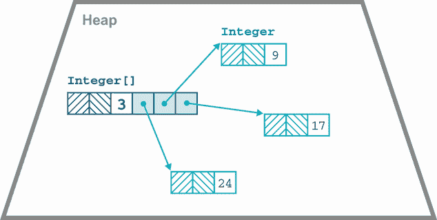
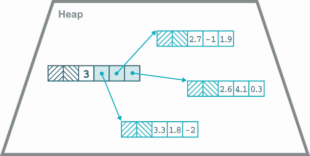
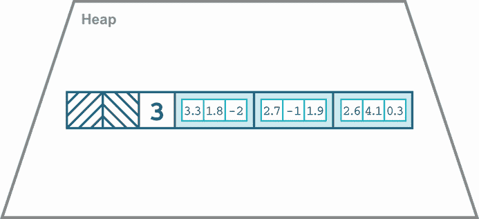

# 18 未来 Java

本章涵盖了

+   Project Amber

+   Project Panama

+   Project Loom

+   Project Valhalla

+   Java 18

本章涵盖了自 Java 17 发布以来的 Java 语言和平台的发展，包括尚未到达的未来更新。Java 语言和平台的新方向由 JEPs 管理，但那些是特定功能实现的描述。在更高层次上，OpenJDK 中有几个大型、长期运行的项目正在实施目前正在进行的重大变化，并将在未来几年内交付。

我们将依次介绍每个项目，然后是 Java 18。我们将从*Project Amber*开始，我们将听到更多关于模式匹配及其为何如此重要的故事。

## 18.1 Project Amber

在 OpenJDK 的当前主要项目中，Amber 最接近完成。它还受益于在开发者日常工作中相对容易理解。从项目的章程中：

Project Amber 的目标是探索和孵化更小、面向生产力的 Java 语言特性 ...

—Project Amber，[`openjdk.java.net/projects/amber/`](https://openjdk.java.net/projects/amber/)

该项目的主要目标是

+   局部变量类型推断（已交付）

+   Switch 表达式（已交付）

+   记录（已交付）

+   Sealed Types（已交付）

+   模式匹配

如您所见，许多这些功能已在 Java 17 中交付——而且非常实用！

Amber 最后一个尚未解决的重大问题是模式匹配。正如我们在第三章中看到的，它正在逐步到来，首先是`instanceof`中的类型模式的使用。我们还遇到了`switch`中的模式预览版本。

有理由预期`switch`中的模式将经历与其他 Project Amber 功能相同的生命周期：首先是一个预览，然后是第二个预览，之后作为标准功能交付。

展望未来，更多 JEPs 计划推出。确定模式匹配的基本形式并非唯一的目标——还有更多模式形式需要添加。这告诉我们，随着发布节奏的变化，每两年一个“LTS”模式，Java 18 或 19 中最初预览的内容将有机会在下一个预期的 LTS，即 2023 年 9 月的 Java 21 中完全成熟。

例如，我们已经看到了如何在当前的模式匹配预览版本中有效地使用 Sealed Types。没有 Sealed Types，即使我们现在拥有的模式匹配形式也不会那么有用。以类似的方式，记录在模式中的某些最重要的用例尚未交付。特别是，*解构模式*将允许将记录分解为其组件，作为模式的一部分。

注意：如果您在 Python、JS 或其他语言中编程，您可能熟悉*解构*。Java 中解构的想法类似，但受 Java 的名义类型系统指导。

这是因为记录是由其语义定义的——记录实际上 nothing more than the sum of its parts。因此，如果记录只能通过拼接其组件来构建，那么它就可以得出结论，它可以无语义后果地分解为其组件。

在撰写本文时，此功能尚未进入主线 JDK 开发，甚至尚未进入 Amber 特定的 JDK 仓库。然而，语法预计将类似于以下：

```
FXOrder order = // ...

// WARNING This is preliminary syntax!!!

var isMarket = switch (order) {
    case MarketOrder(int units, CurrencyPair pair, Side side,
                     LocalDateTime sent, boolean allOrNothing) -> true;
    case LimitOrder(int units, CurrencyPair pair, Side side,
                    LocalDateTime sent double price, int ttl) -> false;
};
```

注意，此代码包含 Record 组件的显式类型。也可以合理地预期，编译器可以推断出这些类型。

也应该能够解构数组，因为它们也充当没有额外语义的元素容器。该语法的样子可能如下所示：

```
// WARNING This is preliminary syntax!!!

if (o instanceof String[] { String s1, String s2, ... }){
    System.out.println(s1 + s2);
}
```

注意，在两个示例中，我们都没有为元素容器声明绑定，无论是记录还是数组。

应该在这里提到的一个旁白是 Java 序列化如何影响这个特性。一般来说，Java 序列化是一个问题，因为它违反了 Java 中封装应该如何工作的基本规则。

序列化构成了一个无形但公开的构造函数，以及一个无形但公开的访问器集合，用于您的内部状态。

——Brian Goetz

幸运的是，记录和数组都非常简单：它们只是其内容的透明载体，因此不需要在序列化机制的细节中调用怪异之处。相反，我们始终可以使用公共 API 和规范构造函数来序列化和反序列化记录。在此基础上，甚至有建议可以非常深远，例如部分或完全移除序列化机制，并将解构扩展到某些（甚至所有）Java 类。

总体来说，Amber 传达的信息是：如果你熟悉其他编程语言中的这些特性，那就太好了。但是，如果你不熟悉，也无需担心——它们被设计成与您已经熟悉的 Java 语言兼容，并且易于在代码中开始使用。

虽然一些特性很小，而另一些则较大，但它们都可以对您的代码产生与更改规模不成比例的积极影响。一旦您开始使用它们，您可能会发现它们为您的程序提供了真正的益处。现在让我们转向下一个主要项目，代号为 Panama。

## 18.2 项目 Panama

根据项目页面上的说法，Project Panama 的全部内容是

提高和丰富 Java 虚拟机与定义良好但“外国”（非 Java）API 之间的连接，包括许多 C 程序员常用的接口。

——Project Panama, [`openjdk.org/projects/panama/`](https://openjdk.org/projects/panama/)

“巴拿马”这个名字来源于一个**地峡**的概念——一条狭窄的陆地连接两个更大的陆地，在这个类比中，这两个更大的陆地被认为是 JVM 和本地代码。它包括两个主要领域的 JEP：

+   外部函数和内存 API

+   向量 API

在这些中，我们将在本节中仅讨论外部 API。向量 API 尚未准备好进行全面讨论，原因我们将在本章后面解释。

### 18.2.1 外部函数和内存 API

自 Java 1.1 以来，Java 就拥有了 Java Native Interface (JNI)来调用本地代码，但它长期以来一直被认为存在以下主要问题：

+   JNI 有很多仪式和额外组件。

+   JNI 实际上仅与用 C 和 C++编写的库良好互操作。

+   JNI 没有自动将 Java 类型系统映射到 C 类型系统的功能。

开发者对额外组件方面有相当好的理解：除了`native`方法的 Java API 外，JNI 还需要一个从 Java API 派生的 C 头文件（`.h`）和一个 C 实现文件，该文件将调用本地库。其他一些方面则不太为人所知，例如，本地方法不能用来调用使用与 JVM 构建时不同的调用约定编写的函数。

自 JNI 首次出现以来，已经尝试了多种提供更好替代方案的方法，例如 JNA。然而，其他（非 JVM）语言在与其他本地代码互操作方面有显著更好的支持。例如，Python 作为机器学习良好语言的声誉很大程度上取决于打包本地库并将其在 Python 代码中提供的简便性。

巴拿马外国 API 是一个尝试填补这一差距的尝试，它允许 Java 直接支持以下功能：

+   外部内存分配

+   结构化外部内存操作

+   外部资源生命周期管理

+   调用外部函数

API 位于`jdk.incubator.foreign`包中的`jdk.incubator.foreign`模块中。它建立在我们在第十七章中遇到的 MethodHandles 和 VarHandles 之上。

注意：外部 API 包含在 Java 17 的孵化模块中。我们早在第一章就讨论了孵化模块及其重要性。要使本节中的代码示例运行，您需要明确将孵化模块添加到您的模块路径中。

API 的第一部分依赖于 `MemorySegment`、`MemoryAddress` 和 `SegmentAllocator` 等类。这提供了对堆外内存的分配和处理访问。目标是提供一个更好的替代方案，以替代 ByteBuffer API 和 `Unsafe` 的使用。Foreign API 旨在避免 `ByteBuffer` 的限制，例如性能受限，只能处理 2 GB 大小的段，并且不是专门为堆外使用而设计的。同时，它应该比使用 `Unsafe` 更安全，`Unsafe` 允许基本上无限制的内存访问，这使得 JVM 出现故障崩溃变得非常容易。

注意：在本节的剩余部分，我们假设你已经熟悉 C 语言概念，以及从源代码构建 C/C++ 程序，并了解 C 编译、链接等阶段。

让我们看看它的实际效果。要开始，你需要从 [`jdk.java.net/panama/`](https://jdk.java.net/panama/) 下载 Panama 的早期访问构建版本。尽管孵化器模块存在于 JDK 17 中，但重要的 `jextract` 工具并不包含在内，我们需要它来演示我们的例子。

一旦你设置了 Panama 的早期访问安装，可以使用 `jextract -h` 来测试它。你应该会看到如下输出：

```
WARNING: Using incubator modules:
         jdk.incubator.jextract, jdk.incubator.foreign
Non-option arguments:
[String] -- header file

Option                         Description
------                         -----------
-?, -h, --help                 print help
-C <String>                    pass through argument for clang
-I <String>                    specify include files path
-d <String>                    specify where to place generated files
--dump-includes <String>       dump included symbols into specified file
--header-class-name <String>   name of the header class
--include-function <String>    name of function to include
--include-macro <String>       name of constant macro to include
--include-struct <String>      name of struct definition to include
--include-typedef <String>     name of type definition to include
--include-union <String>       name of union definition to include
--include-var <String>         name of global variable to include
-l <String>                    specify a library
--source                       generate java sources
-t, --target-package <String>  target package for specified header files
```

对于我们的示例，我们将使用一个用 C 语言编写的简单 PNG 库：LibSPNG ([`libspng.org/`](https://libspng.org/))。

示例：LibSPNG

我们将首先使用 `jextract` 工具获取一组基础 Java 包，我们可以使用这些包。语法看起来像这样：

```
$ jextract --source -t <target Java package> -l <library name> \
    -I <path to /usr/include> <path to header file>
```

在 Mac 上，这最终会变成如下所示：

```
$ jextract --source -t org.libspng \
  -I /Applications/Xcode.app/Contents/Developer/Platforms/MacOSX.platform/ \
      Developer/SDKs/MacOSX.sdk/usr/include \
  -l spng /Users/ben/projects/libspng/spng/spng.h
```

这可能会根据我们生成的头文件的版本产生一些警告，但只要成功，它将在当前目录中创建一个目录结构。这将包含一个名为 `org.libspng` 的包中的许多 Java 类，我们可以在稍后的 Java 程序中使用它们。

我们还需要构建一个共享对象，以便在运行我们的程序时进行链接。这最好是通过遵循项目构建说明来完成，请参阅 [`mng.bz/v6dJ`](http://mng.bz/v6dJ)。

安装会在项目内部生成 `libspng.dylib`，并将其安装到系统共享位置。在运行项目时，你需要确保该文件位于系统属性 `java.library.path` 列出的路径之一，或者直接设置该属性以包含你的位置。在 Mac 上，一个示例默认目录是 `~/Library/Java/Extensions/`。代码生成完成并且库安装后，我们可以继续进行一些 Java 编程。

Panama 的目标是提供与我们要链接的 C 库中符号的名称（以及参数类型的 Java 版本）相匹配的 Java 静态方法。因此，生成的 Java 代码中的符号将遵循 C 命名约定，并且看起来不太像 Java 名称。

对于 Java 程序员来说，整体印象是我们直接调用 C 函数（尽可能直接）。实际上，底层发生了一些巴拿马魔法，使用方法句柄等技术来隐藏复杂性。在正常情况下，大多数开发者不需要担心巴拿马的确切工作细节。

让我们看看一个例子：一个使用 C 库从 PNG 文件读取一些基本数据的程序。我们将把这个代码设置为一个合适的模块化构建。模块描述符`module-info.java`看起来像这样：

```
module wgjd.png {
  exports wgjd.png;

  requires jdk.incubator.foreign;
}
```

代码包括`org.libspng`包，这是我们自动从 C 代码生成的，以及单个导出包`wgjd.png`。它包含一个文件，我们将完整展示，因为导入等对于理解正在发生的事情很重要：

```
package wgjd.png;

import jdk.incubator.foreign.MemoryAddress;                                ❶
import jdk.incubator.foreign.MemorySegment;                                ❶
import jdk.incubator.foreign.SegmentAllocator;                             ❶
import org.libspng.spng_ihdr;

import static jdk.incubator.foreign.CLinker.toCString;
import static jdk.incubator.foreign.ResourceScope.newConfinedScope;
import static org.libspng.spng_h.*;

public class PngReader {
    public static void main(String[] args) {
        if (args.length < 1) {
            System.err.println("Usage: pngreader <fname>");
            System.exit(1);
        }

        try (var scope = newConfinedScope()) {
            var allocator = SegmentAllocator.ofScope(scope);

            MemoryAddress ctx = spng_ctx_new(0);                           ❷
            MemorySegment ihdr = allocator.allocate(spng_ihdr.$LAYOUT());

            spng_set_crc_action(ctx, SPNG_CRC_USE(),                       ❸
                                     SPNG_CRC_USE());

            int limit = 1024 * 1024 * 64;                                  ❹
            spng_set_chunk_limits(ctx, limit, limit);                      ❷

            var cFname = toCString(args[0], scope);                        ❺
            var cMode = toCString("rb", scope);                            ❺
            var png = fopen(cFname, cMode);                                ❻
            spng_set_png_file(ctx, png);                                   ❷

            int ret = spng_get_ihdr(ctx, ihdr);                            ❷

            if (ret != 0) {
                System.out.println("spng_get_ihdr() error: " +
                                   spng_strerror(ret));
                System.exit(2);
            }

            final String colorTypeMsg;
            final byte colorType = spng_ihdr.color_type$get(ihdr);

            if (colorType ==
                  SPNG_COLOR_TYPE_GRAYSCALE()) {                           ❸
                colorTypeMsg = "grayscale";
            } else if (colorType ==
                  SPNG_COLOR_TYPE_TRUECOLOR()) {                           ❼
                colorTypeMsg = "truecolor";
            } else if (colorType ==
                  SPNG_COLOR_TYPE_INDEXED()) {                             ❼
                colorTypeMsg = "indexed color";
            } else if (colorType ==
                  SPNG_COLOR_TYPE_GRAYSCALE_ALPHA()) {                     ❼
                colorTypeMsg = "grayscale with alpha";
            } else {
                colorTypeMsg = "truecolor with alpha";
            }

            System.out.println("File type: " + colorTypeMsg);
        }
    }
}
```

❶ 使用 C 风格内存管理的巴拿马课程

❷ spng.h 中 C 函数的 Java 包装器

❸ C 常量的 Java 包装器

❹ 以 64 M 块读取数据

❺ 将 Java 字符串的内容复制到 C 字符串中

❻ C 标准库函数的 Java 包装器

❼ C 常量的 Java 包装器

这是通过一个 Gradle 构建脚本构建的，如下所示：

```
plugins {
  id("org.beryx.jlink") version("2.24.2")
}

repositories {
  mavenCentral()
}

application {
  mainModule.set("wgjd.png")
  mainClass.set("wgjd.png.PngReader")
}

java {
    modularity.inferModulePath.set(true)
}

sourceSets {
  main {
    java {
      setSrcDirs(listOf("src/main/java/org",
                        "src/main/java/wgjd.png"))
    }
  }
}

tasks.withType<JavaCompile> {
  options.compilerArgs = listOf()
}

tasks.jar {
  manifest {
    attributes("Main-Class" to application.mainClassName)
  }
}
```

可以像这样执行：

```
$ java --add-modules jdk.incubator.foreign \
    --enable-native-access=ALL-UNNAMED \
    -jar build/libs/Panama.jar <FILENAME>.png
```

这应该会输出一些基本元数据，关于我们的图像文件。

在巴拿马中处理原生内存

处理内存的一个关键方面是原生内存的生命周期问题。C 没有垃圾回收器，所以所有内存都必须手动分配和释放。这当然是极其容易出错的，并且对于 Java 程序员来说一点也不自然。

为了解决这个问题，巴拿马提供了几个类，这些类用作 C 内存管理操作的 Java 句柄。关键是`ResourceScope`类，它可以用来提供确定性清理。这通常通过 Java 的`try`-with-resources 方式处理。例如，前面的代码使用了本地内存处理的词法作用域生命周期：

```
try (var scope = newConfinedScope()) {
    var allocator = SegmentAllocator.ofScope(scope);

    // ...

}
```

`allocator`对象是`SegmentAllocator`接口实现的一个实例。它通过工厂方法从作用域创建，然后我们可以从分配器创建`MemorySegment`对象。

实现`MemorySegment`接口的对象代表连续的内存块。通常，这些将由原生内存块支持，但也可以使用堆上的数组来支持内存段。这与 Java NIO API 中的`ByteBuffer`的情况类似。

注意：巴拿马 API 还包含`MemoryAddress`，它实际上是一个 C 指针的 Java 包装器（以`long`值表示）。

当作用域自动关闭时，分配器将被回调以确定性地释放和释放它所持有的任何资源。这就是*资源获取即初始化*（或 RAII）模式在 Java 中使用`try`-with-resources 实现，并将其带入原生代码的方式。作用域和分配器对象持有原生资源的引用，并在 TWR 块退出时自动释放它们。

或者，这可以通过隐式处理，当`MemorySegment`对象被垃圾回收时，原生内存将被清理。当然，这意味着清理是非确定性的，无论 GC 何时运行。一般来说，建议使用显式作用域，特别是如果你不熟悉处理堆外内存的潜在陷阱。

在撰写本文时，`jextract`只理解 C 头文件。这意味着，目前，要从其他原生语言（例如，Rust）中使用它，你必须首先生成一个 C 头文件。理想情况下，将会有一个自动的工具来生成这些文件，它的工作方式类似于`rust-bindgen`工具，但方向相反。

更广泛地说，随着时间的推移，`jextract`可能会为其他语言提供更多的支持。该工具基于 LLVM，它已经是语言无关的，因此，从理论上讲，它应该可以扩展到 LLVM 所知的任何语言，并且可以处理 C 函数调用约定。

外部 API 即将作为孵化功能发布第二个版本（参见第一章中对孵化功能和预览功能的描述），作为 Java 18 的一部分。希望它能在 2022 年 9 月的 Java 19 中成为最终的标准功能。

向量 API 并不像其他 API 那样先进，主要是因为 API 设计者决定他们宁愿等待 Project Valhalla（见本章后面的内容）的功能可用。因此，这个 API 将不会在 Valhalla 作为标准功能可用之前离开孵化状态。

## 18.3 Project Loom

用它自己的话说，OpenJDK 的*Project Loom*是关于

在 Java 平台上，易于使用、高吞吐量、轻量级并发以及新的编程模型。

—Project Loom, [`wiki.openjdk.org/display/loom/Main`](https://wiki.openjdk.org/display/loom/Main)

为什么需要这种新的并发方法？让我们从更历史的角度来考虑 Java。

考虑 Java 的一个有趣的方式是，它是一个 20 世纪 90 年代末的语言和平台，对软件演化的方向做出了许多有见地的、战略性的赌注。从 2022 年的角度来看，这些赌注在很大程度上已经得到了回报（当然，是靠运气还是靠判断，这当然是一个值得讨论的问题）。

例如，考虑线程。Java 是第一个将线程内置于核心语言的流行编程平台。在引入线程之前，最先进的技术是使用多个进程和各种不令人满意的机制（比如 Unix 共享内存）来在它们之间进行通信。

在操作系统级别，线程是独立调度的执行单元，属于一个进程。每个线程都有一个执行指令计数器和调用栈，但与同一进程中的每个其他线程共享堆。

不仅如此，Java 堆只是进程堆的单个连续子集（至少在 HotSpot 实现中是这样——其他 JVM 可能不同），因此线程在操作系统级别的内存模型自然地延续到 Java 语言领域。

线程的概念自然地导致了一个轻量级上下文切换的概念。在同一进程中切换两个线程比其他方式更便宜。这主要是因为将虚拟内存地址转换为物理地址的映射表对于同一进程中的线程来说大部分是相同的。

注意：创建线程也比创建进程便宜。这种说法的确切程度取决于所讨论的操作系统细节。

在我们的情况下，Java 规范并没有强制要求 Java 线程和操作系统（OS）线程之间有任何特定的映射（假设宿主操作系统甚至有一个合适的线程概念，这并不总是如此）。事实上，在非常早期的 Java 版本中，JVM 线程被多路复用到 OS（也称为*平台*）线程上，这被称为*绿色线程*或*M:1 线程*（因为实现实际上只使用了单个平台线程）。

然而，这种做法在 Java 1.2/1.3 时代（以及在 Sun Solaris OS 上稍微早一些）就消失了，而主流操作系统上运行的现代 Java 版本则实现了规则：一个 Java 线程 = 精确的一个操作系统线程。调用`Thread.start()`会调用线程创建系统调用（例如，Linux 上的`clone()`）并实际上创建一个新的 OS 线程。

OpenJDK 的 Project Loom 的主要目标是启用新的`Thread`对象，这些对象可以执行代码，但并不对应于专用的 OS 线程，或者换句话说，创建一个执行模型，其中表示执行上下文的对象不一定是需要由操作系统调度的事物。

因此，在某种程度上，Loom 是回归到类似于绿色线程的东西。然而，在这段时间里，世界发生了很大的变化，有时在计算中，有些想法是超越时代的。

例如，可以将企业 JavaBeans（EJBs）视为一种虚拟化/受限的环境，它试图过度虚拟化环境。它们是否可以被视为后来在现代 PaaS 系统中（以及在一定程度上在 Docker/K8s 中）受到青睐的想法的原型形式？

因此，如果 Loom 是（部分）回归到绿色线程的想法，那么一种接近它的方法可能是通过询问：“环境中的哪些变化使得回归到过去被认为没有用处的旧想法变得有趣？”

为了稍微探讨这个问题，让我们看看一个例子。具体来说，让我们尝试通过创建过多的线程来崩溃 JVM。除非你准备好可能发生的崩溃，否则你不应该运行这个例子中的代码：

```
//
// Do not actually run this code... it may crash your JVM or laptop
//
public class CrashTheVM {
    private static void looper(int count) {
        var tid = Thread.currentThread().getId();
        if (count > 500) {
            return;
        }
        try {
            Thread.sleep(10);
            if (count % 100 == 0) {
                System.out.println("Thread id: "+ tid +" : "+ count);
            }
        } catch (InterruptedException e) {
            e.printStackTrace();
        }
        looper(count + 1);
    }

    public static Thread makeThread(Runnable r) {
        return new Thread(r);
    }

    public static void main(String[] args) {
        var threads = new ArrayList<Thread>();
        for (int i = 0; i < 20_000; i = i + 1) {
            var t = makeThread(() -> looper(1));
            t.start();
            threads.add(t);
            if (i % 1_000 == 0) {
                System.out.println(i + " thread started");
            }
        }
        // Join all the threads
        threads.forEach(t -> {
            try {
                t.join();
            } catch (InterruptedException e) {
                e.printStackTrace();
            }
        });
    }
}
```

代码启动了 20,000 个线程，并在每个线程中执行最小量的处理——或者试图这样做。在实践中，它通常会在达到稳定状态之前就死亡或锁定机器。

注意：如果机器或操作系统被限制并且不能快速创建线程以引起资源饥饿，则可以将示例运行到完成。

虽然这显然并不完全具有代表性，但这个例子旨在表明，例如，对于每个连接一个线程的 Web 服务环境会发生什么。一个现代高性能 Web 服务器能够处理 20,000 个并发连接是完全合理的，而这个例子清楚地表明，对于这种情况，按连接分配线程的架构失败了。

注意：另一种思考 Loom 的方式是，现代 Java 程序可能需要跟踪比它可以创建的线程更多的可执行上下文。

另一种可能的启示可能是，线程可能比我们想象的要昂贵得多，并且代表了现代 JVM 应用程序的扩展瓶颈。开发者已经尝试了多年解决这个问题，要么通过降低线程的成本，要么通过使用不是线程的执行上下文的表示。

实现这一目标的一种方法是通过 SEDA 方法（阶段事件驱动架构）——大致来说，这是一个将域对象从一个阶段移动到另一个阶段，并在途中发生各种不同转换的多阶段管道系统。这可以通过使用消息系统在分布式系统中实现，或者在一个进程中实现，使用阻塞队列和每个阶段的线程池。

在每个步骤中，域对象的处理由一个包含实现步骤转换的代码的 Java 对象描述。为了正确工作，代码必须保证能够终止——没有无限循环——而这不能由框架强制执行。

这种方法有一些明显的缺点——首先是程序员为了有效地使用架构所必需的纪律。让我们看看一个更好的替代方案。

### 18.3.1 虚拟线程

Project Loom 旨在通过向 JVM 添加以下新结构来为今天的超大规模应用程序提供更好的体验：

+   虚拟线程

+   分界性延续

+   尾调用消除

这个关键方面是*虚拟线程*。它们被设计成对程序员来说看起来就像“只是线程”。然而，它们是由 Java 运行时管理的，并且*不是*轻量级的、一对一的操作系统线程的包装器。相反，它们是由 Java 运行时在用户空间中实现的。虚拟线程旨在带来的主要优势包括

+   创建和阻塞它们是廉价的。

+   可以使用标准的 Java 执行调度器（线程池）。

+   对于栈不需要 OS 级别的数据结构。

移除操作系统在虚拟线程生命周期中的参与是消除可扩展性瓶颈的原因。我们的 JVM 应用程序可以处理数百万甚至数十亿个对象——那么为什么我们只限于几千个可由操作系统调度的对象（这是思考线程的一种方式）呢？打破这一限制并解锁新的并发编程风格是 Project Loom 的主要目标。

让我们看看虚拟线程的实际应用。下载 Loom 测试版([`jdk.java.net/loom/`](https://jdk.java.net/loom/))，并像这样启动 `jshell`（启用预览模式以激活 Loom 功能）：

```
$ jshell --enable-preview
|  Welcome to JShell -- Version 18-loom
|  For an introduction type: /help intro

jshell> Thread.startVirtualThread(() -> {
   ...>     System.out.println("Hello World");
   ...> });
Hello World
$1 ==> VirtualThread[<unnamed>,<no carrier thread>]

jshell>
```

我们可以直接在输出中看到虚拟线程结构。我们还在使用一个新的静态方法 `startVirtualThread()` 来在一个新的执行上下文中启动 lambda，这是一个虚拟线程。简单！

通用规则必须是，现有的代码库必须继续以它们在 Loom 之前的方式运行。或者，换句话说，使用虚拟线程必须是可选的。我们必须做出保守的假设，即所有现有的 Java 代码真正需要的是，直到现在，城镇中唯一的游戏——在操作系统线程之上的轻量级包装器。

虚拟线程的出现以其他方式开辟了新的天地。到目前为止，Java 语言提供了以下两种创建新线程的主要方式：

+   继承 `java.lang.Thread` 并调用继承的 `start()` 方法。

+   创建一个 `Runnable` 实例，并将其传递给 `Thread` 构造函数，然后启动生成的对象。

如果线程是什么的概念将会改变，那么重新审视我们用来创建线程的方法也是有意义的。我们已经遇到了为 *fire-and-forget* 虚拟线程提供的新静态工厂方法，但现有的线程 API 还需要在其他几个方面进行改进。

### 18.3.2 线程构建器

一个重要的新概念是 `Thread.Builder` 类，它被添加为 `Thread` 的内部类。`Thread` 中添加了两个新的工厂方法，以提供对平台和虚拟线程构建器的访问，如下所示：

```
jshell> var tb = Thread.ofPlatform();
tb ==> java.lang.ThreadBuilders$PlatformThreadBuilder@312b1dae

jshell> var tb = Thread.ofVirtual();
tb ==> java.lang.ThreadBuilders$VirtualThreadBuilder@506e1b77
```

让我们通过替换我们示例中的 `makeThread()` 方法来查看构建器的实际应用：

```
    // Loom-specific code
    public static Thread makeThread(Runnable r) {
        return Thread.ofVirtual().unstarted(r);
    }
```

这调用 `ofVirtual()` 方法来显式创建一个将执行我们的 `Runnable` 的虚拟线程。当然，我们也可以使用 `ofPlatform()` 工厂方法，我们最终会得到一个传统的、可由操作系统调度的线程对象。但那样有什么乐趣呢？

如果我们用虚拟版本的 `makeThread()` 替换，并使用支持 Loom 的 Java 版本重新编译我们的示例，那么我们可以执行生成的代码。这次，程序运行完成且没有问题。这是一个 Loom 哲学在行动中的好例子——将应用程序需要更改的代码位置局部化。

新的线程库鼓励开发者从旧范式迁移的一种方式是，`Thread` 的子类不能是虚拟的。因此，子类化 `Thread` 的代码将继续使用传统的操作系统线程来创建。

注意：随着时间的推移，随着虚拟线程变得更加普遍，开发者不再关心虚拟和操作系统线程之间的区别，这应该会阻止使用子类化机制，因为它总是会创建一个可由操作系统调度的线程。

目的是保护使用 `Thread` 子类的现有代码，并遵循最小惊讶原则。

线程库的其他部分也需要升级，以更好地支持 Loom。例如，`ThreadBuilder` 也可以构建可以传递给各种 `Executors`（如这样）的 `ThreadFactory` 实例：

```
jshell> var tb = Thread.ofVirtual();
tb ==> java.lang.ThreadBuilders$VirtualThreadBuilder@312b1dae

jshell> var tf = tb.factory();
tf ==> java.lang.ThreadBuilders$VirtualThreadFactory@506e1b77

jshell> var tb = Thread.ofPlatform();
tb ==> java.lang.ThreadBuilders$PlatformThreadBuilder@1ddc4ec2

jshell> var tf = tb.factory();
tf ==> java.lang.ThreadBuilders$PlatformThreadFactory@b1bc7ed
```

虚拟线程需要附加到实际的操作系统线程才能执行。这些执行虚拟线程的操作系统线程被称为 *载体线程*。我们已经在之前的一些示例中看到过载体线程。然而，在其生命周期内，单个虚拟线程可能运行在几个不同的载体线程上。这有点类似于常规线程随着时间的推移在不同的物理 CPU 核心上执行的方式——两者都是执行调度的例子。

### 18.3.3 使用虚拟线程进行编程

虚拟线程的出现带来了思维方式的转变。那些用今天存在的 Java 编写并发应用程序的程序员已经习惯了（有意识地或无意识地）处理线程固有的扩展限制。

我们习惯于创建任务对象，通常基于 `Runnable` 或 `Callable`，并将它们传递给由线程池支持的执行器，以保存我们宝贵的线程资源。如果所有这些都突然变得不同会怎样？

从本质上讲，Project Loom 通过引入一个比现有概念更便宜且不直接映射到操作系统线程的新线程概念，试图解决线程的扩展限制。然而，这种新功能仍然看起来和表现像一个线程，就像 Java 程序员已经理解的那样。

与要求开发者学习全新的编程风格（如延续传递风格或 Promise/Future 方法或回调）相比，Loom 运行时保留了我们从今天线程中熟悉的相同编程模型，用于虚拟线程；对于程序员来说，虚拟线程就是线程。

虚拟线程是**抢占式**的，因为用户代码不需要显式地释放。调度点由虚拟调度器和 JDK 决定。用户无需假设它们何时发生，因为这完全是实现细节。然而，了解支撑调度的操作系统理论基础，有助于理解虚拟线程的不同之处。

当操作系统调度平台线程时，它会为线程分配一个**时间片**的 CPU 时间。当时间片结束时，会生成一个硬件中断，内核能够恢复控制，移除正在执行的平台（用户）线程，并用另一个线程替换它。

注意：这种机制是 Unix（以及其他操作系统）能够在不同任务之间实现处理器时间共享的原因——甚至在计算机只有一个处理核心的几十年前就已经如此。

虚拟线程与平台线程的处理方式不同。现有的虚拟线程调度器都不使用时间片来抢占虚拟线程。

注意：使用时间片来抢占虚拟线程是可能的，并且虚拟机已经能够控制执行 Java 线程——例如，在 JVM 安全点时。

相反，当进行阻塞调用（如 I/O）时，虚拟线程会自动放弃（或**释放**）其承载线程。这由库和运行时处理，并且不在程序员的显式控制之下。

因此，Loom 而不是强迫程序员显式管理释放，或者依赖于非阻塞或基于回调的操作的复杂性，允许 Java 程序员以传统的、线程顺序的方式编写代码。这带来了额外的优势，例如允许调试器和性能分析器以通常的方式工作。工具制造商和运行时工程师需要做一些额外的工作来支持虚拟线程，但这比强迫最终用户 Java 开发者承担额外的认知负担要好。特别是，这种方法与其他一些编程语言采用的`async`/`await`方法不同。

Loom 的设计者预期，由于虚拟线程无需池化，因此它们**不应该**池化，而是采用无约束的虚拟线程创建模式。为此，增加了一个**无界执行器**。可以通过新的工厂方法访问它，即`Executors.newVirtualThreadPerTaskExecutor()`。虚拟线程的默认调度器是`ForkJoinPool`中引入的工作窃取调度器。

注意：Fork/Join 的工作窃取方面已经变得比任务的递归分解更为重要。

Loom 的当前设计基于开发者理解他们应用程序中不同线程上存在的计算开销。简单来说，如果大量线程需要持续的大量 CPU 时间，那么你的应用程序将面临资源紧张，即使是巧妙的调度也无法帮助。另一方面，如果只有少数线程预期会变成 CPU 绑定，那么这些线程应该被放置在单独的池中，并分配平台线程。

虚拟线程也旨在在存在许多偶尔仅 CPU 绑定的线程的情况下表现良好。目标是工作窃取调度器将平滑 CPU 利用率，并且现实世界的代码最终会调用一个传递 yield 点的操作（例如阻塞 I/O）。

### 18.3.4 Project Loom 何时到来？

Loom 的开发正在进行一个单独的仓库中，而不是在 JDK 主线中。早期访问的二进制文件是可用的，但这些仍然有一些粗糙的边缘——崩溃仍然发生，但变得越来越不常见。基本 API 正在成形，但几乎可以肯定还没有完全最终确定。

JEP 425 ([`openjdk.java.net/jeps/425`](https://openjdk.java.net/jeps/425)) 已被提交以将虚拟线程作为预览功能进行集成，但在撰写本文时，此 JEP 尚未针对任何版本进行目标定位。有理由假设，如果它不在 Java 19 中作为预览功能包含，那么该功能的最终版本可能不会作为 Java 21（可能是下一个 Java LTS 版本）的一部分提供。在虚拟线程之上构建的 API 还有很多工作要做，例如结构化并发和其他更高级的功能。

开发者总是有一个关键问题，那就是性能，但在新技术开发的早期阶段，这总是很难回答。对于 Loom，我们还没有达到可以进行有意义的比较的阶段，并且当前的性能并不被认为是最终版本的真实反映。

就像 OpenJDK 中的其他长期项目一样，真正的答案是它准备好了才会准备好。目前，已经有一个足够的原型可以开始实验它，并尝尝未来 Java 开发可能的样子。让我们把注意力转向我们正在讨论的四个主要 OpenJDK 项目中的最后一个：Valhalla。

## 18.4 Project Valhalla

为了使 JVM 内存布局行为与现代硬件的成本模型相一致。

—Brian Goetz

要理解当前 Java 内存布局模型达到极限并开始崩溃的地方，让我们从一个例子开始。在图 18.1 中，我们可以看到一个原始整型数组。因为这些值是原始类型而不是对象，所以它们被布局在相邻的内存位置。


图 18.1 原始整型数组

为了看到与对象数组的区别，让我们将其与装箱整数的情况进行对比。一个`Integer`对象数组将是一个引用数组，如图 18.2 所示。



图 18.2 `Integer`对象数组

因为每个`Integer`都是一个对象，所以它需要有一个对象头，正如我们在上一章中解释的那样。我们有时说每个对象都需要支付作为 Java 对象带来的“头税”。

超过 20 年来，这种内存布局模式一直是 Java 平台运行的方式。它具有简单性的优势，但存在性能权衡：处理对象数组涉及不可避免的指针间接引用和相关的缓存未命中。

例如，考虑一个表示三维空间中点的类，一个`Point3D`类型。它实际上只包含三个空间坐标，并且从 Java 17 开始，可以表示为一个具有三个字段（或等效的记录）的对象类型，如下所示：

```
public final class Point3D {
    private final double x;
    private final double y;
    private final double z;

    public Point3D(double a, double b, double c) {
        x = a;
        y = b;
        c = z;
    }

    // Additional methods, e.g getters, toString() etc.
}
```

在 HotSpot 中，这些点对象的数组在内存中布局，如图 18.3 所示。



图 18.3 `Point3D`数组

在处理这个数组时，每个元素都是通过额外的间接引用来访问的，以获取每个点的坐标。这导致数组中每个点都会发生缓存未命中，没有任何合理的理由而降低性能。

对于非常关注性能的程序员来说，能够定义在内存中更有效地布局的类型将非常有用。我们还应该注意，当与`Point3D`值一起工作时，对象身份对程序员来说并没有真正的益处，因为两个点只有在所有字段都相等的情况下才应该相等。

此示例演示了以下两个独立的编程概念，这两个概念都通过移除对象身份而得以实现：

+   *堆扁平化*—对于无身份对象移除指针间接引用，从而提高内存密度

+   *标量化*—将无身份对象分解为字段并在需要时重新构建的能力

这些独立的属性将对无身份对象的用户模型产生后果。

注意：标量化——JVM 分解和重新构建值对象的能力，出人意料地有用。JVM 包含一种称为*逃逸分析*的 JIT 技术，可以从将值对象拆分为其单个字段并将它们分别通过代码的自由中受益。

记住这些属性，我们也可以从以下问题开始接近 Valhalla：“我们能否避免支付头税？”广泛地说，答案是肯定的，前提是以下条件成立：

+   对象不需要身份的概念。

+   该类是最终的，因此所有方法调用的目标都可以在类加载时知道。

基本上，第一个属性消除了对头部标记词的需要，第二个大大减少了对于 klass 词的需求（参见第四章和第十七章了解更多关于 klass 词的内容）。

当对象在堆上时，klass 词仍然是必需的，除非它已经被作为另一个对象的实例字段或作为数组元素扁平化，因为对象字段布局可能需要被描述——例如，以便 GC 可以遍历对象图。然而，当对象被标量化后，我们可以丢弃头部。

从开发者的角度来看，因此，Valhalla 的主要成果之一是 Java 生态系统中出现了一种新的值形式，被称为*值对象*，它们是*值类*的实例。这些新类型被认为是（通常是）小、不可变、无身份的类型。

音符值类在其发展过程中被赋予了多个不同的名称，包括*原始类*和*内联类型*。给事物命名是困难的，尤其是在一个成熟的语言中，它可能已经使用了许多语言概念的常见名称。

值类的示例用例包括

+   新的数值类型，如无符号字节、128 位整数和半精度浮点数

+   复数、颜色、向量以及其他多维数值

+   带单位的数字：大小、温度、速度、现金流等等

+   映射条目、数据库行和多返回类型

+   不可变游标、子数组、中间流以及其他数据结构视图抽象

还有可能一些现有的类型可以被改造并演变成表示为值类。例如，`Optional`和`java.time`中的许多类型显然是未来版本中可能成为值类的候选者，如果证明这是可行的。

注意记录本身与值类没有直接关系，但高度可能有许多记录是聚合体，不需要身份，因此*值记录*的概念可能非常有用。

如果这种新的值形式可以在 JVM 上实现，那么对于像我们所讨论的空间点这样的类，一个如图 18.4 所示的扁平化内存布局将更加高效。



图 18.4 内联点数组

这种内存布局将接近 C 程序员所认识到的`struct`数组，但不会暴露低级内存访问的全部危险。扁平化布局不仅减少了内存占用，还减轻了垃圾收集器的负担。

### 18.4.1 改变语言模型

需要做的最大改变是修改`java.lang.Object`作为通用超类的概念，因为它上面有`wait()`和`notify()`这样的方法，这些方法本质上与对象身份相关联。没有对象头，就没有标记词来存储对象的监视器，也没有可以等待的东西。对象实际上也没有一个明确的生存期，因为它可以被自由复制，并且产生的副本是无法区分的。相反，在`java.lang`中定义了两个新的接口：`IdentityObject`和`ValueObject`。JEP 401（见[`openjdk.org/jeps/401`](https://openjdk.org/jeps/401)）详细描述了值对象，但基本上所有值类都隐式实现了`ValueObject`。

所有身份类都将隐式实现`IdentityObject`，所有现有的具体类都作为身份类选择加入。现有的接口和（大多数）抽象类不扩展这两个新接口。如果 API 设计者的功能与新语义不兼容，他们可能希望更新他们的接口以显式扩展`IdentityObject`。

值类是`final`的，不能是`abstract`的。它们不能实现（直接或间接地）`IdentityObject`。可以使用`instanceof`测试来检查一个对象是否是值对象。

注意 除了不能在值对象上调用`wait()`或`notify()`之外，也不可能拥有同步方法或块，因为值对象没有监视器。

类`Object`本身将经历一些微妙的位置调整，因为它将不实现`IdentityObject`或`ValueObject`，并将更类似于抽象类或接口。如下代码所示

```
var o = new Object();
```

这也将改变意义——预计`o`将包含`Object`的某个匿名子类的实例，出于向后兼容性的原因，它将被理解为身份类。

虽然值类的初始目标似乎很明确，但它实际上有一些深远的影响。为了使项目成功，有必要考虑引入第三种值形式的逻辑结论。

### 18.4.2 值对象的影响

值对象的赋值具有相当明显的语义：位被复制，就像原始类型（引用的赋值也复制位，但那种情况下，我们最终会得到两个指向同一堆位置的引用）。然而，如果我们需要构建一个与原始对象不完全相同但经过修改的副本的值对象会发生什么呢？

回想一下，值对象是不可变的——它们只有`final`字段。这意味着它们的州不能通过`putfield`操作来改变。相反，需要另一种机制来生成一个与原始对象状态不同的值对象。为了实现这一点，需要一些新的字节码，如下所示：

+   `aconst_init`

+   `withfield`

新的`withfield`指令本质上相当于字节码级别的 wither 方法的使用（我们在第十五章中讨论过）。

另一个新的指令，`aconst_init`，为值类的一个实例提供一个默认值。让我们更深入地了解一下为什么需要这个。

到目前为止，在 Java 中，原始类型和对象引用都被理解为具有与“所有位为零”相对应的默认值，而`null`被理解为引用的零位的意义。然而，当我们尝试将这些语义扩展到处理值对象时，我们发现存在两个相关的问题：

+   一些值类没有好的默认值选择。

+   存在着*值撕裂*的可能性。

没有好的默认值的问题实际上归结于想要能够说值对象实际上还不是值，但 Java 已经有了一种方法来做这件事：`null`。此外，用户已经习惯了在值未初始化时处理`null`指针异常（NPEs）。

第二个问题，撕裂，实际上是一个老问题的新形式。在 Java 的旧版本中，在 32 位硬件上运行时，处理 64 位值（如 longs）时有一些微妙的问题。特别是，对 longs 的写入作为两个独立的（32 位）写入执行，并且读取线程可能会观察到只完成了一个 32 位写入的状态。这会使读取线程观察到 long 的“撕裂”值——既不是之前的状态也不是之后的状态。

值类型有可能重新引入这个问题。如果值可以被标量化，那么我们如何保证写入的原子性？

解决方案是认识到值类代表的不只是一种新的数据形式，而是*两种*。如果我们想避免撕裂，我们需要使用引用。这是一个已经确立的想法，即使用间接层允许我们更新值而不撕裂它们。

此外，考虑一些类可能没有合理的默认值，这些值可以对应于零位。例如，当`LocalDate`迁移到值类后，它的默认值会是什么？有些人可能会争论零位应该被解释为零偏移量（即，1970 年 1 月 1 日），但这似乎很容易出错。

这引出了*无身份引用*的概念——基本上，我们移除了对象的身份。在底层，这仍然允许在 JIT（例如，值的标量化传递）和 JIT 代码中进行标量化优化，但放弃了堆上的内存改进。这些对象总是通过引用来处理，就像身份对象一样，并且它们有一个简单的默认值`null`。然后，通过构造函数或工厂方法设置非平凡默认值，正如它应该的那样。

此外，对于高级用例，也存在*原始值类型*。这些类型更像是内置的“真正原始类型”，允许在堆中扁平化以及与值对象一起允许的标量化。然而，额外的利益伴随着相关的成本——需要接受零位作为默认值，以及在可能存在数据竞争的更新中可能会撕裂的可能性。

注意：原始值类型实际上仅适用于小型值（在今天的硬件上为 64-128 位或更少），在用它们编程时需要额外的注意。

撕裂确实使用户面临潜在的安全问题，尽管人们可能会倾向于认为这是一个只有“坏”程序（存在数据竞争）的问题。无论如何，它是一种新的可能的并发错误形式，需要锁定来正确防御。

原始值类的另一个方面是，运行时需要知道如何在内存中布局它们。因此，不可能创建一个引用声明类的原始值类字段（无论是直接还是间接）。换句话说，原始值类的实例不能包含原始值类的循环数据结构——它们必须有固定大小的布局，这样它们才能在堆中扁平化。总的来说，预期是大多数用户将想要使用无身份的值对象，而扩展的原始类型将很少使用。

为了总结本节，让我们看看值类在字节码中表示的另一个方面。回想一下，在第四章中，我们遇到了类型描述符的概念。通过*L 类型描述符*表示身份引用类型，例如字符串的`Ljava/lang/String;`。

为了描述原始类的值，正在添加一个新的基本类型，即*Q 类型描述符*。以`Q`开头的描述符与 L 描述符具有相同的结构（例如，对于原始类`Point3D`，`QPoint3D;`）。Q 和 L 值都由同一组字节码操作，即以`a`开头的字节码，例如`aload`或`astore`。

通过 Q 描述符（有时称为“裸”对象）引用的值与值对象的引用有以下主要区别：

+   值对象的引用，如所有对象引用一样，可以是`null`，而裸值则不能。

+   引用加载和存储是相对于彼此原子的，而足够大的裸值加载和存储可能会撕裂，就像在 32 位实现中的长和双精度浮点数一样。

+   如果通过 Q 描述符的路径链接，对象图可能不是循环的：类`C`在其布局中不能直接或间接地引用`QC;`。

+   由于技术原因，JVM 需要比由 L 描述符命名的类更早地加载 Q 描述符中命名的类。

这些属性基本上是我们已经遇到的一些值和原始对象属性的字节码级编码。

在从 Valhalla 移动之前，我们应该简要考虑一个最终的问题：需要重新审视泛型类型的问题。这作为引入值和原始对象的自然结果而出现。

### 18.4.3 泛型重访

如果 Java 要包含值类，自然会提出一个问题：值类是否可以在泛型类型中使用，例如，作为类型参数的值。如果不能，这似乎会极大地限制该特性的有用性。因此，高级设计始终包括假设值类最终将以增强泛型形式作为类型参数的值。

幸运的是，在 Valhalla 中 `Object` 的角色发生了微妙的变化——它被追溯性地修改为值对象和身份对象的超类。这使我们能够将值对象纳入现有泛型的范畴。然而，将原始类型整合到这个模型中也是可取的。

长期目标是能够扩展泛型——允许对所有类型进行抽象，包括值类和现有的原始类型（以及 `void`）。如果这个项目要成功，我们需要能够兼容地演进现有的库——特别是 JDK 库——以充分利用这些特性。

在一定程度上，这项工作还涉及更新基本值类型（`int`、`boolean`等）以成为原始值类，从而使基本原始值成为原始对象。这也意味着包装类将被重新用于适应原始类模型。

这种泛型扩展将为原始类型产生一种 *泛型特化* 形式。这引入了类似于在其他语言中找到的泛型编程系统的方面，例如 C++ 中的模板。在撰写本文时，泛型工作仍处于早期阶段，所有与之相关的 JEPs 都仍处于草案状态。

## 18.5 Java 18

任何试图具有前瞻性的文本的本质在于，它在被阅读时不可避免地会过时。在撰写本文时，Java 17 已经发布，Java 18 于 2022 年 3 月发布。以下 JEPs 针对 Java 18，并构成了新版本的内容：

+   JEP 400 默认使用 UTF-8

+   JEP 408 简单 Web 服务器

+   JEP 413 Java API 文档中的代码片段

+   JEP 416 重新实现核心反射使用方法句柄

+   JEP 417 向量 API（第三孵化器）

+   JEP 418 互联网地址解析 SPI

+   JEP 419 外部函数和内存 API（第二次孵化器）

+   JEP 420 `switch` 的模式匹配（第二次预览）

+   JEP 421 废弃最终化以进行移除

在这些中，UTF-8 的变化、核心反射（Core Reflection）的变化以及最终化（finalization）的弃用是一些内部变化，它们提供了一些整理和简化，可以在未来的版本中构建。

向量（Vector）和外部（Foreign）API 的更新是通往巴拿马（Panama）之旅的下一个里程碑，而模式匹配（Pattern Matching）的下一版本是琥珀（Amber）的下一步。Java 18 不包含任何 JEPs，它们提供 Loom 或 Valhalla 的任何部分。在撰写本文时，尚未有任何确认，但据传闻，Loom 的第一个版本将在 Java 19（预计于 2022 年 9 月发布）中作为预览功能提供。

## 摘要

Java 的一个原始设计原则是，语言应该谨慎地进化——一个语言特性应该在完全理解其对整个语言的影响之前不应实现。其他语言可以，并且确实比 Java 进化得更快，这有时会导致开发者抱怨“Java 需要更快地进化”。然而，这一面的反面是，其他语言可能会“快速前进，然后悠闲地反省”。一旦一个有缺陷的设计被整合到语言中，它基本上就永远存在了。

相反，Java 的做法是谨慎行事——在做出承诺之前，确保理解一个特性，包括其所有后果。让其他语言开辟新天地（或者，愤世嫉俗者可能会说，首先“冲在最前面”），然后看看可以从他们的实验中得出什么结论。

实际上，这种影响——语言概念的相互借鉴——是语言设计中的常见特征。它也提供了一个很好的例子，有时这种观点被表达为“伟大的艺术家偷窃”。这句话通常被归功于史蒂夫·乔布斯，但他并非发明者——他只是从其他思想家那里借鉴（或窃取）了它。

实际上，这个想法似乎被发明了多次，但可以明确追踪的一种原始形式是这样的：

最可靠的测试之一是诗人借鉴的方式。不成熟的诗人在模仿；成熟的诗人在窃取；糟糕的诗人在他们所取的东西上留下污点；而优秀的诗人在他们所取的东西上创造出更好的东西，或者至少是不同的东西。

——T. S. 埃利奥特

埃利奥特的观点同样适用于语言设计者，就像适用于诗人一样。真正伟大的编程语言（以及语言设计者）会自由地相互借鉴（或窃取）。首先在一个语言中表达的好想法并不会仅仅局限于那里——事实上，这正是我们知道这个想法最初就是好的原因之一。

在这一章的结尾，我们遇到了 OpenJDK 中的四个主要正在进行的项目。总的来说，它们的目的是提供未来 Java 的一个根本不同的版本。其中一些项目非常雄心勃勃，而另一些则更为谨慎。它们都将作为 Java 正常发布节奏的一部分交付。我们一年或三年后编写的 Java 可能看起来与我们今天编写的大相径庭。

我们可能会猜测，以下主要方面将会发生改变：

+   *面向对象和函数式编程的融合*——Amber 引入了新的语言特性，使这些模型趋于一致。

+   *线程处理*——Loom 将引入一个新的线程模型，用于处理 I/O 操作。

+   *内存布局*——Valhalla 一次解决多个问题，提高内存密度并扩展泛型。

+   *更好的本地互操作性*——Panama 有助于解决 JNI 和其他本地技术中的一些设计问题。

+   *持续清理内部结构*——一系列 JEPs 将逐步移除平台中不再需要的部分。

未来 Java 的最终形态尚未确定——到目前为止，未来仍是未写的。然而，可以肯定的是，经过超过 25 年的发展，Java 仍然是一个不容忽视的力量。它已经在软件世界中经历了多次重大转变——这是一份值得骄傲的记录，同时也预示着未来的光明。
